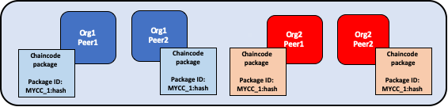
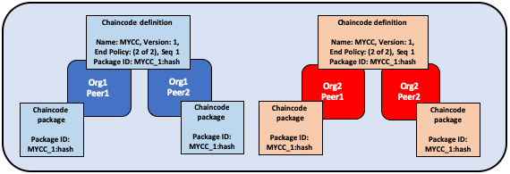

# Жизенный цикл чейнкода Fabric

## Что такое чейнкод??

Чейнкод --- это программа, написанная на [Go](https://golang.org), [Node.js](https://nodejs.org),
или [Java](https://java.com/en/), которая реализует определенный интерфейс.
Чейнкод исполняется в защищенном Docker-контейнере, изолированном от
процесса подтверждающего пира. Чейнкод инициализирует и управляет состоянием реестра
через транзакции, создающиеся приложениями.

Обычно чейнкод реализует бизнесс-логику, согласованную членами сети, так что
он может считаться смартконтрактом. Созданные чейнкодом обновления состояний реестра, до сохранения в блокчейн доступны
только этому чейнкоду и не могут использоваться напрямую другим чейнкодом.
Однако, будучи в одной сети и имея на то разрешение, чейнкод может вызвать другой чейнкод, чтобы получить эти 
обновленные состояния.

В этой статье мы будем рассматривать чейнкод глазами оператора сети, а не разработчика чейнкода.
Операторы могут использовать эту статью как руководство использования жизненного цикла (ЖЦ) Fabric,
чтобы развертывать и контролировать чейнкод сети.

## Развертывание чейнкода

Жизненный цикл Fabric (ЖЦ) --- это процеесс, позволяющий нескольким организациям согласовать 
то, как чейнкод будет использоваться до его сохранения в канал.
Оператор сети может испольовать ЖЦ, чтобы выполнять следующие задачи:

- [Установка и определение чейнкода](#установка-и-определение-чейнкода)
- [Обновление чейнкода](#обновление-чейнкода)
- [Сценарии](#сценарии)
- [Миграция на новый ЖЦ](#миграция-на-новый-жц)

Вы можете использовать ЖЦ, создав канал версии 2.0 и выше. Вы не сможете использовать
старый ЖЦ для установки, инстанцирования или обновления чейнкода. Вы все еще
сможете вызывать чейнкод, установленный с помощью старого ЖЦ. Если вы обновляете
сеть с версии 1.4.x, возможно вам пригодится [статья об обновлении конфигурации на новый ЖЦ](./enable_cc_lifecycle.html).

## Установка и определение чейнкода

ЖЦ требует, чтобы организации согласовали параметры, определяющие чейнкод,
такие как имя, версия и политика одобрения. Участники канала приходят к согласию
по следующему алгоритму. Не все участники должны выполнить каждый шаг.

1. **Пакетирование чейнкода:** Этот шаг может быть выполнен одной или всеми организациями.
2. **Установка чейнкода на пиры:** Каждая организация, которая будет использовать чейнкод
  для подтверждения транзакции или совершения запросов к реестру должна выполнить этот шаг.
3. **Одобрение определения чейнкода организацией:** Каждая организация, которая будет 
  использовать чейнкод, должна выполнить этот шаг. Определение чейнкода
  должно быть одобрено достаточным количеством организаций для удовлетворения политики
  LifecycleEndorsement канала (большинство по умолчанию), до того, как он может быть
  запущен на канале.
4. **Сохранение определения чейнкода в канале:** Транзакцию сохранения создает одна организация после того, 
  как удовлетворена политика LifecycleEndorsement. Эта организация должна сначала собрать
  подтверждения от пиров организаций, одобривших определение чейнкода.

В этой статье приведена общая информация о операциях с ЖЦ, конкретные команды в статье отсутствуют.
О том, как использовать ЖЦ через Peer CLI, обратитесь к статье
[Развертывание смартконтракта на канале](deploy_chaincode.html)
или к [Справочнику команд ЖЦ пира](commands/peerlifecycle.html).

### Шаг первый: пакетирование смартконтракта

Чейнкод должен быть пакетирован в tar-файл, прежде чем он может быть установлен
на пирах. Вы можете пакетировать чейнкод, используя CLI пира, Node.js SDK или
сторонние программы, такие как GNU tar. Когда вы создаете чейнкод-пакет,
вы должны указать label (ярлык) пакета.

Если вы используйте стороннюю программу для пакетирования, результирующий файл должен
быть в следующем формате (CLI пира или SDK автоматически использует этот формат):
- Чейнкод должен быть пакетирован в tar-файле, заканчивающимся расширением `.tar.gz`.
- tar-файл должен содержать два файла (без директорий): файл с метаданными "metadata.json" и еще один tar-файл "code.tar.gz",
  содержащий исходники чейнкода.
- "metadata.json" содержит JSON, определяющий язык, на котором написан чейнкод, путь и label пакета. Пример:
  ```
  {"Path":"fabric-samples/chaincode/fabcar/go","Type":"golang","Label":"fabcarv1"}
  ```


*Чейнкод пакетируется отдельно Org1 и Org2. Обе организации указали label
MYCC_1, чтобы идентифицировать пакет одинаковым именем и версией.
Организациям не обязательно использовать один и тот же label.*

### Шаг второй: установка чейнкода на пиры

Вам необходимо установить чейнкод пакет на каждый пир, который будет исполнять и 
подтверждать транзакции. Если вы используете CLI или SDK, вам необходимо совершить
этот шаг как **Администратор пира**. Пир соберет чейнкод после установки. Организации рекомендуется пакетировать
чейнкод единожды, а потом использовать один и тот же пакет для установки чейнкода на пиры.
Если необходимо, чтобы каждая организация исполняла один и тот же чейнкод,
одна организация должна пакетировать чейнкод и отослать пакет всем другим (вне Fabric).

Если команда установки завершилась успешно, она вернет идентификатор чейнкод-пакета,
являющийся объединением label с хешом пакета. Этот идентификатор связывает
чейнкод-пакет, установленный на пирах, с определением чейнкода, одобренным вашей организацией.
**Сохраните идентификатор** для следующего шага. Вы также можете его получить через CLI пира.

  

*Администраторы пиров Org1 и Org2 устанавливают чейнкод-пакет MYCC_1 на
пиры канала. Установка чейнкод-пакета собирает чейнкод и возвращает идентификатор 
пакета MYCC_1:hash.*

### Шаг третий: Одобрение определения чейнкода организацией

Чейнкод зависит от определения чейнкода. Определение состоит из следующих параметров
(они должны быть одними и теми же у всех организаций):

- **Имя:** Имя, по которому приложения будут вызывать чейнкод.
- **Версия:** Номер версии. Если вы обновляете исходники чейнкода, вы должны обновить и версию.
- **Порядковый номер:** Сколько раз чейнкод был определен. Используется для отслеживания обновлений чейнкода.
  Например, когда вы в первый раз одобряете определение чейнкода, порядковый номер будет 1. При обновлении чейнкода,
  номер станет 2.
- **Политика подтверждения:** указывает, какие организации должны выполнить транзакцию и проверить результат ее работы.
  Политика подтверждения может выражена в виде строки, переданной в CLI, или указывать на существующую
  политику в конфигурации канала. Стандартная политика подтверждения --- 
  ``Channel/Application/Endorsement``, требующая подтверждения большинства организаций.
- **Конфигурация коллекции:** Путь к файлу с определением коллекции конфиденциальных данных, связанных с чейнкодом.
  [Больше информации о конфиденциальных данных](private-data-arch.html).
- **Плагины ESCC/VSCC:** Названия пользовательских плагинов подтверждения или проверки, используемых этим чейнкодом.
- **Инициализация:** Если вы используете низкоуровневые API, предоставляемые Fabric Chaincode
  Shim API, ваш чейнкод должен содержать функцию `Init`.
  Эта функция обязательна, так как реализует интерфейс чейнкода, но не обязательно должна вызываться приложениями.
  Вы можете указать, должна ли `Init` быть вызвана до вызова всех других функций чейнкода. Если должна, то Fabric гарантирует, что
  она будет вызвана первой и только один раз. Это позволит вам реализовать, например, установку начального состояния.
  `Init`  надо будет вызывать каждый раз, когда вы обновляете чейнкод.

  Если вы используете CLI пира, вы можете использовать флаг `--init-required` во время одобрения и сохранения определения чейнкода, чтобы
  потребовать вызов `Init`. Чтобы вызвать `Init` из CLI, используйте команду  
   `peer chaincode invoke` с флагом `--isInit`.

  Если вы используйте Fabric contract API, вам не нужно включать метод `Init` в чейнкод, но вы все равно можете использовать
  флаг `--init-required`.  Вы можете передать `--isInit` и инициализировать чейнкод через любую функцию.

Определение чейнкода также включает **идентификатор пакета**, если организация хочет
использовать чейнкод. Идентификатор не должен быть одним и тем же для каждой организации. Организация может одобрить определение чейнкода
не устанавливая чейнкод-пакет (и не указывая идентификатор).

  

*Администраторы Org1 и Org2 одобряют определение чейнкода MYCC.*

### Шаг четвертый: Сохранение определения чейнкода в канале

После того, как политика подтверждения определения удовлетворена,
одна организация должна сохранить определение в канале. Вы можете проверить удовлетворение
политики одобрения командой CLI ``checkcommitreadiness``. Proposal транзакции сохранения
сначала отправляется пирам канала, они проверяют, было ли определение одобрено их организацией, и если да,
то они подтверждают proposal. Далее транзакция отправляется ордеринг-службе, которая сохраняет определение
чейнкода в канал. Транзакция должна быть послана **Администратором организации**.

Заметьте, что политика подтверждения определения, ``Channel/Application/LifecycleEndorsement``, может быть
установлена в виде Signature политики.

  

*Один из администраторов сохраняет определение чейнкода в канал. Определение не включает идентификатора пакета.*

После сохранения определения в канал, контейнер с чейнкодом запустится на всех пирах с установленным чейнкодом,
позволяя начать использовать чейнкод. Это может занять несколько минут. 

  

*Как только определение MYCC сохранено, Org1 и Org2 могут начать использовать чейнкод. Первый вызов чейнкода на пире запускает контейнер на этом пире.*

## Обновление чейнкода

Обновление чейнкода проиходит в рамках этого же ЖЦ. Алгоритм обновления:

1. **Снова пакетируйте чейнкод:** Вам нужно выполнить этот шаг только если вы обновляете исходники чейнкода.

    

   *Org1 и Org2 обновляют исходники и репакетируют чейнкод. Они обе изменили label чейнкода с MYCC_1 на MYCC_2.*  

2. **Установите новый чейнкод-пакет на пиры:** Вам нужно выполнить этот шаг только если вы обновляете исходники.

    

   *Org1 и Org2 устанавливают новый пакет. Установка выдает новый идентификатор пакета.*  

3. **Одобрите новое определение:** Если вы обновляете исходники, вам нужно будет также
  обновить версию чейнкода и идентификатор пакета.
  Вы также можете обновить политику подтверждения без нужды в репакетировании исходников.
  Новое определение также должно увеличить порядковый номер на 1. Потом новое определение
  должны одобрить для удовлетворения соответствующей политики.

    

   *Администраторы Org1 и Org2 одобряют новое определение. Новое определение указывает новый идентификатор пакета, изменяет версию чейнкода и увеличивает порядковый номер.*

4. **Сохраните новое определение в канал.**

  

  Если вы изменили исходники, то при первом вызове чейнкода пир запустит новый контейнер. Если первым вызовом должен быть ``Init``, он должен быть
  вызван снова.

  

## Сценарии развертывания

Следующий пример показывает, как вы можете использовать ЖЦ для управления каналами и чейнкодом.

### Присоединение организации к каналу

Новая организация может присоединиться к каналу и запустить чейнкод
после того, как установит пакет и одобрит определение.

  

*Org3 присоединяется к каналу и одобряет определение чейнкода, ранее сохраненное в канал Org1 и Org2.*

Политика одобрения определения автоматически обновится, "большинство" будет теперь высчитываться из трех организаций.

  

*Запук контейнера с чейнкодом будет осуществлен с первым вызовом чейнкода на пире Org3.*

### Одобрение определения без установки чейнкода

Вы можете одобрить определение чейнкода без установки чейнкод пакета.
Вы должны одобрить те же параметры, что и другие участники канала, но без включения
идентификатора пакета в определение.

  

*Org3 не устанавливает чейнкод.*

### Одна организация не соглашается с определением

Организация, которая не одобряет определение чейнкода, не может использовать чейнкод.

  

*Org3 одобряет определение чейнкода с отличающейся от политики из определений Org1 и Org2 политикой подтверждения.
Org3 не сможет использовать MYCC на канале, но Org1 и Org2 смогут. Транзакции от этого чейнкода будут добавлены в реестр
пира Org3, но Org3 не сможет подтверждать такие транзакции.*

### Канал не приходит к согласию 

Если политика подтверждения определения не была удовлетворена, определение не сохраняется в канал.
Никакая организация канала не сможет использовать чейнкод.

  

*Org1, Org2, и Org3 все одобряют разные определения. Никакое определение
не получает нужного количества подтрвеждений.*

### Организации устанавливают разные чейнкод-пакеты

Каждая организация может использовать свой идентификатор пакета при одобрении определения чейнкода.
Это позволяет участникам канала установить разные исходники, использующие ту же политику подтверждения
и считывают и записывают данные в одном и том же пространстве имен чейнкода.

Организации могут использовать эту возможность для установки смартконтрактов, содержащих
нужную для них бизнес-логику. Каждая организация может писать код, взаимодействующий с
существующими системами организации.

  

### Создание нескольких чейнкодов, использующих один и тот же пакет

Такой подход позволяет вам иметь несколько копий смартконтракта, но с разными политиками подтверждения.

  

*Org1 и Org2 используют пакет MYCC_1 чтобы одобрить и сохранить два разных определения чейнкода.
В результате оба пира имеют по два разных чейнкод-контейнера. MYCC1 имеет политику одобрения 1 организация из 2, MYCC2 - 2 из 2.

## Миграция на новый ЖЦ

[Больше информации о миграции на новый ЖЦ](./upgrade_to_newest_version.html#chaincode-lifecycle).

[Включение нового ЖЦ](./enable_cc_lifecycle.html).

## Дополнительная информация

Вы можете посмотреть видео ниже, чтобы узнать, что привело к выбору именно такого ЖЦ и как именно он реализован.

<iframe class="embed-responsive-item" id="youtubeplayer2" title="Starter Plan videos" type="text/html" width="560" height="315" src="https://www.youtube.com/embed/XvEMDScFU2M" frameborder="0" webkitallowfullscreen mozallowfullscreen allowfullscreen> </iframe>

<!--- Licensed under Creative Commons Attribution 4.0 International License
https://creativecommons.org/licenses/by/4.0/ -->
