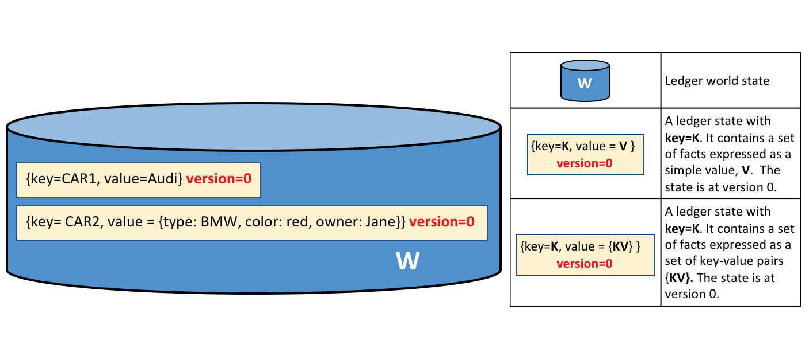
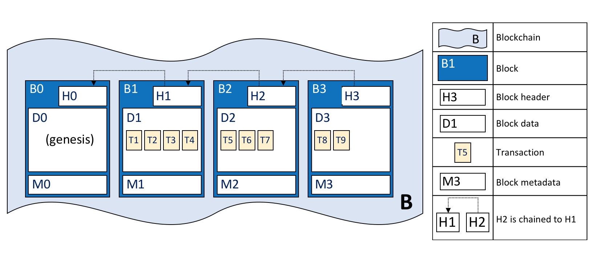

# Реестр

**Для кого это**: Архитекторы, разработчики приложений и смарт-контрактов,
администраторы

**Реестр** это ключевая концепция в Hyperledger Fabric; в нем хранится важная фактическая 
информация про бизнес-объекты; как текущее состояние их аттрбутов, так и история всех 
транзакций, которые на них повлияли.

В этом разделе мы поговорим о:

* [Что такое реестр?](#what-is-a-ledger)
* [Хранение фактов о бизнес-объектах](#ledgers-facts-and-states)
* [Блокчейн-реестр](#the-ledger)
* [World state](#world-state)
* [Структура данных блокчейна](#blockchain)
* [Как хранятся блоки в блокчейне](#blocks)
* [Транзакции](#transactions)
* [Опции базы данных world state](#world-state-database-options)
* [Пример реестра **Fabcar**](#example-ledger-fabcar)
* [Реестры и пространства имен](#namespaces)
* [Реестры и каналы](#channels)

## Что такое Реестр?

Реестр содержит текущее состояние бизнеса в виде журнала транзакций. Первые Европейские и Китайские 
реестры существуют уже 1000 лет, а Шумеры имели [каменные реестры]
(http://www.sciencephoto.com/media/686227/view/accounting-ledger-sumerian-cuneiform)
более 4000 лет назад -- но давайте начнем с более современных примеров!

Вы, наверное, уже привыкли смотреть на свой банковский счет. Самым важным для вас, наверняка, 
является балланс --- то, что вы можете потратить в данный момент времени. Если вы хотите 
увидеть, откуда взялось это значение балланса, то вы можете просмотреть предыдущие транзакции 
кредитов и дебетов. Это пример реестра из реальной жизни --- состояние (текущий балланс) и 
последовательность транзакций (кредиты и дебеты), которые поясняют его значение. Hyperledger 
Fabric также руководствуется этими двумя соображениями --- представить текущее значение набора 
сотстояний реестра, а также отобразить историю транзакций, которые привели к этим состояниям.

## Реестр, факты и состояния

Реестр не буквально хранит бизнес-объекты --- на самом деле, он хранит **факты** об этих 
объектах. Когда мы говорим "мы храним бизнес-объект в реестре", мы имеем в виду лишь то, что 
записываем факты о текущем состоянии оъекта и факты об истории транзакций, предшествующих этому 
состоянию. В развивающемся цифровом мире можно почувствовать, что мы действительно имеем дело с 
объектом, а не с фактами о нем. В случае цифрового объекта, он скорее всего находится во внешнем 
хранилище данных; факты, записываемые в реестр, позволяют нам идентифицировать его 
метонахождение, а также дают ключевую информацию о нем.

В отличие от текущего состояния бизнес-объекта, которое может меняться со временем, история 
фактов о нем **неизменна**, в нее можно добавить что-нибудь, но после добавления, изменить его 
нельзя. Сейчас мы увидим, что представлять блокчейн, как неизменяемую историю фактов о бизнес-
объектах, это простой, но действенный ключ к его пониманию.

Давайте теперь присмотримся к структуре Hyperledger Fabric! 

## Реестр

В Hyperledger Fabric реестр состоит из двух отдельных, но связанных частей --- world state и 
блокчейн. Каждая из них представляет собой набор фактов о наборе бизнес-объектов.

Первая часть --- **world state** --- база данных, содержащая **текущие значения** набора 
состояний реестра. World state предоставляет программе прямой доступ к текущему значению 
состояния, позволяя не просчитывать его через весь журнал транзакций. Состояния реестра по 
умолчанию хранятся в парах **ключ-значение**, и позже мы увидим, как Hyperledger Fabric 
обеспечивает гибкость в этой области. World state может часто менятся, поскольку состояния 
создааются, обновляются и удаляются.

Вторая часть --- **блокчейн** --- транзакционный журнал, записывающий все изменения, влияющие на 
на текущее world state. Транзакции собраны в блоки, которые добавляются в блокчейн --- что 
позволяет понять историю изменений, повлиявшие на текущее world state. Структура данных блокчейн 
сильно отличается от world state, поскольку после добавления нового блока, его уже нельзя 
изменить или удалить; поэтому ее называют **неизменяемой**.

 *Журнал L содержит блокчейн B и
world state W, где блокчейн B определяет world state W. Можно сказать, что
world state W выводится из блокчейна B.*

Удобно представлять, что в сети Hyperledger Fabric существует **единственный по смыслу** реестр. 
Хотя на самом деле сеть поддерживает много копий реестра, которые согласуются между собой с 
помощью процесса, называемого **консенсусом**. Термин **Distributed Ledger Technology** 
(**DLT**) (Технология распределенного реестра) часто используется с таким типом реестра --- 
единственного по смыслу, но хранящегося в множестве копий, распространенных по всей сети.

Давайте теперь рассмотрим структуры данных world state и блокчейн более подробно.

## World State

World state содержит текущее значение атрибутов бизнес-объектов в виде уникального состояния 
реестра. Это полезно, поскольку для программ обычно требуются текущее состояния объекта; было бы 
сложно каждый раз просматривать всю блокчейн-сеть, вычисляя текущее состостояние объекта (в том 
числе его цену) --- вместо этого его можно напрямую получить из world state.

 *Реестр world state содержит
два состояния. Первое: key=CAR1 и value=Audi. Второе состояние имеет более сложную структуру: key=CAR2 
и value={model:BMW, color=red, owner=Jane}. Оба состояния 0 версии.*

Состояние реестра содержит набор фактов об определенном бизнес-объекте. Наш пример показывает 
состояния реестра для двух машин, CAR1 и CAR2, каждая из которых имеет ключ и значение. 
Программа приложения может вызвать смарт-контракт, использующий простой API-реестр чтобы 
**get**, **put** и **delete** (найти, добавить, удалить) состояния. Обратите внимание, что 
значение состояние может быть простым (Audi...) или коплекным (type:BMW...). World state часто 
используется, чтобы найти все объекты с определенными атрибутами, например, найти все красные 
BMW.

World state используется как база данных. В этом есть смысл, поскольку база данных предоставляет 
большой набор операторов для эффективного хранения и извлечения состояний. Позже мы увидем, что 
Hyperledger Fabric можно настроить так, чтобы он использовал разные базы данных world state, 
отвечающие потребностям различных типов значений состояния и моделей доступа, например, сложных 
запросов.

Приложения подают транзакции, которые фиксируют изменения в world state, и эти транзакции 
вносятся в реестр блокчейн. Приложения изолированы от деталей механизма [консенсуса]
(../txflow.html) с помощью Hyperledger Fabric SDK; она просто вызывают смарт-контракт и 
понимают, когда транзакция была включена в блокчейн (неважно, валидная или нет). Ключевой момент 
разработки заключается в том, что только **подписанные** необходимыми **утвержающими 
организациями** обновляют world state. Если транзакция не подписана утверждающими организациями, 
она не сможет изменить world state. Можно почитать больше о том, как приложения используют 
[смарт-контракты](../smartcontract/smartcontract.html), и как их [разрабатывать]
(../developapps/developing_applications.html).

Вы можете заметить, что у состояния есть номер версии, например, на диаграме, расположенной 
выше, состояния CAR1 и CAR2 на начальной версии, то есть 0. Номер версии предназначен для 
внутреннего пользования Hyperledger Fabric, и каждый раз, когда состояние изменяется, номер 
увеличивается. Версия проверяется при обновлении состояния для того, чтобы убедиться, что 
текущее состояние соответствует версии на момент одобрения. Таким образом, world state 
изменяется ожидаемо, и не происходит параллельных обновлений.

Когда реестр только создан, world state пустует. Поскольку любая транзакция, отображающая 
валидное изменение world change, записана в блокчейне, world state в любой момент можно 
восстановить из блокчейна. Это может оказаться очень удобным --- например, world state 
автоматически генерируется, когда создается пир. Более того, если пир некорректно завершает свою 
работу, world state может быть восстановлен при перезагрузке пира, до того, как принимаются 
транзакции.

## Блокчейн

Давайте теперь переведем внимание с world state на блокчейн. Если world state содержит набор 
фактов, относящихся к текущему состоянию бизнес-объектов, то блокчейн это летопись того, как эти 
объекты пришли к их текущему состоянию. Блокчейн записывает каждую предыдущую версию каждого 
состояния реестра и то, как он изменялся.

Блокчейн структурирован в виде журнала последовательных взаимосвязанных блоков, где каждый блок 
состоит из поледовательности транзакций, каждая из которых представляет собой запрос или 
обновление world state. Про механизмы, упорядочивающие транза кции, можно узнать [здесь]
(../peers/peers.html#peers-and-orderers); упорядочивание блоков, также как и упорядочивание 
транзакций в блоках происходит, когда блоки создаются Hyperledger Fabric, компонентом под 
названием **ordering-служба**.

Заголовок каждого блока включает в себя хэш транзакций этого блока, а также хэш из заголовка 
предыдущего блока. Таким образом, все транзакции в реестре упорядочены и криптографически 
связаны между собой. Хэширование и связывание обеспечивают безопасность данных реестра. Даже 
если один узел, ведущий реестр, был подделан, он не сможет убедить остальные узлы в том, что он 
имеет корректный блокчейн, поскольку реестр распределен по всей сети независимых узлов.

Блокчейн, в отличие от world state, являющегося базой данной, всегда реализован в виде файла. 
Это разумный выбор, поскольку структура данных блокчейн поддерживает только небольшой набор 
простых операций. Добавление в конец блокчейна --- основная операция, а запрос в настоящее время 
является редкоиспользуемой операцией. 

Давайте более детально рассмотрим структуру блокчейн.

 *Блокчейн B содержит блоки
B0, B1, B2, B3. B0 --- первый блок, называемый genesis-блоком.*

Как можно видеть в диаграмме выше, **блок** B2 содержит **данные блока** D2, состоящие из 
транзакций: T5, T6, T7.

Что особенно важно, у B2 есть **заголовок блока** H2, который состоит из криптографического 
**хэша** всех транзакций в D2, а также хэш H1. Таким образом, блоки неразрывно и неизменно 
связаны друг с другом, что отражает суть термина **блокчейн** (цепь блоков).

И наконец, как можно видеть на диаграмме, первый блок в блокчейне называется **genesis-блоком**. 
Genesis-блок --- точка отсчета реестра, хоть он и не содержит никаких пользовательских 
транзакций. Вместо этого, он состоит из конфигурационной транзакции, содержащей начальное 
состояние сетевого канала (не показано). Мы обсудим genesis-блок более подробно, когда будем 
обсуждать блокчейн-сеть и [каналы](../channels.html) в документации.

## Блоки

Давайте присмотримся к структуре блока. Блок состоит из трех разделов.

* **Заголовок блока**

  Этот раздел состоит из трех полей, которые заполняются при создании блока.

  * **Номер блока**: Целое число, 0 у genesis-блока, у каждого следующего блока на 1 больше чем 
  у предыдущего

  * **Хэш блока**: Хэш всех транзакций, содержащихся в данном блоке.

  * **Хэш предыдущего блока**: Хэш из заголовка предыдущего блока.
  
  Эти поля заполняются с помощью криптографического хэщирования данных блока. Они обеспечивают 
  неразрывную связь блоков, из-за чего реестр становится неизменным.

   *Детали заголовка блока. Заголовок H2
  блока B2 содержит номер блока (2), хэш CH2 данных блока
  D2, и хэш предыдущего заголовка блока H1.*

* **Данные блока**

  Этот раздел содержит список упорядоченных транзакций. Он записывается ordering-службой при 
  создании блока. Эти транзакции имеют простую, но итересную структуру, которую мы обсудим 
  [позже](#Transactions).

* **Метаданные блока**

  Этот раздел содержит сертификат и подпись создателя блока, которая используется для проверки 
  блока сетевыми узлами. Создатель блока добавляет валидный/невалидный идентификатор для каждой 
  транзакции в bitmap, который также находится в метаданных блока, также как и хэш совокупных 
  обновления состояния, произведенных до (и включая его) данного блока, для того, чтобы 
  обнаружить разветвления состояния.
  В отличие от данных блока и полей заголовка блока, этот раздел не учитываются при вычислении  
  хэша блока.

## Транзакции

Как мы уже поняли, транзакция отражает изменения в world state. Давайте более детально 
рассмотрим структуру **данные блока** (blockdata), которая содержит транзакции блока.

 *Детали транзакций. Транзакция
T4 в данных блока D1 блока B1 состоит из заголовка транзакции, H4, подписи транзакции, S4, предложения транзакции P4, ответа транзакции, R4, и списка подтверждений, E4.*

В примере, приведенном выше, можно видеть следующие поля:

* **Заголовок**

  Этот раздел, проиллюстрированный H4, содержит основные метаданные о транзакции --- например, 
  имя соответствующей цепи и ее версию.

* **Подпись**

  Этот раздел, проиллючтрированный S4, содержит криптографическую подпись, созданную приложением 
  клиента. Это поле используется для подтверждения того, что детали транзакции не были 
  подделаны, поскольку оно требует приватного ключа приложения для создания.

* **Предложение**

  Этот раздел, проиллюстрированный P4, кодирует входные параметры смарт-контракта, 
  предоставленные приложением, который генерирует предложение обновить реестр.
  Когда выполняется смарт-контракт, это предложение обеспечивает набор входных данных 
  параметров, которые в сочетании с текущим world state определяют новый world state.

* **Ответ**

  Этот раздел, проиллюстрированный R4, содержит значения world state до и после, как 
  **Read Write set** (RW-set). Это результат работы смарт-контракта, и, если транзакция будет успешно 
  подтверждена, она будет применена к реестру для обновления world state.

* **Подтверждения**

  Как показывает E4, это список подписанных ответов на транзакции от всех требуемых для политики 
  подтверждения организаций. Можно видеть, что хотя 
  As shown in E4, this is a list of signed transaction responses from each
  required organization sufficient to satisfy the endorsement policy. You'll
  notice that, whereas only one transaction response is included in the
  transaction, there are multiple endorsements. That's because each endorsement
  effectively encodes its organization's particular transaction response --
  meaning that there's no need to include any transaction response that doesn't
  match sufficient endorsements as it will be rejected as invalid, and not
  update the world state.

That concludes the major fields of the transaction -- there are others, but
these are the essential ones that you need to understand to have a solid
understanding of the ledger data structure.

## World State database options

The world state is physically implemented as a database, to provide simple and
efficient storage and retrieval of ledger states. As we've seen, ledger states
can have simple or compound values, and to accommodate this, the world state
database implementation can vary, allowing these values to be efficiently
implemented. Options for the world state database currently include LevelDB and
CouchDB.

LevelDB is the default and is particularly appropriate when ledger states are
simple key-value pairs. A LevelDB database is co-located with the peer
node -- it is embedded within the same operating system process.

CouchDB is a particularly appropriate choice when ledger states are structured
as JSON documents because CouchDB supports the rich queries and update of richer
data types often found in business transactions. Implementation-wise, CouchDB
runs in a separate operating system process, but there is still a 1:1 relation
between a peer node and a CouchDB instance. All of this is invisible to a smart
contract. See [CouchDB as the StateDatabase](../couchdb_as_state_database.html)
for more information on CouchDB.

In LevelDB and CouchDB, we see an important aspect of Hyperledger Fabric -- it
is *pluggable*. The world state database could be a relational data store, or a
graph store, or a temporal database.  This provides great flexibility in the
types of ledger states that can be efficiently accessed, allowing Hyperledger
Fabric to address many different types of problems.

## Example Ledger: fabcar

As we end this topic on the ledger, let's have a look at a sample ledger. If
you've run the [fabcar sample application](../write_first_app.html), then you've
created this ledger.

The fabcar sample app creates a set of 10 cars each with a unique identity; a
different color, make, model and owner. Here's what the ledger looks like after
the first four cars have been created.

 *The ledger, L, comprises a world
state, W and a blockchain, B. W contains four states with keys: CAR0, CAR1, CAR2
and CAR3. B contains two blocks, 0 and 1. Block 1 contains four transactions:
T1, T2, T3, T4.*

We can see that the world state contains states that correspond to CAR0, CAR1,
CAR2 and CAR3. CAR0 has a value which indicates that it is a blue Toyota Prius,
currently owned by Tomoko, and we can see similar states and values for the
other cars. Moreover, we can see that all car states are at version number 0,
indicating that this is their starting version number -- they have not been
updated since they were created.

We can also see that the blockchain contains two blocks.  Block 0 is the genesis
block, though it does not contain any transactions that relate to cars. Block 1
however, contains transactions T1, T2, T3, T4 and these correspond to
transactions that created the initial states for CAR0 to CAR3 in the world
state. We can see that block 1 is linked to block 0.

We have not shown the other fields in the blocks or transactions, specifically
headers and hashes.  If you're interested in the precise details of these, you
will find a dedicated reference topic elsewhere in the documentation. It gives
you a fully worked example of an entire block with its transactions in glorious
detail -- but for now, you have achieved a solid conceptual understanding of a
Hyperledger Fabric ledger. Well done!

## Пространства имен

Хотя мы и говорили, что у реестра есть единственное world state и единственный блокчейн, это слегка упрощенное представление. На самом деле каждое звено цепи имеет собственное world state, отдельное от других звений. 

Even though we have presented the ledger as though it were a single world state
and single blockchain, that's a little bit of an over-simplification. In
reality, each chaincode has its own world state that is separate from all other
chaincodes. World states are in a namespace so that only smart contracts within
the same chaincode can access a given namespace.

A blockchain is not namespaced. It contains transactions from many different
smart contract namespaces. You can read more about chaincode namespaces in this
[topic](../developapps/chaincodenamespace.html).

Let's now look at how the concept of a namespace is applied within a Hyperledger
Fabric channel.

## Каналы

В Hyperledger Fabric, каждый [канал](../channels.html) имеет полностью отдельный реестр, 
что означает полностью отдельный блокчейн и полностью отдельое world state, включая пространство имен. Приложения и смарт-контракты могут коммуницировать между каналами так, что информация реестров доступна 
This means a completely separate blockchain, and completely
separate world states, including namespaces. It is possible for applications and
smart contracts to communicate between channels so that ledger information can
be accessed between them.

Про работу реестра и каналов можно почитать поподробнее
[здесь](../developapps/chaincodenamespace.html#channels).

## Больше информации

See the [Transaction Flow](../txflow.html),
[Read-Write set semantics](../readwrite.html) and
[CouchDB as the StateDatabase](../couchdb_as_state_database.html) topics for a
deeper dive on transaction flow, concurrency control, and the world state
database.

<!--- Licensed under Creative Commons Attribution 4.0 International License
https://creativecommons.org/licenses/by/4.0/ -->
