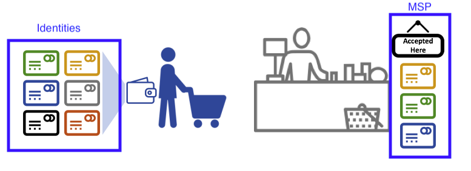
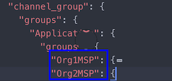
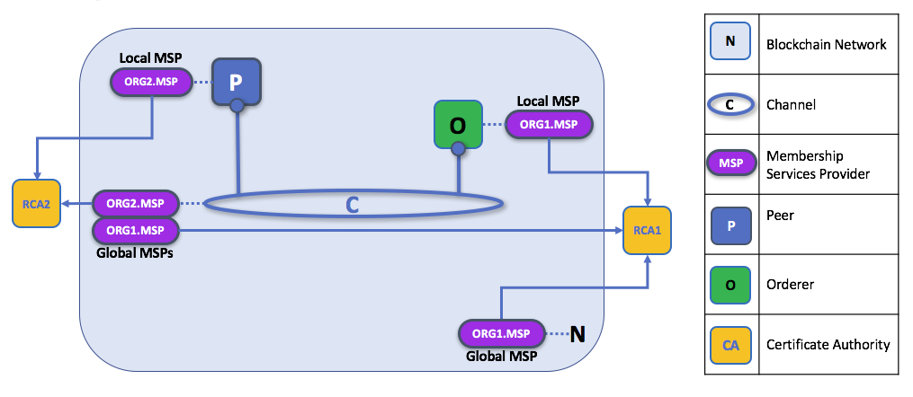
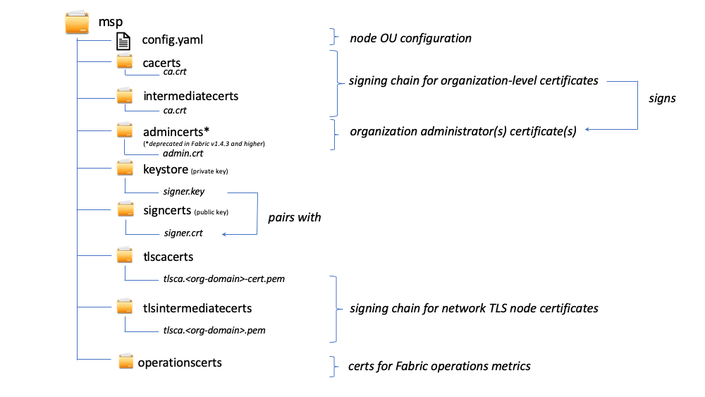

# Membership Service Provider (MSP)

## Зачем нужен MSP?

Поскольку Fabric -- permissioned-сеть, участникам блокчейн-сети нужен способ подтвердить их 
identity остальной части сети, чтобы осуществлять транзакции. Если вы читали документацию 
про [Identity](../identity/identity.html), то вы видели, как Public Key Infrastructure (PKI) 
(инфраструктура публичного ключа) с помощью цепочек доверия предоставляет проверяемые 
identities. Как эта цепочка доверия используется блокчейн-сетью?

Certificate Authorities раздают identities, генерируя публичный и приватный ключи, с помощью которых можно подтвердить identity. Поскольку приватный ключ должен 
оставаться приватным, необходим механизм, позволяющий получить подтверждение, и здесь появляется 
MSP. Например, пир использует приватный ключ, чтобы поставить цифровую подпись на транзакции. 
MSP ordering-службы владеет публичным ключом пира и использует его, чтобы проверить, что 
приложенная к транзакции подпись валидна. Приватный ключ используется для создания подписи 
транзакции, к подписи подходит только соответствующий публичный ключ. Таким образом, MSP -- это механизм, позволяющий узнавать и доверять 
identity, при этом не раскрывая ее публичный ключ.

Возвращаясь к сценарию из Identity про кредитные карты: Certificate Authority -- как 
поставщик карт -- выдает множество различных видов identities, поддающихся проверке. MSP же 
определяет, карты от каких поставщиков принимаются в магазине. Так, MSP превращает identity 
(кредитную карту) в "роль" (возможность покупать вещи в магазине). 

Возможность превращать проверяемые identities в роли является очень важным в сети
Fabric.



Рассмотрим консорциум банков, управляющих блокчейн-сетью. Каждый банк управляет пирами и 
ordering-узлами, пиры подтверждают транзакции в сети. Однако в каждом банке есть департаменты и 
владельцы счетов. Владельцы счетов принадлежат организациям, но не управляют узлами в сети. Они 
могут взаимодействовать с системой только с помощью мобильных или веб приложений. Как сеть узнает 
и будет различать эти роли, identities? CA создал identities, но, как и в примере с картой, эти 
identities нельзя просто выдать -- их еще и должна узнавать сеть. MSP используются для определения 
организаций, которым доверяют члены сети. MSP также является механизмом, предоставляющим членам 
роли и разрешения в сети. 

В итоге, если вы хотите присоединиться к _существующей_ сети, вы должны превратить вашу identity 
во что-то узнаваемое в сети. MSP -- механизм, позволяющий вам участвовать в permissioned 
блокчейн-сети. Для осуществления транзакций член сети Fabric должен:

1. Иметь identity, выданное доверенным CA
2. Стать членом _организации_, утвержденной и признаваемой членами сети.
С помощью MSP identity привязана к организации, что достигается путем добавления сертификата в MSP организации.
3. Добавить MSP в [консорциум](../glossary.html#consortium) сети или в канал.
4. Убедиться, что MSP включен в определения [политик](../policies/policies.html) в сети.

## Что такое MSP?

MSP реализован как набор директорий, которые добавляются в конфигурацию сети и используются
как внутри организации (организации решают, кто является их администратором), так и снаружи 
(позволяя другим организациям подтверждать, что эти органы имеют полномочия на действия, которые 
они хотят совершить).

MSP определяет, какие identity валидные, а какие нет, в списке валидных identity
или в списке доверенных корневых и промежуточных CA.

Область ответственности MSP выходит за рамки простого перечисления участников сети и членов 
каналов. MSP превращает identity в **роль**, определяя особые привилегии участника в канале или 
узле. Заметьте, что если пользователь регистрируется с помощью Fabric CA, роль администратора, 
пира, ordering-службы или члена должна быть связана с пользователем. Например, identities, 
зарегистрированные в качестве "пиров" должны, очевидно, принадлежать пирам;
identities, зарегистрированные в качестве "администраторов" должны принадлежать администраторам 
организаций.

В дополнение, MSP может отзывать (аннулировать) конкретные identity.

## Области MSP

MSP встречается в двух областях блокчейн-сети:

* Локально на узле участника (**локальный MSP**)
* В конфигурации каналов (**MSP канала**)

Ключевое различие между локальным и MSP канала не в том, как они функционируют -- оба 
превращают identities в роли -- а в **уровне**, на котором они функционируют.

### Локальные MSP

Локальные MSP определяют разрешения пользователей узла, например, кто может устанавливать чейнкод, кто является администратором узла (заметьте, что
администраторы узла не обязательно являются администраторами сети, и наоборот). Также локальный MSP подписывает сообщения, исходящие от узла.

**Каждый узел должен иметь локальный MSP**. 

Локальный MSP определен в файловой системе узла и применяется только к 
этому узлу.

### MSPs канала (глобальные MSPs)

В отличие от локального MSP, **MSP канала определяет административные права и права участия на уровне каналов**. Пиры и ordering-узлы в канале пользуются одними и теми же MSPs канала, и поэтому могут корректно определять участников канала. Если организация хочет присоединиться к каналу, в конфигурацию канала нужно включить ее MSP (MSPs канала это объединение MSP организаций). В противном случае транзакции от identities этой организации будут отклоняться. В отличие от локальных MSPs, MSPs канала описываются в конфигурации канала.



*Кусок кода из файла config.json канала, содержащего два MSP двух организаций.*

**MSPs канала определяют, на уровне канала, кто какими обладает полномочиями**.
Они обеспечивает соблюдение политик на уровне каналов. MSPs канала содержат MSP организаций-
членов канала.

**Каждая участвующая в канале организация должна иметь MSP, определенный для нее**. На самом 
деле рекомендуется соотношение один-к-одному между организациями и MSP. MSP определяет, какие 
identities уполномочены действовать от имени организации. Это включает в себя конфигурацию самого 
MSP, а также утверждение административных задач, выполняемых организацией (например, добавление 
новых организаций в канал). Если все участники сети являются членами одной организации или MSP, то 
конфиденциальность данных нарушается. Большее число организаций обеспечивает конфиденциальность, 
так как изолирует данные реестра от членов сети, не состоящих в канале. При возникновении 
потребности можно разделить организацию на организационные подразделения (OU), о которых мы 
позже поговорим чуть подробнее.

**MSP системного канала включает в себя MSP всех организаций, участвующих в ordering-службе.** 
Ordering-служба обычно состоит из ordering-узлов нескольких организаций, которые коллективно 
управляют ordering-службой, что включает в себя управление консорциумами организаций и дефолтными 
политиками, которые наследуются обычными каналами.

**Локальные MSP определяются только в файловой системе узла**. Поэтому для 
каждого узла существует единственный, физически и логически, локальный MSP. Однако MSPs канала доступны всем узлам 
канала и определены в конфигурации канала. **MSPs канала воспроизводится в файловой 
системе каждого узла в канале и синхронизируется с помощью консенсуса**. Таким образом, у 
каждого узла есть копия всех MSP канала в файловой системе, но "логически" MSPs канала
хранится на канале.

Заметьте, что все identies одного MSP, локального или глобального, имеют один и тот же root of trust.

Следующая схема иллюстрирует сосуществование локального и канального MSP в сети:



*MSP пиров и ordering-службы локальны, а MSPs любого канала (в том числе системного канала)
 глобальны и являются общими для всех участников канала. Здесь 
системный канал сети администрируется ORG1. Пир -- актор ORG2 и управляется ею, а ORG1 управляет ordering-службой. ORG1 доверяет 
identities из RCA1, а ORG2 доверяет identities из RCA2.*


## Как связаны MSP и организации?

**Организация** -- это логическая, управляемая группа членов. Она может быть размером с 
международную корпорацию или размером с цветочный магазин. Самое важное в организациях 
-- то, что они управляют своими членами в рамках единого MSP. MSP привязывает identity 
к организации. 

Благодаря уникальным отношениям между организацией и ее MSP разумно называть MSP в честь 
организации. У организации `ORG1` MSP будет называться, например, `ORG1-MSP`. В некоторых случаях организации может
требоваться разбиение многочисленные группы, например, в тех случаях, когда организации используют каналы 
для выполнения различных бизнес-функций. В таких случаях логично иметь несколько MSP, названных 
соответственно, например, `ORG2-MSP-NATIONAL` и `ORG2-MSP-GOVERNMENT`.

### Организационные подразделения (OUs) и MSP

Организация может быть разделена на несколько **organizational units** (OU, организационные 
подразделения), у каждой из которых есть свой набор обязанностей, также называемых `affiliations`. 
Например, организация `ORG1` может состоять из OU `ORG1.MANUFACTURING` и OU `ORG1.DISTRIBUTION`, отражающих две отдельные ветки бизнеса.
В сертификатах X.509, выданных CA, поле `OU` уточняет ветку бизнеса, которой принадлежит identity.
Преимущество использования OU заключается в том, что эти значения можно использовать в определениях политик для ограничения доступа или в смарт-контрактах для осуществления доступа на основе атрибутов.
Иначе нужно было бы создавать несколько MSP для одной организации.

Указание OU являются необязательным. Если не использовать OU, все identities, являющиеся частью 
MSP -- указанные в папках корневых и промежуточных CA -- будут считаться членами организации.

### Роли Node OU и MSP

Кроме того, существует особый тип OU, иногда называемый `Node OU`, который может использоваться для
наделения identity ролью. Node OU определены в файле 
`$FABRIC_CFG_PATH/msp/config.yaml` и содержат список организационных подразделений, чьи члены 
считаются частью организации, представляемой MSP. На практике это полезно, когда вы хотите 
допустить только участников организации с identity (подписанной одним из принимаемых MSP CA) с 
конкретной ролью Node OU. Например, с Node OU вы можете реализовать более детализованную 
политику подтверждения, требующую, чтобы транзакцию одобрили именно пиры ORG1, а не любой член ORG1.

Для того, чтобы использовать роли Node OU необходимо включить функцию классификации identity. 
При использовании структуры MSP, основанной на директориях, это достигается включением секции "Node 
OUs" в файле config.yaml, который находится в корне директории MSP:

```
NodeOUs:
  Enable: true
  ClientOUIdentifier:
    Certificate: cacerts/ca.sampleorg-cert.pem
    OrganizationalUnitIdentifier: client
  PeerOUIdentifier:
    Certificate: cacerts/ca.sampleorg-cert.pem
    OrganizationalUnitIdentifier: peer
  AdminOUIdentifier:
    Certificate: cacerts/ca.sampleorg-cert.pem
    OrganizationalUnitIdentifier: admin
  OrdererOUIdentifier:
    Certificate: cacerts/ca.sampleorg-cert.pem
    OrganizationalUnitIdentifier: orderer
```

В примере выше есть 4 возможные `ROLES` Node OU  для MSP:

   * клиент
   * пир
   * администрация
   * ordering-служба

Это позволяет отличать роли MSP по OU в атрибуте CommonName сертификата X.509. В примере выше 
любой сертификат, выданный cacerts/ca.sampleorg-cert.pem, в котором OU=client будет 
идентифицирован как клиент, OU=peer как пир, и так далее. Начиная с Fabric v1.4.3, существуют OU 
для администратора и ordering-службы.  Новая роль администратора позволяет не помещать явно 
сертификаты в папку сертификатов администраторов в директории MSP. Вместо этого, роль `admin` в 
сертификате пользователя определяет его identity как администратора.

Эти атрибуты OU и Role присваиваются identity, когда для регистрации (`register`) пользователей используется Fabric CA или SDK.
Последующая команда пользователя `enroll` генерирует сертификаты в директории пользователя `/msp`.


Атрибуты Role и OU видны в сертификате X.509, расположенного в директории `/signcerts`. Атрибут 
`ROLE` определяется по `hf.Type` и указывает роль участника в его организации (например, 
указывая, что участник является `peer`). Для примера, взгляните на кусок сертификата:


Заметьте, что в случае MSPs канала участник, обладающий ролью администратора, не обязательно 
может администрировать какие-то отдельные ресурсы. Фактически, права, которыми 
обладает данная identity в отношении управления системой, определяются _политиками_, которые 
управляют системными ресурсами. Например, в политике канала может быть указано, что 
администраторы `ORG1-MANUFACTURING` (то есть identities с ролью `admin` и Node OU 
`ORG1-MANUFACTURING`) имеют право добавлять новые организации в канал, а администраторы 
`ORG1-DISTRIBUTION` - нет.

Наконец, OU может использоваться различными организациями в рамках консорциума для того, чтобы 
различать друг друга. Однако в таких случаях различные организации должны использовать одни и те 
же корневые и промежуточные CA для своей цепочки доверия и использовать OU для идентификации 
членов каждой организации. Когда каждая организация имеет один и тот же CA или цепочку доверия, 
система становится более централизованой, чем нам иногда нужно.

## Структура MSP

Давайте посмотрим на элементы MSP.

Директория локального MSP содержит следующие поддиректории:



* **config.yaml:**  Используется для настройки классификации identity в Fabric путем подключения "Node OUs" и определения ролей.

* **cacerts:** Эта директория содержит список самоподписанных сертификатов X.509 корневых CA, которым доверяет организация, представленная MSP.
  В этой директории должен быть хотя бы один сертификат корневого CA.
  Это самая важная директория, поскольку она указывает CA, формирующего цепочку доверия.

* **intermediatecerts:**  Эта директория содержит список сертификатов X.509 промежуточных CA, которым доверяет организация.
  Каждый сертификат должен быть подписан одним из корневых CA в MSP или другим промежуточным CA, чья цепочка доверия в конечном счете приводит к доверенному корневому CA.
  Промежуточный CA может представлять подразделение организации (например, `ORG1-MANUFACTURING` и `ORG1-DISTRIBUTION` для `ORG1`) или саму организацию 
  (как, например, в случае использования коммерческого CA для управления идентификационными данными организации).

  [Здесь](../msp.html) можно найти информацию о лучших практиках настройки MSP. 
  Заметьте, что можно иметь функционирующую сеть, не имеющую промежуточного CA.
  В этом случае папка будет пуста.
  Также как и папка корневых CA эта папка определяет CA, которые выдают сертификаты, нужные для того, чтобы считаться членом организации. 

* **admincerts (устарела с Fabric v1.4.3):**  Эта директория содержит список identities, определяющий участников, имеющих роль администратора организации.
  Обычно в этом списке один или больше сертификатов X.509.

  Заметьте, что до Fabric v1.4.3 администраторы определялись путем явного помещения в поддиректорию `admincerts` в директории локального MSP пира.
  **Для Fabric v1.4.3 и более поздних версий в этой директории больше не требуются сертификаты**.
  Вместо этого, рекомендуется при регистрации пользователя CA для назначения администратором выдавать ему роль `admin`.

* **keystore: (private Key)** Эта директория определена для локального MSP пира или узла ordering-службы (или в локальном клиентском MSP) и содержит приватный ключ узла.
  Этот ключ используется для подписи данных --- например, для подписи транзакционного ответа (tx proposal), что является обязательной частью фазы подтверждения.
  Эта папка обязательна для локальных MSP и должна содержать ровно один приватный ключ.
  Очевидно, доступ к этой директории должен быть ограничен администраторам.

  Конфигурация **MSP канала** не содержит эту директорию, поскольку MSP канала предназначен исключительно для проверки identities, для подписывания сообщений он не используется.
  Заметьте, что если вы используете [HSM](../hsm.html) для управления ключами, эта папка будет пустой, так как приватный ключ генерируется и хранится в HSM.

* **signcert:** У пира или узла ordering-службы (или в локальном клиентском MSP) эта директория содержит файл с сертификатом X.509 узла.

* **tlscacerts:** Эта директория содержит список самоподписанных сертификатов корневых CA, которым эта организация доверяет **безопасную связь между узлами с использованием TLS**.
  Информация MSP TLS относится к узлам внутри сети --- пирам и ordering-службам, а не приложениям и администраторам.
  Для более подробной информации о TLS ознакомьтесь с [Безопасная коммуникация с использованием TLS](../enable_tls.html).

* **tlsintermediatecacerts:** Эта директория содержит список сертификатов промежуточных CA, которым организация, представленная MSP, доверяет **безопасную связь между узлами с использованием TLS**.
  Эта директория особенно полезна, если коммерческие CA используются для получения организацией сертификатов TLS.
  Указание промежуточных TLS CA является необязательным.

* **operationscerts:** Эта директория содержит сертификаты, необходимые для взаимодействия с API [мониторинг-службы](../operations_service.html).

MSP канала содержит следующую дополнительную директорию:

* **Revoked Certificates:** (отозванные сертификаты) Если identity был аннулирован, информация об этом identity --- не сама identity --- хранится в этой директории.
  Для identities, основанных на сертификатах X.509, эта информация хранится в виде пар строк, называемых Subject Key Identifier (SKI) и Authority Access Identifier (AKI), 
  SKI и AKI используется для проверки сертификата на отозванность.
  Список аналогичен Certificate Revocation List (CRL) CA, но он также связан с аннулированием членства в организации.
  В результате администратор MSP канала может быстро аннулировать участника или узел из организации, распространив через MSP обновленный CRL CA.
  Использование этого механизма опционально, директория заполнится только после аннулирования сертификатов.

Если вы ознакомились с этой документацией, а также документацией про 
[Identity](../identity/identity.html), у вас должно было сформироваться понимание того, как в  Hyperledger Fabric работают identities и MSP.
Вы теперь знаете, как PKI и MSP используются для идентификации участников блокчейн-сети. 
Вы узнали, как работают сертификаты, публичные и приватные ключи и цепочки доверия, кроме того, вы узнали структуру MSP.

<!---
Licensed under Creative Commons Attribution 4.0 International License https://creativecommons.org/licenses/by/4.0/
-->
