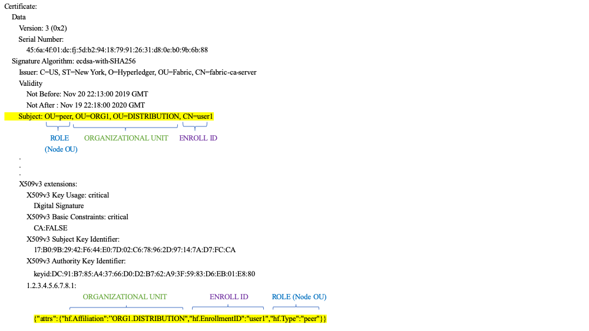

# Membership Service Provider (MSP)

## Зачем нужен MSP?

Поскольку Fabric -- permissioned сеть, участникам блокчейн-сети нужен способ подтвердить их 
identity остальной части сети, чтобы осуществлять транзакции в сети. Если вы читали документацию 
про [Identity](../identity/identity.html), то вы видели, как Public Key Infrastructure (PKI) 
(инфраструктура публичного ключа) с помощью цепочек доверия предоставляет проверяемые 
identities. Как эта цепочка доверия используется блокчейн-сетью?

Certificate Authorities раздают identities, генерируя публичный и приватный ключи, которые 
формируют пару, с помощью которой можно подтвердить identity. Поскольку приватный ключ должен 
оставаться приватным, необходим механизм, позволяющий получить подтверждение, и здесь появляется 
MSP. Например, пир использует приватный ключ, чтобы поставить цифровую подпись на транзакции. 
MSP ordering-службы владеет публичным ключом пира и использует его, чтобы проверить, что 
приложенная к транзакции подпись валидна. Приватный ключ используется для создания подписи на 
транзакции, которая может соответствовать только парному публичному ключу (и именно за эту часть 
отвечает MSP). Таким образом, MSP -- это механизм, позволяющий узнавать и доверять отдельно 
взятой identity, при этом не раскрывая ее публичный ключ.

Возвращаясь к сценарию из темы Identity про кредитные карты: Certificate Authority -- как 
поставщик карт -- выдает множество различных видов identities, поддающихся проверке. MSP же 
определяет, какие поставщики карт принимаются в магазине. Так, MSP превращает identity 
(кредитную карту) в "роль" (возможность покупать вещи в магазине). 

Возможность превращать проверяемые identities в роли является очень важной в работе сетей 
Fabric, поскольку это позволяет организациям, узлам и каналам устанавливать MSP, который 
определяет кто что может делать на уровне организации, узла и канала. 


*Identities похожи на кредитные карты, подтверждающие, что вы способны заплатить. MSP похож на 
список принимаемых карт.*

Рассмотрим консорциум банков, управляющих блокчейн-сетью. Каждый банк управляет пирами и 
ordering-узлами, пиры подтверждают транзакции в сети. Однако в каждом банке есть департаменты и 
владельцы счетов. Владельцы счетов принадлежат организациям, но не управляют узлами в сети. Они 
лишь будут взаимодействовать с системой с помощью мобильных или веб приложений. Как сеть узнает 
и будет различать эти identities? CA создал identities, но, как и в примере с картой, эти 
identities нельзя просто выдать -- их должна узнавать сеть. MSP испоьзуются для определения 
организаций, которым доверяют члены сети. MSP также является механизмом, предоставляющим членам 
роли и разрешения в сети. Поскольку MSP, определяющие эти организации, известны членам сети, их 
можно использовать, чтобы проверить, что структуры в сети, пытающиеся выполнить действия, имеют 
право на эти действия. 

В итоге, если вы хотите присоединиться к _существующей_ сети, вы должны превратить вашу identity 
во что-то узнаваемое в сети. MSP -- механизм, позволяющий вам участвовать в permissioned 
блокчейн-сети. Для осуществления транзакций член сети Fabric должен иметь:

1. Иметь identity, выданное доверенным CA
2. Стать членом _организации_, утвержденной и признаваемой членами сети
С помощью MSP identity привязана к организации, что достигается путем добавления публичного 
ключа члена (также называемого сертификатом) в MSP организации.
3. Добавить MSP или в [консорциум](../glossary.html#consortium) в сети или в канал.
4. Убедиться, что MSP включен в определения [политики](../policies/policies.html) в сети.

## Что такое MSP?

Несмотря на имя, Membership Service Provider ничего не предоставляет. MSP реализован как набор 
директорий, которые добавляются в конфигурацию сети и используются для определения организации 
как внутри организации (организации решают, кто является их администратором), так и снаружи 
(позволяя другим организациям подтверждать, что эти органы имеют полномочия на действия, которые 
они хотят совершить).

MSP определяет, какие identity валидные, а какие нет, либо состовляя список валидных identity, 
либо указывая доверенные корневые и промежуточные CA, которые могут выписывать identity.

Но область ответственности MSP выходит за рамки простого перечисления участников сети и членов 
каналов. MSP превращает identity в **роль**, определяя особые привилегии участника в канале или 
узле. Заметьте, что если пользователь регистрируется с помощью Fabric CA, роль администратора, 
пира, ordering-службы или члена должна быть связана с пользователем. Например, identities, 
зарегестрированные в качестве "пиров" должны, очевидно, принадлежать пирам. Аналогично, 
identities, зарегестрированные в качестве "администраторов" должны принадлежать администраторам 
организаций. Мы более подробно рассмотрим значение этих ролей в этой теме.

В дополнение, MSP может отзывать (аннулировать) конкретные identity (что упоминалось в ...), но 
мы обсудим, как этот процесс выглядит со стороны MSP.

## Области MSP

MSP встречается в двух областях блокчейн-сети:

* Локально на узле участника (**локальный MSP**)
* В конфигурации каналов (**канальный MSP**)

Ключевое различие между локальным и канальным MSP не в том, как они функционируют -- оба 
превращают identities в роли -- а их **масштаб**. В каждом MSP перечисляются функции и 
полномочия на определенном уровне управления.

### Локальные MSP

**Локальные MSP определены для клиентов и узлов (пиров и ordering-служб)**.
Локальные MSP определяют разрешения для узла в сети. Локальный MSP клиентов (владельцев счетов в 
сценарии про банк) позволяют пользователям указывать себя на транзакциях в качестве члена канала 
(например, в транзакции чейнкода) или в качестве обладателя конкретной роли в системе (например, 
администратор организации в конфигурационных транзакциях).

**Каждый узел должен иметь определенный локальный MSP**, поскольку он определяет, кто имеет 
административные права или права участия на этом уровне (пиры-администраторы не обязательно 
будут администраторами каналов и наоборот). Это позволяет аутентифицировать сообщения членов вне 
канала и определять разрешения на управление конкретными узлами (имеющими, например, возможность 
установить чейнкод на пир). Заметьте, что у организации может быть несколько узлов. MSP 
определяет администраторов организации. И организация, администратор организации, администратор 
узла и сам узел должны входить в одну цепочку доверия.

Локальный MSP ordering-службы также определен в файловой системе узла и применяется только к 
этому узлу. Так же как и пиры, ordering-службы принадлежат единственной организации и поэтому 
имеют один MSP для ведения списка участников или узлов, которым она доверяет.

### Канальные MSP

В отличие от локального MSP, **канальный MSP определяет административные права и права участия на уровне каналов**. Пиры и ordering-узлы в канале пользуются одним и тем же канальным MSP, и поэтому могут корректно определять участников канала. Это означает, что, если организация хочет присоединиться к каналу, в конфигурацию канала нужно включить MSP. В противном случае транзакции от identities этой организации будут отклоняться. В отличие от локальных MSP, канальные MSP описываются в конфигурации канала.


*Кусок кода из файла config.json канала, содержащего два MSP двух организаций.*

**Канальные MSP определяют, кто на уровне канала обладает полномочиями**.
Канальный MSP определяет _отношения_ между identities членов канала (которые сами являются MSP) 
и обеспечивает соблюдение политики на уровне каналов. Канальные MSP содержат MSP организаций-
членов канала.

**Каждая участвующая в канале организация должна иметь MSP, определенный для нее**. На самом 
деле рекомендуется соотношение один-к-одному между организациями и MSP. MSP определяет, какие 
члены уполномочены действовать от имени организации. Это включает в себя конфигурацию самого 
MSP, а также утверждение административных задач, выполняемых организацией (например, добавление 
новых членов в канал). Если все участники сети являются членами одной организации или MSP, то 
конфиденциальность данных нарушается. Большее число организаций обеспечивает конфиденциальность, 
так как изолирует данные реестра от членов сети, не состоящих в канале. При возникновении 
потребности можно разделить организацию на организационные подразделения (OU), о которых мы 
позже поговорим чуть подробнее.

**MSP системного канала включает в себя MSP всех организаций, участвующих в ordering-службе.** 
Ordering-служба обычно состоит из ordering-узлов нескольких организаций, которые коллективно 
управляют ordering-службой, что включает в себя управление консорциумом организаций и дефолтными 
политиками, которые наследуются обычными каналами.

**Локальные MSP определяются только в файловой системе узла или пользователя**. Поэтому для 
каждого узла существует единственный локальный MSP. Однако канальные MSP доступны всем узлам 
кнала и определены в конфигурации канала. Однако **канальный MSP воспроизводится в файловой 
системе каждого узла в канале и синхронизируется с помощью консенсуса**. Таким образом, у 
каждого узла есть копия всех канальных MSP в файловой системе, и "логически" каналы MSP 
поддерживаются каналом или сетью.

Следующая схема иллюстрирует сосуществование локального и канального MSP в сети:


*MSP пиров и ordering-службы локальны, а MSP канала (в том числе канала конфигурации сети, 
называемого системным каналом) глобальны и являются общими для всех участников канала. Здесь 
системный канал сети администрируется ORG1, однако обычный канал может управляться как ORG1, так 
и ORG2. Пир -- член ORG2 и управляется ею, а ORG1 управляет ordering-службой. ORG1 доверяет 
identities из RCA1, а ORG2 доверяет identities из RCA2. Важно заметить, что это identities 
администраторов, определяющие, кто может управлять этими компонентами. Так, ORG1 управляет 
сетью, а ORG2.MSP существует в определении сети.*


## Какую роль в MSP играют организации?

**Организация** -- это логическая управляемая группа членов. Она может быть размером с 
международную корпорацию или размером с цветочный магазин. Самое важное в организациях (или 
**orgs**) -- то, что они управляют своими членами в рамках единого MSP. MSP привязывает identity 
к организации. Заметьте, что это отличается от определения организации в сертификате X.509, 
который мы упоминали выше.

Благодаря уникальным отношениям между организацией и ее MSP разумно называть MSP в честь 
организации, обычай, который принят в большинстве конфигураций политик. Например, у организации 
`ORG1` MSP будет называться как-то похоже на `ORG1-MSP`. В некоторых случаях организации могут 
требоваться многочисленные группы, например, в тех случаях, когда организации используют каналы 
для выполнения различных бизнес-функций. В таких случаях логично иметь несколько MSP, названных 
соответственно, например, `ORG2-MSP-NATIONAL` и `ORG2-MSP-GOVERNMENT`.

### Organizational Units (OUs) и MSP

Организация может быть разделена на несколько **organizational units** (OU, организационные 
подразделения), у каждой из которых есть свой набор обязанностей, также называемых `affiliations`. OU можно представлять как департамент внутри определенной организации. Например, организация `ORG1` может состоять из `ORG1.MANUFACTURING` и `ORG1.DISTRIBUTION` OU, отражающих две отдельные ветки бизнеса. В сертификатах X.509, выданных CA, поле `OU` уточняет ветку бизнеса, которой принадлежит identity. Преимущество использования OU заключается в том, что эти значения можно использовать в определениях политик для ограничения доступа или в смарт-контрактах для осуществления доступа на основе атрибутов. Иначе нужны были бы отдельные MSP для создания каждой организации.

Указание OU являются необязательным. Если не использовать OU, все identities, являющиеся частью 
MSP -- указанные в папках корневых и промежуточных CA -- будут считаться членами организации.

### Роли Node OU и MSP

Кроме того, существует особый тип OU, иногда называемый `Node OU`, использующийся для 
превращения роли в identity. Роли этих Node OU определены в файле 
`$FABRIC_CFG_PATH/msp/config.yaml` и содержат список организационных подразделений, чьи члены 
считаются частью организации, представляемой MSP. Это полезно на практике, когда вы хотите 
допустить только участников организации с identity (подписанной одним из принимаемых MSP CA) с 
конкретной ролью Node OU. Например, с Node OU вы можете реализовать более детализированую 
политику подтверждения, требующую, чтобы транзакцию одобрили пиры ORG1, а не любой член ORG1.

Для того, чтобы использовать роли Node OU необходимо включить функцию "классификации identity". 
При использовании структуры MSP, основанной на директориях, это достигается подключением "Node 
OUs" в файле config.yaml, который находится в корне директории MSP:

```
NodeOUs:
  Enable: true
  ClientOUIdentifier:
    Certificate: cacerts/ca.sampleorg-cert.pem
    OrganizationalUnitIdentifier: client
  PeerOUIdentifier:
    Certificate: cacerts/ca.sampleorg-cert.pem
    OrganizationalUnitIdentifier: peer
  AdminOUIdentifier:
    Certificate: cacerts/ca.sampleorg-cert.pem
    OrganizationalUnitIdentifier: admin
  OrdererOUIdentifier:
    Certificate: cacerts/ca.sampleorg-cert.pem
    OrganizationalUnitIdentifier: orderer
```

В примере выше есть 4 возможные `ROLES` Node OU  для MSP:

   * клиент
   * пир
   * администрация
   * ordering-служба

Это позволяет отличать роли MSP по OU в атрибуте CommonName сертификата X.509. В примере выше 
любой сертификат, выданный cacerts/ca.sampleorg-cert.pem, в котором OU=client будет 
идентифицирован как клиент, OU=peer как пир, и так далее. Начиная с Fabric v1.4.3, существуют OU 
для администратора и ordering-службы.  Новая роль администратора позволяет не помещать явно 
сертификаты в папку сертификатов администраторов в директории MSP. Вместо этого, роль `admin` в 
сертификате пользователя определяет его identity как администратора.

Атрибуты OU и Role присваиваются identity, когда Fabric CA или SDK используется, чтобы 
`register` (зарегестрировать) пользователя с CA. Последующая команда пользователя `enroll` 
генерирует сертификаты в директории пользователя `/msp`.


Атрибуты Role и OU видны в сертификате X.509, расположенного в папке `/signcerts`. Атрибут 
`ROLE` определяется как `hf.Type` и указывает роль участника в его организации (например, 
указывая, что участник является `peer` (пиром)). Взгляните на кусок кода подписания сертификата, 
который показывает, как Roles и OU представлены в сертификате.



Заметьте, что для канальных MSP участник, обладающий ролью администратора, не обязательно 
означает, что он может администрировать какие-то отдельные ресурсы. Фактические права, которыми 
обладает данная identity в отношении управления системой, определяются _политиками_, которые 
управляют системными ресурсами. Например, в политике канала может быть указано, что 
администраторы `ORG1-MANUFACTURING` (то есть identities с ролью `admin` и Node OU 
`ORG1-MANUFACTURING`) имеют право добавлять новые организации в канал, а администраторы 
`ORG1-DISTRIBUTION` такого права не имеют.

И наконец, OU может использоваться различными организациями в рамках консорциума для того, чтобы 
различать друг друга. Однако в таких случаях различные организации должны использовать одни и те 
же корневые и промежуточные CA для своей цепочки доверия и использовать OU для идентификации 
членов каждой организации. Когда каждая организация имеет один и тот же CA или цепочку доверия, 
система становится более централизованой, чем нам иногда нужно.

## Структура MSP

Давайте посмотрим на элементы MSP.

Директория локального MSP содержит следующие поддиректории:


*Здесь показаны поддиректории в файловой системе локального MSP*

* **config.yaml:**  Используется для настройки функции классификации identity в Fabric путем подключения "Node OUs" и определения ролей.

* **cacerts:** Эта директория содержит список самоподписанных сертификатов X.509 корневых CA, которым доверяет организация, представленная MSP. В этой директории MSP должен быть хотя бы один сертификат корневого CA. Это самая важная директория, поскольку она указывает CA, от которого должны быть получены все остальные сертификаты членов соответствующей организации, формируя цепочку доверия.

* **intermediatecerts:**  Эта директория содержит список сертификатов X.509 промежуточных CA, которым доверяет организация. Каждый сертификат должен быть подписан одним из корневых CA в MSP или любым другим промежуточным CA, чья цепочка доверия в конечном счете приводит к доверенному корневому CA. Промежуточный CA может представлять подразделение организации (например, `ORG1-MANUFACTURING` и `ORG1-DISTRIBUTION` для `ORG1`) или саму организацию (как, например, в случае использования коммерческого CA для управления идентификационными данными организации). В последнем случае промежуточные CA могут представлять подразделения организации. 
[Здесь](../msp.html) можно найти информацию о лучших практиках для настройки MSP. Заметьте, что можно иметь функционирующую сеть, не имеющую промежуточного CA. В этом случае папка будет пуста. Также как и папка корневых CA эта папка определяет CA, которые выдают сертификаты, нужные для того, чтобы считаться членом организации. 

* **admincerts (Fabric v1.4.3 и более поздние версии):**  Эта директория содержит список identities, определяющий участников, имеющих роль администратора данной организации. Обычно в этом списке один или больше сертификатов X.509. Заметьте, что до Fabric v1.4.3 администраторы определялись путем явного помещения в папку `admincerts` в директории локального MSP пира. **Для Fabric v1.4.3 и более поздних версий в этой папке больше не требуются сертификаты**. Вместо этого, рекомендуется при регистрации пользователя CA для назначения администратором использовалась роль `admin`. Identity узнается в качестве `admin` по значению роли Node OU в его сертификате. Напомним, что для использования роли администратора, должна быть подключена функция "классификация identity" в config.yaml выше, путем установления `Enable: true` у "Node OUs". Мы обсудим это позже. Также напомним, что для канального MSP роль администратора не означает, что участник может управлять определенными ресурсами. Фактические права на управления данной системой определяются _политиками_, управляющими системными ресурсами. Например, политика канала может указывать, что администраторы `ORG1-MANUFACTURING` имеют право добавлять новые организации в канал, а администраторы `ORG1-DISTRIBUTION` не имеют этого права.

* **keystore: (private Key)** Эта директория определена для локального MSP пира или узла ordering-службы (или в локальном клиентском MSP) и содержит приватный ключ узла. Этот ключ используется для подписи данных --- например, для подписи на транзакционном ответе proposal, что является обязательной частью фазы подтверждения. Эта папка обязательна для локальных MSP и должна содержать ровно один приватный ключ. Очевидно, доступ к этой директории должен быть ограничен лишь identities пользователей, несущими административную ответственность за пира. Конфигурация **канального MSP** не содержит эту директорию, поскольку канальный MSP предназначен исключительно для функций проверки identities. Заметьте, что если вы используете [Hardware Security Module(HSM)](../hsm.html) для управления ключами, эта папка будет пустой, так как приватный ключ генерируется и хранится в HSM.

* **signcert:** У пира или узла ordering-службы (или в локальном клиентском MSP) эта директория содержит **ключ для подписи**. Этот ключ криптографически соответствует identity узла, содержащейся в директории **Node Identity** и используется для подписи данных --- например, для подписи на транзакционном ответе proposal, что является обязательной частью фазы подтверждения. Эта папка обязательна для локальных MSP и должна содержать ровно один публичный ключ. Очевидно, доступ к этой директории должен быть ограничен лишь identities пользователей, несущими административную ответственность за пира. Конфигурация **канального MSP** не содержит эту директорию, поскольку канальный MSP предназначен исключительно для функций проверки identities.

* **tlscacerts:** Эта директория содержит список самоподписанных сертификатов корневых CA, которым эта организация доверяет **безопасную связь между узлами с использованием TLS**. Пример коммуникации TLS будет ситуация, когда пиру нужно подключиться к ordering-службе, чтобы получать обновления реестра. Информация MSP TLS относится к узлам внутри сети --- пирам и ordering-службам, а не приложениям и администраторам. В этой папке должен быть как минимум один сертификат TLS корневого CA. Для более подробной информации о TLS ознакомьтесь с [Безопасная коммуникация с использованием Transport Layer Security (TLS)](../enable_tls.html).

* **tlsintermediatecacerts:** Эта директория содержит список сертификатов промежуточных CA, которым организация, представленная MSP, доверяет **безопасную связь между узлами с использованием TLS**. Эта директоря особенно полезна, если коммерческие CA используются для получения организацией сертификатов TLS. Указание промежуточных TLS CA является необязательным.

* **operationscerts:** Эта директория содержит сертификаты, необходимые для взаимодействия с API [Fabric Operations Service](../operations_service.html).

Канальный MSP содержит следующую дополнительную директорию:

* **Revoked Certificates:** (отозванные сертификаты) Если identity или участник сети был аннулирован, информация об identity --- не сама identity --- хранится в этой директории. Для identities, основанных на сертификатах X.509 эта информация хранится в виде пар строк, называемых Subject Key Identifier (SKI) и Authority Access Identifier (AKI), и используется для проверки, что сертификат не отозван. Список аналогичен Certificate Revocation List (CRL) CA, но он также связан с аннулированием членства в организации. В результате администратор канального MSP может быстро аннулировать участника или узел из организации, распространив обновленный CRL CA. Такой "список списков" необязателен. Он будет заполняться только после аннулирования сертификатов.

Если вы ознакомились с этой документацией, а также документацией про 
[Identity](../identity/identity.html), у вас должно было сформироваться понимание того, как в  Hyperledger Fabric работают identities и MSP. Вы теперь знаете, как PKI и MSP используются для идентификации участников блокчейн-сети. Вы узнали, как работают сертификаты, публичные и приватные ключи и цепочки доверия, кроме того, вы узнали структуру MSP.

<!---
Licensed under Creative Commons Attribution 4.0 International License https://creativecommons.org/licenses/by/4.0/
-->
