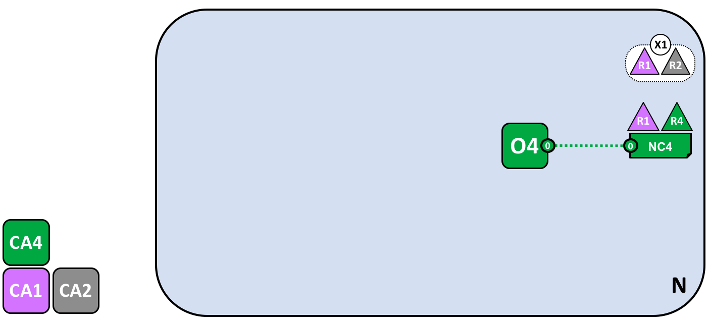
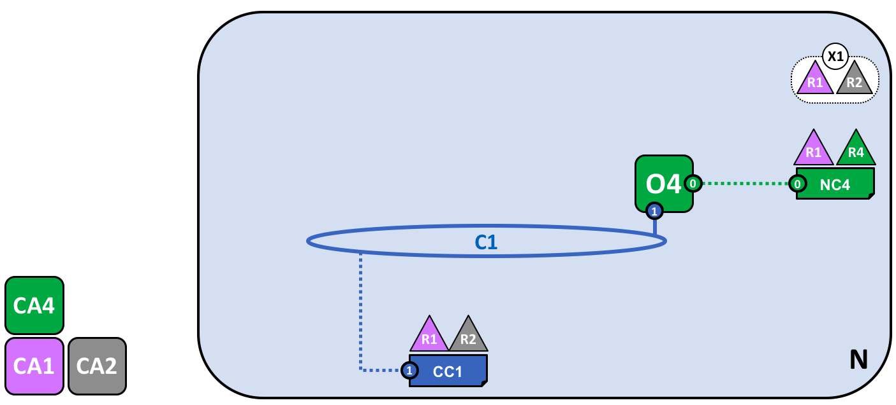
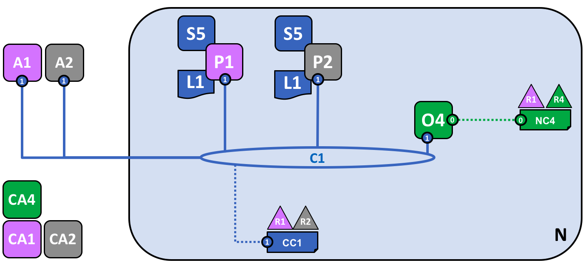
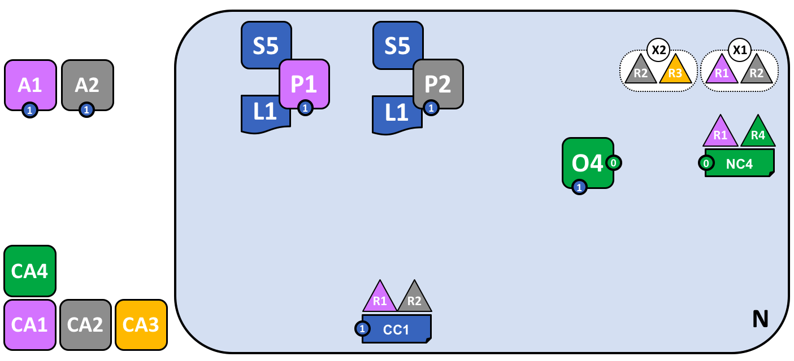
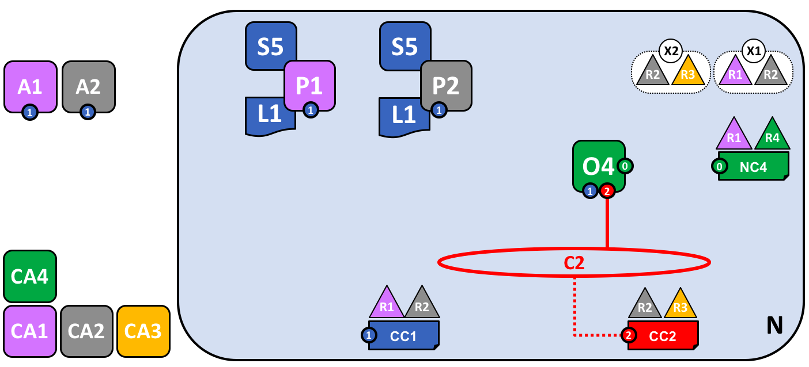
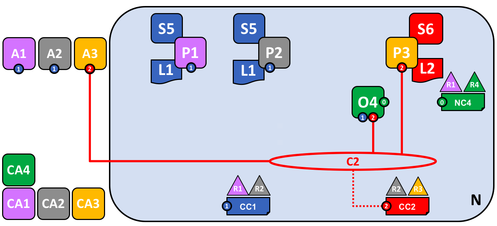
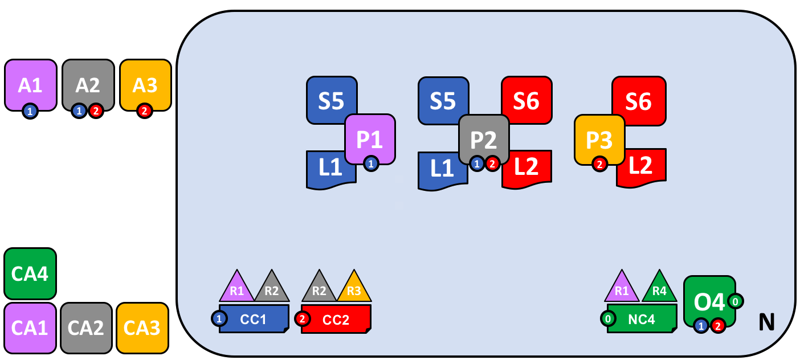

# Блокчейн-сеть

Этот раздел **на уровне ключевых идей** описывает, как Hyperledger Fabric позволяет
организациям сотрудничать в создании сетей блокчейн. Если вы архитектор, администратор или 
разработчик, этот раздел поможет вам сформировать глубокое понимание основных элементов 
структуры и процесса блокчейн-сети Hyperledger Fabric. В рамках этой темы будет использоваться 
управляемый рабочий пример, в котором будут представлены все основные компоненты блокчейн-сети.

После прочтения этого раздела и формирования понимания идей политик, вы будете иметь четкое 
представление о принимаемых организациями решениях, нужных для установления политики, 
управляющей запученную сеть Hyperledger Fabric. Вы также поймете, как организации управляют 
развитием сети с помощью дакларативной политики -- это является, ключевым отличием Hyperledger 
Fabric. Одним словом, вы поймете большинство технических компонентов Hyperledger Fabric и 
решения, которые должны быть приняты организациями по этим компонентам. 

## Что такое блокчейн-сеть?

Блокчейн сеть -- это инфраструктура, предоставляющая приложениям реестр и смарт-контракты 
(чейнкоды). Прежде всего, смарт-контракты используются для генерации транзакций, которые 
распространяются по сети и записываются в копию реестра всех узлов пиров в сети. Пользователи 
приложения могут быть конечными пользователями, использующими клиентские приложения или 
администраторами блокчейн-сети.

В большинстве случаев, некоторое количество [организаций](../glossary.html#organization) 
формируют [консорциум](../glossary.html#consortium) для создания сети и их разрешения 
определяются набором [политик](../glossary.html#policy), при настройке сети принятых
консорциумом. Более того, политики сети могут со временем меняться, если организации 
консорциума соглашаются с изменением, позже мы обсудим идею *политику изменений*.

## Пример сети

Перед тем как начать, давайте поймем, к чему мы стремимся! Здесь приведена диаграмма, 
показывающая **окончательный вид** примера сети.

Не переживайте, если она покажется вам сложной! По мере обсуждения этой темы, мы шаг за шагом 
построим сеть так, что вы увидели, как организации R1, R2, R3 и R4 способствуют развитию 
инфраструктуры сети, чтобы помочь сформировать ее. Эта инфраструктура обеспечивает 
функционирование блокчейн-сети и регулируется политикой, согласованной входящими в нее 
организациями -- например, кто может добавлять новые организации. Вы узнаете, как приложения 
используют реестры и смарт-контракты, предоставляемые блокчейн-сетью.

*Четыре организации, R1, R2, R3 и R4, вместе решили и подписали соглашение, что вместе создадут 
и будут эксплуатировать сеть Hyperledger Fabric. R4 был выдвинут в качестве инициатора сети -- 
ему были предоставлены полномочия на создание начальной версии сети. R4 не собирается 
осуществлять бизнес-транзакции в сети. R1 и R2 нуждаются в конфиденциальной связи в рамках 
общей сети, также как и R2 с R3. У организации R1 есть клиентское приложение, которможет 
осуществлять бизнес-транзакции по каналу C1. У организациц R2 также есть клиентское приложение, 
которое может осуществлять ту же работу по каналам C1 и C2. У организации R3 есть клиентское 
приложение, которое может делать эту работу по каналу C2. Узел пира P1 поддерживает копию 
реестра L1, связанного с C1. Узел пира P2 поддерживает копию реестра L1, связанного с каналом 
C1, и копию реестра L2, связанную с каналом C2. Управление сетью осуществляется в соответствии 
с правилами политик, указанных в конфигурации сети NC4, сеть контролируется организациями R1 и 
R4. Канал C1 управляется в соответствии с правилами политик, указанных в конфигурации канала 
CC1; канал контролируется организациями R1 и R2. Канал C2 управляется в соответствии с 
правилами политик, указанных в конфигурации канала CC2; канал контролируется организациями R2 и 
R3. Ordering-служба O4 служит пунктом администрирования сети для N и пользуется системным 
канал. Ordering-служба также поддерживает каналы C1 и C2, в целях проведения ordering 
транзакций в блоки для дальнейшего распроcтранения. У каждой из четырех организаций есть 
предпочтительный Certificate Authority (центр сертификации).*

## Создание сети

Начнем с создания основы сети:

*Сеть создается в момент запуска ordering-службы. В нашем примере, N, ordering-служба, 
состоящая из одного узла, O4, настроена в соответствии с конфигурацией сети NC4, которая дает 
права администратора организации R4. На уровне сети, Certificate Authority CA4 используется для 
выдачи identities администраторам и узлам сети организации R4.*

Можно видеть, что **ordering service, O4** -- первое, что определяет **сеть, N,**. Полезно 
представлять ordering-службу первоначальным административным центром сети. Как было согласовано 
заранее, O4 изначально настроена и запущена администратором из R4, а также запущена у R4. 
Конфигурация NC4 содержит политики, описывающие изначальный набор администраторских 
возможностей. Изначально это набор только дает права над сетью R4. Это изменится позже, но пока 
R4 -- единственный член сети.

### Certificate Authorities

Certificate Authority, CA4, выдает сертификаты администраторам и узлам сети. CA4 играет 
ключевую роль в нашей сети, поскольку он распространяет сертификаты X.509, которые используются 
для идентификации компонентов, относящихся к R4. Сертификаты, розданные CA4, могут также 
использоваться для подписи транзакций, чтобы показать, что организация подтверждает результат 
транзакции -- предварительное условие включения его в реестр. Давайте рассмотрим оба эти 
аспекта CA более подробно.

Во-первых, разные компоненты блокчейн-сети испоьзуют сертификаты, чтобы идентифицировать 
организации друг друга. Поэтому обычно существует несколько CA, поддерживающих блокчейн-сеть -- 
разные организации обычно используют разные CA. Мы будем использовать четыре CA в нашей сети; 
по одному на каждую организацию. Действительно, CA насктолько важны, что Hyperledger Fabric 
предоставляет встроенный (*Fabric-CA*) для помощи вам, хотя на практике организации обычно 
используют свой собственный CA.

За сопоставление сертификатов и организаций-членов отвечает структура под названием 
[Membership Services Provider (MSP)](../glossary.html#membership-services). Конфигурация сети 
NC4 использует именованное MSP для того, чтобы определить параметры сертификатов, 
выданных CA4 (CA4 связывает владельцев сертификатов с организацией R4). NC4 использует имя MSP 
в политиках, чтобы давать участникам R4 доступ к ресурсам сети. Пример такой политики: 
определить администратора из R4, который может добавлять новые организации в сеть. Мы не будет 
показывать MSP на диаграммах, так как они только загромодят их, но они очень важны.

Во-вторых, мы позже увидим, как выданные CA сертификаты находятся в центре генерации 
[транзакций](../glossary.html#transaction) и процесс проверки. Сертификаты X.509 используются в
[транзакционных proposals](../glossary.html#proposal) клиентских приложений и 
[ответов на транзакцию](../glossary.html#response) смарт-контрактов для цифровой подписи 
[транзакций](../glossary.html#transaction). Впоследствии узлы сети, хранящие копии реестра, 
проверяют подписи транзакций на валидность перед занесением транзакций в свой реестр.

Давайте повторим базовую структуру нашего примера блокчейн-сети. В ней есть ресурсы, сеть N, к 
которой есть доступ у ряда пользователей, определенных Certificate Authority CA4, который имеет 
набор прав на ресурсы в сети N, что описано в политиках, содержащихся в конфигурации сети NC4.
Все приходит в действие, когда мы запускаем узел ordering-службы O4.

## Добавление сетевых администраторов

NC4 изначально был настроен лишь предоставлять пользователям R4 администраторские права в сети.
На следующем шаге, мы разрешим пользователям организации R1 администрировать сеть. Давайте 
посмотрим, как развивается сеть:

*Организация R4 обновляет конфигурации сети, чтобы сделать R1 вторым администратором. После 
этого действия R1 и R4 имеют равные права на настройку сети.*

Мы видим добавление новой организации R1 в качестве администратора -- R1 и R4 теперь имеют 
равные права в сети. Мы также можем видеть, что был добавлен certificate authority CA1 -- для 
идентификации пользователей из R1. С этого момента пользователи и R1, и R4 могут 
администрировать сеть.

Хотя узел ordering-службы, O4, работает на инфраструктуре R4, R1 имеет такие же 
администраторские права на нее. R1 или R4 могут обновить конфигурацию сети NC4 и позволить 
организации R2 совершать некоторое количество сетевых операций. Тогда, несмотря на то, что R4 
управляет ordering-службой, а R4 обладает всеми администраторскими правами на него, R2 имеет 
ограниченные права на создание новых консорциумов. 

В своей самой простой форме, ordering-служба является одним узлом в сети, и именно это мы видим 
в примере. Ordering-службы обычно запущена на нескольких узлах сразу и может быть настроена 
так, чтобы иметь разные узлы в разных организациях. Например, мы можем запустить O4 на R4 и 
объединить ее с O2, отдельным узлом ordering-службы в организации R1. Таким образом, у нас 
будет административная структура, включающая несколько сайтов и организаций.

Мы обсудим ordering-службу чуть [позже](#the-ordering-service), сейчас давайте представлять 
ordering-службу, как об административном пункте, предоставляющем разным организациям 
контролируемый доступ в сеть.

## Создание консорциума

Хотя сеть теперь администрируется R1 и R4, мало что можно сделать. Первое, что нам нужно 
сделать -- создать консорциум. Это слово буквально означает "группа с общей судьбой" (a group 
with a shared destiny, а реестр -- shared ledger) -- поэтому это логичный выбор для группы 
организаций в блокчейн-сети. 

Давайте посмотрим, как создается консорциум:

*Сетевой администратор создает консорциум Х1, состоящий из двух членов -- организаций R1 и R2. 
Определение этого консорциума хранится в конфигурации сети NC4 и будет использовано на 
следующем шаге развития сети. CA1 и CA2 -- доверенные Certificate Authorities этих 
организаций.*

Из-за определенной настройки NC4 только R1 и R4 могут создавать новые консорциумы. Это схема 
показывает добавление нового консорциума, X1, который определяет R1 и R2 в качестве 
организаций, образующих его. Мы также можум видеть, что CA2 был добавлен для идентификации 
пользователей из R2. Заметьте, что консорциум может состоять из скольки угодно членов -- мы 
приводим двух членов в качестве простейшей конфигурации.

Почему консорциум важен? Мы можем видеть, что консорциум определяет набор организаций в сети, 
которым нужно осуществлять **транзакции** друг с другом -- в нашем случае R1 и R2. Действительно 
имеет смысл группировать организации, имеющие общие цели, и это именно то, что мы делаем.

Сеть, которая в начале контролировалась единственной организацией, сейчас контролируется большим 
набором организаций. Мы могли бы начать с того, что R1, R2 и R4 имеют общий контроль, однако так 
было проще понять.

Теперь мы используем консорциум X1 для создания важного элемента блокчейна Hyperledger Fabric -- 
**канал**.

## Создание канала для консорциума

Давайте создадим ключевой элемент блокчейн-сети Fabric -- **канал**. Канал -- это основной 
механизм связи, с помощью которого члены консорциума могут общаться друг с другом. В сети может 
быть несколько каналов, но мы начнем с одного. 

Давайте посмотрим, как первый канал добавляется в сеть:

*Канал C1 был создан для R1 и R2 с использованием определения консорциума X1. Канал управляется 
конфигурацией канала CC1, отдельной от конфигурации сети. CC1 управляется R1 и R2, обладающими 
равными правами над C1. R4 не имеет никаких прав в CC1.*

Канал C1 предоставляет механизмы конфиденциальной коммуникации для консорциума X1. Мы можем 
видеть, что канал C1 был привязан к ordering-службе O4, но больше ни к чему не привязан. На 
следующем шаге развития, мы подключим такие компоненты как клиентские приложения и узлы пиров. 
Но на текущий момент, канал представляет **потенциал** для будующих подключений.

Хотя канал C1 является частью сети N, он весьма отличен от нее. Также заметим, что организаций 
R3 и R4 нет в этом канале -- он предназначен лишь для обработки транзакций между R1 и R2. На 
предыдущем шаге мы видели, как R4 разрешила R1 создавать новые консорциумы. Полезно заметить, 
что R4 **также** разрешила R1 создавать каналы. На этой схеме канал C1 могла создать как 
организация R1, так и организация R4. Опять же заметим, что канал может иметь сколько угодно 
организаций -- мы приводим в пример две организации, так как это проще всего. 

Опять же заметим, что у канала C1 есть полностью отдельная от NC4 конфигурация, CC1. CC1 
содержит политики, управляющие правами, которые R1 и R2 имеют в канале C1 -- как мы знаем, R3 и 
R4 не имеют доступа в этот канал. R3 и R4 смогут взаимодействовать с C1 только, если их добавит 
R1 or R2 к соответствующей политике в конфигурации канала CC1. Пример показывает, кто может 
добавлять новые организации в канал. Важно заметить, что R4 не может добавить саму себя в канал 
C1 -- ее должна добавить либо R1, либо R2.

Почему каналы так важны? Каналы очень полезны, поскольку они предоставляют механизм для 
приватной коммуникации и конфиденциальных данных между членами консорциума. Каналы гарантируют 
конфиденциальность в сети и изолируют данные от других каналов. Сила Hyperledger Fabric состоит 
в том, что он позволяет иметь общую инфраструктуру, однако при этом оставлять ее 
конфиденциальной. Здесь нет никакого противоречия -- разные консорциумы в рамках сети могут 
нуждаться в отдельной информации и отдельных процессах и каналы предоставляют для этого 
механизмы. Каналы предоставляют эффиктивную распределенную инфраструктуру, но при этом 
поддерживают конфиденциальность даты и коммуникаций.

Мы также можем видеть, что как только канал создается, он становится "свободным от сети". С 
этого момента только организации, указанные в конфигурации канала, имеют над ним контроль. 
Аналогично, любое обновление конфигурации сети NC4 с этого момента не будет воздействовать на 
конфигурацию канала CC1; например, если если изменится определение консорциума X1, это не 
повлияет на членов канала C1. Таким образом, каналы полезны, поскольку они предоставляют 
возможность приватной коммуникации между организациями, состоящими в канале. Более того, данные 
канала полностью изолированы от остальной сети, включая другие каналы.

Кстати, существует специальный **системный канал** только для ordering-службы. Он ведет себя 
точно так же как и другие каналы, которые иногда называют **application** каналами (прикладными 
каналами). Мы обсудим этот канал  [чуть позже](#the-ordering-service).

## Пиры и реестры

Let's now start to use the channel to connect the blockchain network and the
organizational components together. In the next stage of network development, we
can see that our network N has just acquired two new components, namely a peer
node P1 and a ledger instance, L1.

*A peer node P1 has joined the channel C1. P1 physically hosts a copy of the
ledger L1. P1 and O4 can communicate with each other using channel C1.*

Peer nodes are the network components where copies of the blockchain ledger are
hosted!  At last, we're starting to see some recognizable blockchain components!
P1's purpose in the network is purely to host a copy of the ledger L1 for others
to access. We can think of L1 as being **physically hosted** on P1, but
**logically hosted** on the channel C1. We'll see this idea more clearly when we
add more peers to the channel.

A key part of a P1's configuration is an X.509 identity issued by CA1 which
associates P1 with organization R1. When R1 administrator takes the
action of joining peer P1 to channel C1, and the peer starts pulling blocks from
the orderer O4, the orderer uses the channel configuration
CC1 to determine P1's permissions on this channel. For example, policy in CC1
determines whether P1 (or the organization R1) can read and/or write on the
channel C1.

Notice how peers are joined to channels by the organizations that own them, and
though we've only added one peer, we'll see how  there can be multiple peer
nodes on multiple channels within the network. We'll see the different roles
that peers can take on a little later.

## Applications and Smart Contract chaincode

Now that the channel C1 has a ledger on it, we can start connecting client
applications to consume some of the services provided by workhorse of the
ledger, the peer!

Notice how the network has grown:

*A smart contract S5 has been installed onto P1.  Client application A1 in
organization R1 can use S5 to access the ledger via peer node P1. A1, P1 and
O4 are all joined to channel C1, i.e. they can all make use of the
communication facilities provided by that channel.*

In the next stage of network development, we can see that client application A1
can use channel C1 to connect to specific network resources -- in this case A1
can connect to both peer node P1 and orderer node O4. Again, see how channels
are central to the communication between network and organization components.
Just like peers and orderers, a client application will have an identity that
associates it with an organization.  In our example, client application A1 is
associated with organization R1; and although it is outside the Fabric
blockchain network, it is connected to it via the channel C1.

It might now appear that A1 can access the ledger L1 directly via P1, but in
fact, all access is managed via a special program called a smart contract
chaincode, S5. Think of S5 as defining all the common access patterns to the
ledger; S5 provides a well-defined set of ways by which the ledger L1 can
be queried or updated. In short, client application A1 has to go through smart
contract S5 to get to ledger L1!

Smart contracts can be created by application developers in each organization to
implement a business process shared by the consortium members. Smart contracts
are used to help generate transactions which can be subsequently distributed to
every node in the network. We'll discuss this idea a little later; it'll be
easier to understand when the network is bigger. For now, the important thing to
understand is that to get to this point two operations must have been performed
on the smart contract; it must have been **installed** on peers, and then
**defined** on a channel.

Hyperledger Fabric users often use the terms **smart contract** and
**chaincode** interchangeably. In general, a smart contract defines the
**transaction logic** that controls the lifecycle of a business object contained
in the world state. It is then packaged into a chaincode which is then deployed
to a blockchain network. Think of smart contracts as governing transactions,
whereas chaincode governs how smart contracts are packaged for deployment.

### Installing a chaincode package

After a smart contract S5 has been developed, an administrator in organization
R1 must create a chaincode package and [install](../glossary.html#install) it
onto peer node P1. This is a straightforward operation; once completed, P1 has
full knowledge of S5. Specifically, P1 can see the **implementation** logic of
S5 -- the program code that it uses to access the ledger L1. We contrast this to
the S5 **interface** which merely describes the inputs and outputs of S5,
without regard to its implementation.

When an organization has multiple peers in a channel, it can choose the peers
upon which it installs smart contracts; it does not need to install a smart
contract on every peer.

### Defining a chaincode

Although a chaincode is installed on the peers of individual organizations, it
is governed and operated in the scope of a channel. Each organization needs to
approve a **chaincode definition**, a set of parameters that establish how a
chaincode will be used on a channel. An organization must approve a chaincode
definition in order to use the installed smart contract to query the ledger
and endorse transactions. In our example, which only has a single peer node P1,
an administrator in organization R1 must approve a chaincode definition for S5.

A sufficient number of organizations need to approve a chaincode definition (A
majority, by default) before the chaincode definition can be committed to the
channel and used to interact with the channel ledger. Because the channel only
has one member, the administrator of R1 can commit the chaincode definition of
S5 to the channel C1. Once the definition has been committed, S5 can now be
[invoked](../glossary.html#invoke) by client application A1!

Note that although every component on the channel can now access S5, they are
not able to see its program logic.  This remains private to those nodes who have
installed it; in our example that means P1. Conceptually this means that it's
the smart contract **interface** that is defined and committed to a channel, in
contrast to the smart contract **implementation** that is installed. To reinforce
this idea; installing a smart contract shows how we think of it being
**physically hosted** on a peer, whereas a smart contract that has been defined
on a channel shows how we consider it **logically hosted** by the channel.

### Endorsement policy

The most important piece of information supplied within the chaincode definition
is the [endorsement policy](../glossary.html#endorsement-policy). It describes
which organizations must approve transactions before they will be accepted by other
organizations onto their copy of the ledger. In our sample network, transactions
can only be accepted onto ledger L1 if R1 or R2 endorse them.

Committing the chaincode definition to the channel places the endorsement policy
on the channel ledger; it enables it to be accessed by any member of the channel.
You can read more about endorsement policies in the [transaction flow topic](../txflow.html).

### Invoking a smart contract

Once a smart contract has been installed on a peer node and defined on a
channel it can be [invoked](../glossary.html#invoke) by a client application.
Client applications do this by sending transaction proposals to peers owned by
the organizations specified by the smart contract endorsement policy. The
transaction proposal serves as input to the smart contract, which uses it to
generate an endorsed transaction response, which is returned by the peer node to
the client application.

It's these transactions responses that are packaged together with the
transaction proposal to form a fully endorsed transaction, which can be
distributed to the entire network.  We'll look at this in more detail later  For
now, it's enough to understand how applications invoke smart contracts to
generate endorsed transactions.

By this stage in network development we can see that organization R1 is fully
participating in the network. Its applications -- starting with A1 -- can access
the ledger L1 via smart contract S5, to generate transactions that will be
endorsed by R1, and therefore accepted onto the ledger because they conform to
the endorsement policy.

## Network completed

Recall that our objective was to create a channel for consortium X1 --
organizations R1 and R2. This next phase of network development sees
organization R2 add its infrastructure to the network.

Let's see how the network has evolved:

*The network has grown through the addition of infrastructure from
organization R2. Specifically, R2 has added peer node P2, which hosts a copy of
ledger L1, and chaincode S5. R2 approves the same chaincode definition as R1.
P2 has also joined channel C1, as has application A2. A2 and P2 are identified
using certificates from CA2. All of this means that both applications A1 and A2
can invoke S5 on C1 either using peer node P1 or P2.*

We can see that organization R2 has added a peer node, P2, on channel C1. P2
also hosts a copy of the ledger L1 and smart contract S5. We can see that R2 has
also added client application A2 which can connect to the network via channel
C1. To achieve this, an administrator in organization R2 has created peer node
P2 and joined it to channel C1, in the same way as an administrator in R1. The
administrator also has to approve the same chaincode definition as R1.

We have created our first operational network! At this stage in network
development, we have a channel in which organizations R1 and R2 can fully
transact with each other. Specifically, this means that applications A1 and A2
can generate transactions using smart contract S5 and ledger L1 on channel C1.

### Generating and accepting transactions

In contrast to peer nodes, which always host a copy of the ledger, we see that
there are two different kinds of peer nodes; those which host smart contracts
and those which do not. In our network, every peer hosts a copy of the smart
contract, but in larger networks, there will be many more peer nodes that do not
host a copy of the smart contract. A peer can only *run* a smart contract if it
is installed on it, but it can *know* about the interface of a smart contract by
being connected to a channel.

You should not think of peer nodes which do not have smart contracts installed
as being somehow inferior. It's more the case that peer nodes with smart
contracts have a special power -- to help **generate** transactions. Note that
all peer nodes can **validate** and subsequently **accept** or **reject**
transactions onto their copy of the ledger L1. However, only peer nodes with a
smart contract installed can take part in the process of transaction
**endorsement** which is central to the generation of valid transactions.

We don't need to worry about the exact details of how transactions are
generated, distributed and accepted in this topic -- it is sufficient to
understand that we have a blockchain network where organizations R1 and R2 can
share information and processes as ledger-captured transactions.  We'll learn a
lot more about transactions, ledgers, smart contracts in other topics.

### Types of peers

In Hyperledger Fabric, while all peers are the same, they can assume multiple
roles depending on how the network is configured.  We now have enough
understanding of a typical network topology to describe these roles.

  * [*Committing peer*](../glossary.html#commitment). Every peer node in a
    channel is a committing peer. It receives blocks of generated transactions,
    which are subsequently validated before they are committed to the peer
    node's copy of the ledger as an append operation.

  * [*Endorsing peer*](../glossary.html#endorsement). Every peer with a smart
    contract *can* be an endorsing peer if it has a smart contract installed.
    However, to actually *be* an endorsing peer, the smart contract on the peer
    must be used by a client application to generate a digitally signed
    transaction response. The term *endorsing peer* is an explicit reference to
    this fact.

    An endorsement policy for a smart contract identifies the
    organizations whose peer should digitally sign a generated transaction
    before it can be accepted onto a committing peer's copy of the ledger.

These are the two major types of peer; there are two other roles a peer can
adopt:

  * [*Leader peer*](../glossary.html#leading-peer). When an organization has
    multiple peers in a channel, a leader peer is a node which takes
    responsibility for distributing transactions from the orderer to the other
    committing peers in the organization.  A peer can choose to participate in
    static or dynamic leadership selection.

    It is helpful, therefore to think of two sets of peers from leadership
    perspective -- those that have static leader selection, and those with
    dynamic leader selection. For the static set, zero or more peers can be
    configured as leaders. For the dynamic set, one peer will be elected leader
    by the set. Moreover, in the dynamic set, if a leader peer fails, then the
    remaining peers will re-elect a leader.

    It means that an organization's peers can have one or more leaders connected
    to the ordering service. This can help to improve resilience and scalability
    in large networks which process high volumes of transactions.

  * [*Anchor peer*](../glossary.html#anchor-peer). If a peer needs to
    communicate with a peer in another organization, then it can use one of the
    **anchor peers** defined in the channel configuration for that organization.
    An organization can have zero or more anchor peers defined for it, and an
    anchor peer can help with many different cross-organization communication
    scenarios.

Note that a peer can be a committing peer, endorsing peer, leader peer and
anchor peer all at the same time! Only the anchor peer is optional -- for all
practical purposes there will always be a leader peer and at least one
endorsing peer and at least one committing peer.

### Adding organizations and peers to the channel

When R2 joins the channel, the organization must install smart contract S5
onto its peer node, P2. That's obvious -- if applications A1 or A2 wish to use
S5 on peer node P2 to generate transactions, it must first be present;
installation is the mechanism by which this happens. At this point, peer node P2
has a physical copy of the smart contract and the ledger; like P1, it can both
generate and accept transactions onto its copy of ledger L1.

R2 must approve the same chaincode definition as was approved by R1 in order to
use smart contract S5. Because the chaincode definition has already been
committed to the channel by organization R1, R2 can use the chaincode as soon as
the organization approves the chaincode definition and installs the chaincode
package. The commit transaction only needs to happen once. A new organization
can use the chaincode as soon as they approve the chaincode parameters agreed to
by other members of the channel. Because the approval of a chaincode definition
occurs at the organization level, R2 can approve the chaincode definition once
and join multiple peers to the channel with the chaincode package installed.
However, if R2 wanted to change the chaincode definition, both R1 and R2 would
need to approve a new definition for their organization, and then one of the
organizations would need to commit the definition to the channel.

In our network, we can see that channel C1 connects two client applications, two
peer nodes and an ordering service.  Since there is only one channel, there is
only one **logical** ledger with which these components interact. Peer nodes P1
and P2 have identical copies of ledger L1. Copies of smart contract S5 will
usually be identically implemented using the same programming language, but
if not, they must be semantically equivalent.

We can see that the careful addition of peers to the network can help support
increased throughput, stability, and resilience. For example, more peers in a
network will allow more applications to connect to it; and multiple peers in an
organization will provide extra resilience in the case of planned or unplanned
outages.

It all means that it is possible to configure sophisticated topologies which
support a variety of operational goals -- there is no theoretical limit to how
big a network can get. Moreover, the technical mechanism by which peers within
an individual organization efficiently discover and communicate with each other --
the [gossip protocol](../gossip.html#gossip-protocol) -- will accommodate a
large number of peer nodes in support of such topologies.

The careful use of network and channel policies allow even large networks to be
well-governed.  Organizations are free to add peer nodes to the network so long
as they conform to the policies agreed by the network. Network and channel
policies create the balance between autonomy and control which characterizes a
de-centralized network.

## Simplifying the visual vocabulary

We’re now going to simplify the visual vocabulary used to represent our sample
blockchain network. As the size of the network grows, the lines initially used
to help us understand channels will become cumbersome. Imagine how complicated
our diagram would be if we added another peer or client application, or another
channel?

That's what we're going to do in a minute, so before we do, let's simplify the
visual vocabulary. Here's a simplified representation of the network we've
developed so far:

*The diagram shows the facts relating to channel C1 in the network N as follows:
Client applications A1 and A2 can use channel C1 for communication with peers
P1 and P2, and orderer O4. Peer nodes P1 and P2 can use the communication
services of channel C1. Ordering service O4 can make use of the communication
services of channel C1. Channel configuration CC1 applies to channel C1.*

Note that the network diagram has been simplified by replacing channel lines
with connection points, shown as blue circles which include the channel number.
No information has been lost. This representation is more scalable because it
eliminates crossing lines. This allows us to more clearly represent larger
networks. We've achieved this simplification by focusing on the connection
points between components and a channel, rather than the channel itself.

## Adding another consortium definition

In this next phase of network development, we introduce organization R3.  We're
going to give organizations R2 and R3 a separate application channel which
allows them to transact with each other.  This application channel will be
completely separate to that previously defined, so that R2 and R3 transactions
can be kept private to them.

Let's return to the network level and define a new consortium, X2, for R2 and
R3:

*A network administrator from organization R1 or R4 has added a new consortium
definition, X2, which includes organizations R2 and R3. This will be used to
define a new channel for X2.*

Notice that the network now has two consortia defined: X1 for organizations R1
and R2 and X2 for organizations R2 and R3. Consortium X2 has been introduced in
order to be able to create a new channel for R2 and R3.

A new channel can only be created by those organizations specifically identified
in the network configuration policy, NC4, as having the appropriate rights to do
so, i.e. R1 or R4. This is an example of a policy which separates organizations
that can manage resources at the network level versus those who can manage
resources at the channel level. Seeing these policies at work helps us
understand why Hyperledger Fabric has a sophisticated **tiered** policy
structure.

In practice, consortium definition X2 has been added to the network
configuration NC4. We discuss the exact mechanics of this operation elsewhere in
the documentation.

## Adding a new channel

Let's now use this new consortium definition, X2, to create a new channel, C2.
To help reinforce your understanding of the simpler channel notation, we've used
both visual styles -- channel C1 is represented with blue circular end points,
whereas channel C2 is represented with red connecting lines:

*A new channel C2 has been created for R2 and R3 using consortium definition X2.
The channel has a channel configuration CC2, completely separate to the network
configuration NC4, and the channel configuration CC1. Channel C2 is managed by
R2 and R3 who have equal rights over C2 as defined by a policy in CC2. R1 and
R4 have no rights defined in CC2 whatsoever.*

The channel C2 provides a private communications mechanism for the consortium
X2. Again, notice how organizations united in a consortium are what form
channels. The channel configuration CC2 now contains the policies that govern
channel resources, assigning management rights to organizations R2 and R3 over
channel C2. It is managed exclusively by R2 and R3; R1 and R4 have no power in
channel C2. For example, channel configuration CC2 can subsequently be updated
to add organizations to support network growth, but this can only be done by R2
or R3.

Note how the channel configurations CC1 and CC2 remain completely separate from
each other, and completely separate from the network configuration, NC4. Again
we're seeing the de-centralized nature of a Hyperledger Fabric network; once
channel C2 has been created, it is managed by organizations R2 and R3
independently to other network elements. Channel policies always remain separate
from each other and can only be changed by the organizations authorized to do so
in the channel.

As the network and channels evolve, so will the network and channel
configurations. There is a process by which this is accomplished in a controlled
manner -- involving configuration transactions which capture the change to these
configurations. Every configuration change results in a new configuration block
transaction being generated, and [later in this topic](#the-ordering-serivce),
we'll see how these blocks are validated and accepted to create updated network
and channel configurations respectively.

### Network and channel configurations

Throughout our sample network, we see the importance of network and channel
configurations. These configurations are important because they encapsulate the
**policies** agreed by the network members, which provide a shared reference for
controlling access to network resources. Network and channel configurations also
contain **facts** about the network and channel composition, such as the name of
consortia and its organizations.

For example, when the network is first formed using the ordering service node
O4, its behaviour is governed by the network configuration NC4. The initial
configuration of NC4 only contains policies that permit organization R4 to
manage network resources. NC4 is subsequently updated to also allow R1 to manage
network resources. Once this change is made, any administrator from organization
R1 or R4 that connects to O4 will have network management rights because that is
what the policy in the network configuration NC4 permits. Internally, each node
in the ordering service records each channel in the network configuration, so
that there is a record of each channel created, at the network level.

It means that although ordering service node O4 is the actor that created
consortia X1 and X2 and channels C1 and C2, the **intelligence** of the network
is contained in the network configuration NC4 that O4 is obeying.  As long as O4
behaves as a good actor, and correctly implements the policies defined in NC4
whenever it is dealing with network resources, our network will behave as all
organizations have agreed. In many ways NC4 can be considered more important
than O4 because, ultimately, it controls network access.

The same principles apply for channel configurations with respect to peers. In
our network, P1 and P2 are likewise good actors. When peer nodes P1 and P2 are
interacting with client applications A1 or A2 they are each using the policies
defined within channel configuration CC1 to control access to the channel C1
resources.

For example, if A1 wants to access the smart contract chaincode S5 on peer nodes
P1 or P2, each peer node uses its copy of CC1 to determine the operations that
A1 can perform. For example, A1 may be permitted to read or write data from the
ledger L1 according to policies defined in CC1. We'll see later the same pattern
for actors in channel and its channel configuration CC2.  Again, we can see that
while the peers and applications are critical actors in the network, their
behaviour in a channel is dictated more by the channel configuration policy than
any other factor.

Finally, it is helpful to understand how network and channel configurations are
physically realized. We can see that network and channel configurations are
logically singular -- there is one for the network, and one for each channel.
This is important; every component that accesses the network or the channel must
have a shared understanding of the permissions granted to different
organizations.

Even though there is logically a single configuration, it is actually replicated
and kept consistent by every node that forms the network or channel. For
example, in our network peer nodes P1 and P2 both have a copy of channel
configuration CC1, and by the time the network is fully complete, peer nodes P2
and P3 will both have a copy of channel configuration CC2. Similarly ordering
service node O4 has a copy of the network configuration, but in a [multi-node
configuration](#the-ordering-service), every ordering service node will have its
own copy of the network configuration.

Both network and channel configurations are kept consistent using the same
blockchain technology that is used for user transactions -- but for
**configuration** transactions. To change a network or channel configuration, an
administrator must submit a configuration transaction to change the network or
channel configuration. It must be signed by the organizations identified in the
appropriate policy as being responsible for configuration change. This policy is
called the **mod_policy** and we'll [discuss it later](#changing-policy).

Indeed, the ordering service nodes operate a mini-blockchain, connected via the
**system channel** we mentioned earlier. Using the system channel ordering
service nodes distribute network configuration transactions. These transactions
are used to co-operatively maintain a consistent copy of the network
configuration at each ordering service node. In a similar way, peer nodes in an
**application channel** can distribute channel configuration transactions.
Likewise, these transactions are used to maintain a consistent copy of the
channel configuration at each peer node.

This balance between objects that are logically singular, by being physically
distributed is a common pattern in Hyperledger Fabric. Objects like network
configurations, that are logically single, turn out to be physically replicated
among a set of ordering services nodes for example. We also see it with channel
configurations, ledgers, and to some extent smart contracts which are installed
in multiple places but whose interfaces exist logically at the channel level.
It's a pattern you see repeated time and again in Hyperledger Fabric, and
enables Hyperledger Fabric to be both de-centralized and yet manageable at the
same time.

## Adding another peer

Now that organization R3 is able to fully participate in channel C2, let's add
its infrastructure components to the channel.  Rather than do this one component
at a time, we're going to add a peer, its local copy of a ledger, a smart
contract and a client application all at once!

Let's see the network with organization R3's components added:

*The diagram shows the facts relating to channels C1 and C2 in the network N as
follows: Client applications A1 and A2 can use channel C1 for communication
with peers P1 and P2, and ordering service O4; client applications A3 can use
channel C2 for communication with peer P3 and ordering service O4. Ordering
service O4 can make use of the communication services of channels C1 and C2.
Channel configuration CC1 applies to channel C1, CC2 applies to channel C2.*

First of all, notice that because peer node P3 is connected to channel C2, it
has a **different** ledger -- L2 -- to those peer nodes using channel C1.  The
ledger L2 is effectively scoped to channel C2. The ledger L1 is completely
separate; it is scoped to channel C1.  This makes sense -- the purpose of the
channel C2 is to provide private communications between the members of the
consortium X2, and the ledger L2 is the private store for their transactions.

In a similar way, the smart contract S6, installed on peer node P3, and defined
on channel C2, is used to provide controlled access to ledger L2. Application A3
can now use channel C2 to invoke the services provided by smart contract S6 to
generate transactions that can be accepted onto every copy of the ledger L2 in
the network.

At this point in time, we have a single network that has two completely separate
channels defined within it.  These channels provide independently managed
facilities for organizations to transact with each other. Again, this is
de-centralization at work; we have a balance between control and autonomy. This
is achieved through policies which are applied to channels which are controlled
by, and affect, different organizations.

## Joining a peer to multiple channels

In this final stage of network development, let's return our focus to
organization R2. We can exploit the fact that R2 is a member of both consortia
X1 and X2 by joining it to multiple channels:

*The diagram shows the facts relating to channels C1 and C2 in the network N as
follows: Client applications A1 can use channel C1 for communication with peers
P1 and P2, and ordering service O4; client application A2 can use channel C1
for communication with peers P1 and P2 and channel C2 for communication with
peers P2 and P3 and ordering service O4; client application A3 can use channel
C2 for communication with peer P3 and P2 and ordering service O4. Ordering service O4
can make use of the communication services of channels C1 and C2. Channel
configuration CC1 applies to channel C1, CC2 applies to channel C2.*

We can see that R2 is a special organization in the network, because it is the
only organization that is a member of two application channels!  It is able to
transact with organization R1 on channel C1, while at the same time it can also
transact with organization R3 on a different channel, C2.

Notice how peer node P2 has smart contract S5 installed for channel C1 and smart
contract S6 installed for channel C2. Peer node P2 is a full member of both
channels at the same time via different smart contracts for different ledgers.

This is a very powerful concept -- channels provide both a mechanism for the
separation of organizations, and a mechanism for collaboration between
organizations. All the while, this infrastructure is provided by, and shared
between, a set of independent organizations.

It is also important to note that peer node P2's behaviour is controlled very
differently depending upon the channel in which it is transacting. Specifically,
the policies contained in channel configuration CC1 dictate the operations
available to P2 when it is transacting in channel C1, whereas it is the policies
in channel configuration CC2 that control P2's behaviour in channel C2.

Again, this is desirable -- R2 and R1 agreed the rules for channel C1, whereas
R2 and R3 agreed the rules for channel C2. These rules were captured in the
respective channel policies -- they can and must be used by every
component in a channel to enforce correct behaviour, as agreed.

Similarly, we can see that client application A2 is now able to transact on
channels C1 and C2.  And likewise, it too will be governed by the policies in
the appropriate channel configurations.  As an aside, note that client
application A2 and peer node P2 are using a mixed visual vocabulary -- both
lines and connections. You can see that they are equivalent; they are visual
synonyms.

### The ordering service

The observant reader may notice that the ordering service node appears to be a
centralized component; it was used to create the network initially, and connects
to every channel in the network.  Even though we added R1 and R4 to the network
configuration policy NC4 which controls the orderer, the node was running on
R4's infrastructure. In a world of de-centralization, this looks wrong!

Don't worry! Our example network showed the simplest ordering service
configuration to help you understand the idea of a network administration point.
In fact, the ordering service can itself too be completely de-centralized!  We
mentioned earlier that an ordering service could be comprised of many individual
nodes owned by different organizations, so let's see how that would be done in
our sample network.

Let's have a look at a more realistic ordering service node configuration:

*A multi-organization ordering service.  The ordering service comprises ordering
service nodes O1 and O4. O1 is provided by organization R1 and node O4 is
provided by organization R4. The network configuration NC4 defines network
resource permissions for actors from both organizations R1 and R4.*

We can see that this ordering service completely de-centralized -- it runs in
organization R1 and it runs in organization R4. The network configuration
policy, NC4, permits R1 and R4 equal rights over network resources.  Client
applications and peer nodes from organizations R1 and R4 can manage network
resources by connecting to either node O1 or node O4, because both nodes behave
the same way, as defined by the policies in network configuration NC4. In
practice, actors from a particular organization *tend* to use infrastructure
provided by their home organization, but that's certainly not always the case.

### De-centralized transaction distribution

As well as being the management point for the network, the ordering service also
provides another key facility -- it is the distribution point for transactions.
The ordering service is the component which gathers endorsed transactions
from applications and orders them into transaction blocks, which are
subsequently distributed to every peer node in the channel. At each of these
committing peers, transactions are recorded, whether valid or invalid, and their
local copy of the ledger updated appropriately.

Notice how the ordering service node O4 performs a very different role for the
channel C1 than it does for the network N. When acting at the channel level,
O4's role is to gather transactions and distribute blocks inside channel C1. It
does this according to the policies defined in channel configuration CC1. In
contrast, when acting at the network level, O4's role is to provide a management
point for network resources according to the policies defined in network
configuration NC4. Notice again how these roles are defined by different
policies within the channel and network configurations respectively. This should
reinforce to you the importance of declarative policy based configuration in
Hyperledger Fabric. Policies both define, and are used to control, the agreed
behaviours by each and every member of a consortium.

We can see that the ordering service, like the other components in Hyperledger
Fabric, is a fully de-centralized component. Whether acting as a network
management point, or as a distributor of blocks in a channel, its nodes can be
distributed as required throughout the multiple organizations in a network.

### Changing policy

Throughout our exploration of the sample network, we've seen the importance of
the policies to control the behaviour of the actors in the system. We've only
discussed a few of the available policies, but there are many that can be
declaratively defined to control every aspect of behaviour. These individual
policies are discussed elsewhere in the documentation.

Most importantly of all, Hyperledger Fabric provides a uniquely powerful policy
that allows network and channel administrators to manage policy change itself!
The underlying philosophy is that policy change is a constant, whether it occurs
within or between organizations, or whether it is imposed by external
regulators. For example, new organizations may join a channel, or existing
organizations may have their permissions increased or decreased. Let's
investigate a little more how change policy is implemented in Hyperledger
Fabric.

The key point of understanding is that policy change is managed by a
policy within the policy itself.  The **modification policy**, or
**mod_policy** for short, is a first class policy within a network or channel
configuration that manages change. Let's give two brief examples of how we've
**already** used mod_policy to manage change in our network!

The first example was when the network was initially set up. At this time, only
organization R4 was allowed to manage the network. In practice, this was
achieved by making R4 the only organization defined in the network configuration
NC4 with permissions to network resources.  Moreover, the mod_policy for NC4
only mentioned organization R4 -- only R4 was allowed to change this
configuration.

We then evolved the network N to also allow organization R1 to administer the
network.  R4 did this by adding R1 to the policies for channel creation and
consortium creation. Because of this change, R1 was able to define the
consortia X1 and X2, and create the channels C1 and C2. R1 had equal
administrative rights over the channel and consortium policies in the network
configuration.

R4 however, could grant even more power over the network configuration to R1! R4
could add R1 to the mod_policy such that R1 would be able to manage change of
the network policy too.

This second power is much more powerful than the first, because R1 now has
**full control** over the network configuration NC4! This means that R1 can, in
principle remove R4's management rights from the network.  In practice, R4 would
configure the mod_policy such that R4 would need to also approve the change, or
that all organizations in the mod_policy would have to approve the change.
There's lots of flexibility to make the mod_policy as sophisticated as it needs
to be to support whatever change process is required.

This is mod_policy at work -- it has allowed the graceful evolution of a basic
configuration into a sophisticated one. All the time this has occurred with the
agreement of all organization involved. The mod_policy behaves like every other
policy inside a network or channel configuration; it defines a set of
organizations that are allowed to change the mod_policy itself.

We've only scratched the surface of the power of policies and mod_policy in
particular in this subsection. It is discussed at much more length in the policy
topic, but for now let's return to our finished network!

## Network fully formed

Let's recap what our network looks like using a consistent visual vocabulary.
We've re-organized it slightly using our more compact visual syntax, because it
better accommodates larger topologies:

*In this diagram we see that the Fabric blockchain network consists of two
application channels and one ordering channel. The organizations R1 and R4 are
responsible for the ordering channel, R1 and R2 are responsible for the blue
application channel while R2 and R3 are responsible for the red application
channel. Client applications A1 is an element of organization R1, and CA1 is
it's certificate authority. Note that peer P2 of organization R2 can use the
communication facilities of the blue and the red application channel. Each
application channel has its own channel configuration, in this case CC1 and
CC2. The channel configuration of the system channel is part of the network
configuration, NC4.*

We're at the end of our conceptual journey to build a sample Hyperledger Fabric
blockchain network. We've created a four organization network with two channels
and three peer nodes, with two smart contracts and an ordering service.  It is
supported by four certificate authorities. It provides ledger and smart contract
services to three client applications, who can interact with it via the two
channels. Take a moment to look through the details of the network in the
diagram, and feel free to read back through the topic to reinforce your
knowledge, or go to a more detailed topic.

### Summary of network components

Here's a quick summary of the network components we've discussed:

* [Ledger](../glossary.html#ledger). One per channel. Comprised of the
  [Blockchain](../glossary.html#block) and
  the [World state](../glossary.html#world-state)
* [Smart contract](../glossary.html#smart-contract) (aka chaincode)
* [Peer nodes](../glossary.html#peer)
* [Ordering service](../glossary.html#ordering-service)
* [Channel](../glossary.html#channel)
* [Certificate Authority](../glossary.html#hyperledger-fabric-ca)

## Network summary

In this topic, we've seen how different organizations share their infrastructure
to provide an integrated Hyperledger Fabric blockchain network.  We've seen how
the collective infrastructure can be organized into channels that provide
private communications mechanisms that are independently managed.  We've seen
how actors such as client applications, administrators, peers and orderers are
identified as being from different organizations by their use of certificates
from their respective certificate authorities.  And in turn, we've seen the
importance of policy to define the agreed permissions that these organizational
actors have over network and channel resources.
