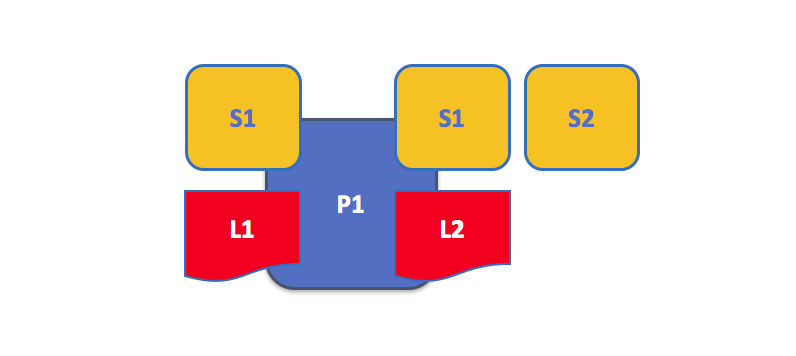
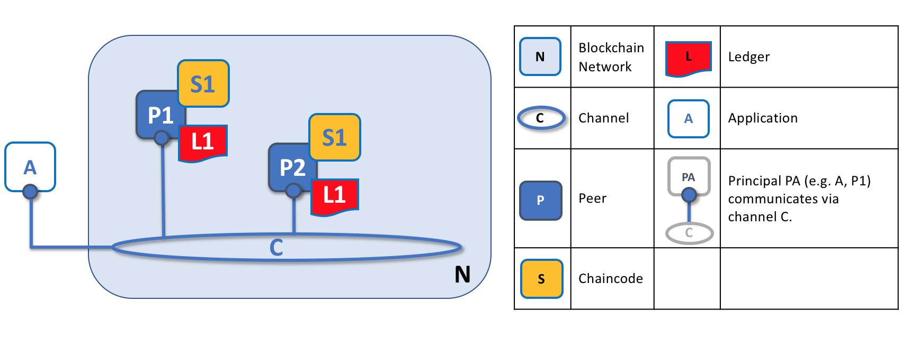

# Пиры

Пиры являются важнейшими элементами блокчейн-сети, поскольку они хранят реестры и смартконтракты. Напомним, что реестр записывает 
(без возможности последующего редактирования) транзакции, созданные смартконтрактами.

Другие элементы блокчейн-сети также, конечно, очень важны: реестры, смартконтракты, ordering-службы, 
политики, каналы, приложения, организации, identities, membership --- о них можно 
почитать в разделах, специально посвященным им. В этом разделе идет речь о пирах и их отношениях 
с остальными элементами сети Fabric.

*Блокчейн-сеть состоит из пиров, каждый из которых может хранить копии реестров и копии 
смартконтрактов. В этом примере, сеть  N состоит из пиров P1, P2 и P3, каждый из которых хранит 
свою копию распределенного реестра L1. P1, P2 и P3 используют один и тот же чейнкод S1, для обеспечения
доступа в свою копию распределенного реестра*.

Пиры можно создавать, запускать, останавливать, перенастраивать и даже удалять. Они 
предоставляют набор API, который позволяет администраторам и приложениям взаимодействовать с 
услугами, которые они предоставляют. Мы узнаем больше про эти услуги ниже.

### Пара слов о терминологии

**Смартконтракты** реализованы в Fabric с помощью чейнкода --- куска кода, 
который имеет доступ к реестру и написан на одном из поддерживаемых языков программирования. В 
этой теме мы будем чаще использовать термин **чейнкод**, но вы можете читать этот термин как 
**смартконтракт**, если так вам привычнее. Если вы хотите узнать больше о 
чейнкодах и смартконтрактах, ознакомьтесь с
[документацией про чейнкоды и смартконтракты](../smartcontract/smartcontract.html).

## Реестры и чейнкод

Давайте присмотримся к пиру. Мы видим, что этот пир хранит и реестр, и чейнкод. Точнее пир 
хранит *копию* реестра и *копию* чейнкода. Заметьте, благодаря этому Fabric избегает единичных 
точек сбоя. Мы узнаем больше о децентрализованности и распределенности блокчейн-сети позже в 
этом разделе.

*Пир хранит копии реестров и чейнкодов. В этом примере, P1 хранит копию реестра L1 и копию 
чейнкода S1. Отдельно взятый пир может хранить много реестров и чейнкодов.*

Поскольку пир хранит реестры и чейнкоды, приложения и администраторы для получения доступа к 
этим ресурсам взаимодействуют с пиром. Именно поэтому пиры считаются важными элементами в сети 
Fabric. Только что созданный пир не имеет ни копии реестра, ни копии чейнкода. Позже мы увидим, 
как у пиров создаются реестры и устанавливаются чейнкоды. 

### Несколько реестров

Пир способен хранить больше одного реестра, что полезно, поскольку так архитектура системы 
становится более гибкой. В простейшей конфигурации пир управляет единственным реестром, но, если 
пир хранит два и более реестра, это абсолютно нормально.

*Пиры хранят один или более реестр и каждый реестр имеет чейнкоды, которые 
пополняют его. В нашем примере пир P1 хранит реестры L1 и L2. Доступ к реестр L1 осуществляется 
с помощью чейнкода S1. Доступ к реестру L2 же осуществляется с использованием чейнкодов S1 и 
S2.*

У подавляющего большинства пиров установлен хотя 
бы один чейнкод, с помощью которого можно запросить или обновить копию реестра пира. Стоит 
упомянуть, что вне зависимости от того, установили ли пользователи чейнкод для использования 
внешними приложениями, у пиров всегда есть специальные **системные чейнкоды**. Мы обсудим это 
более детально позже.

### Несколько чейнкодов

Между количеством реестров и количеством чейнкодов отдельного пира нет установленного 
соотношения. Пир может иметь много чейнкодов и много реестров, доступных чейнкодам.

*Каждый реестр может иметь много чейнкодов, у которых есть к нему доступ. В нашем примере пир P1 
хранит реестры L1 и L2, причем L1 доступен чейнкодам S1 and S2, а L2 доступен S1 and S3. Мы 
видим, что S1 имеет доступу и к L1, и к L2.*

Позже мы поймем почему **каналы** в Fabric при хранении нескольких реестров или чейнкодов одним 
пиром так важны.

## Приложения и пиры

Сейчас мы увидим, как приложения взаимодействуют с пирами, если хотят получить доступ к реестру. 
Взаимодействия типа запрос в реестр состоят из трехступенчатого диалога между пиром и 
приложением, взаимодействия типа обновления требуют на два шага больше. Мы упростили эти шаги, 
чтобы упростить вам начало работы с Fabric, но не волнуйтесь --- самое важное --- понять разницу 
между запросами в реестр и обновлениями реестра.

Приложения подключаются к пирам, когда им нужен доступ к реестрам и чейнкодам. Fabric Software 
Development Kit (SDK) упрощает это для программистов --- его API позволяет приложениям 
подключаться к пирам, запускать чейнкоды для генерации транзакций, распространять в сеть 
транзакции, которые впоследствии будут упорядочены, проверены и сохранены в распределенный 
реестр, и получать информацию о событиях после завершения этого процесса.

Через подключение к пирам приложения могут запускать чейнкоды для запросов в реестр или 
обновлений его. Результат транзакции запроса в реестр возвращается сразу же, а для обновления 
реестра нужно более сложное взаимодействие между приложениями, пирами и ordering-службами. 
Давайте рассмотрим процесс более детально.

*Пиры вместе с ordering-службами обеспечивают актуальность реестра на каждом пире. В нашем 
примере приложение A подключается к P1 и запускает чейнкод S1 для запроса в реестр L1 или его 
обновления. P1 запускает S1 для генерации ответа на proposal, содержащего результат запроса или 
proposal на обновление реестра. Приложение A получает ответ на proposal и на этом завершается 
процесс запроса. В случае же обновлений A составляет из всех ответов транзакцию и посылает ее O1 
для упорядочивания. O1 собирает транзакции со всей сети в блоки и распространяет их пирам всей 
сети, в том числе P1. P1 проверяет транзакцию перед сохранением в L1. После обновления L1 P1 
создает событие, которое для приложения A означает окончание процесса.*

Пир сразу же возвращает результат запроса приложению, так как вся необходимая информация 
находится в локальной копии реестра пира. Пиры не взаимодействуют друг с другом для отправки 
приложению ответа на запрос. Однако приложения могут подключиться к нескольким пирам для одного и 
того же запроса; например, для сопостовления результатов от разных пиров или для получения более 
актуальтой информации, при подозрении, что информация могла устареть. На схеме можно видеть, что 
запрос это простой трехступенчатый процесс.

Транзакция обновления начинается так же, как и транзакция запроса, но содержит на два шага 
больше. Хотя приложения, обновляющие реестр, тоже подключаются к пиру для запуска чейнкода, в 
отличие от приложений, запрашивающих реестр, пир не может в одиночку обновить реестр, поскольку 
остальные пиры должны согласиться на изменениях, иначе **консенсус может быть не достигнут**. 
Так, пиры возвращают **свое** подтверждение обновления, которое будет применено в случае согласия 
всех остальных пиров. Первый дополнительный шаг --- четвертый --- требует, чтобы приложения 
послали соответствующий набор предлагаемых обновлений всей сети пиров в виде транзакций для 
сохранения в их реестры. Это достигается с использованием ordering-службы, упаковывающей 
транзакции в блоки и распространяющей их по всей сети пиров, после чего их подтверждают перед 
занесением в реестр. Процесс упорядочивания происходит какое-то время (порядка секунд), 
приложение асинхронно уведомляется, как и показано на пятом шаге.

Позже в этом разделе вы узнаете больше о процессе упорядочивания --- но можете ознакомиться с 
темой [Transaction Flow](../txflow.html) для более подробной информации.

## Пиры и каналы

Хотя этот раздел скорее о пирах, чем о каналах, можно потратить немного времени, чтобы понять, 
как пиры взаимодействуют друг с другом и приложениями с помощью *каналов* --- механизма, с 
помощью которого набор компонент блокчейн-сети может коммуницировать и совершать транзакции 
*конфиденциально*.

Этими компонентами обычно являются пиры, ordering-узлы и приложения. Присоединяясь к каналу, они 
соглашаются совместно использовать и управлять идентичными копиями реестра этого канала. Можно 
думать о канале как о группе друзей (хотя члены канала, конечно, не обязаны дружить). Человек 
может иметь несколько групп друзей, с каждой из которых у него есть определенные занятия. Эти 
группы могут быть как изолированы друг от друга (группа друзей по работе и группа школьных 
друзей) или могут пересекаться. Тем не менее у каждой группы есть собственная структура и 
своеобразные "правила".

*Каналы позволяют определенной группе пиров и приложений клммуницировать друг с другом в 
блокчейн-сети. В этом примере, приложение A может напрямую контактировать с пирами P1 и P2 при 
помощи канала C. (Для простоты ordering-службы не показаны на нашей схеме, но в функционирующей 
сети должны быть.)*

Важно понять, что пиры предоставляют "контрольный пункт" для доступа к каналам и управлению ими.

## Пиры и организации

Теперь, когда вы понимаете, что такое пиры и их отношения с реестром, чейнкодами и каналами, вы 
сможете понять, как несколько организаций объединяются для формирования блокчейн-сети.

Блокчейн-сети администрируются набором организаций, а не одной организацией. Пиры играют 
центральную роль в создании такого рода распределенной сети, поскольку они принадлежат этим 
организациям и служат для них точками соединения с сетью. 

*Пиры в блокчейн-сети из нескольких организаций. Блокчейн-сеть состоит из пиров, принадлежащих 
разным организациям. В нашем примере четыре организации предоставили восемь пиров для 
формирования сети. Канал C объединяет пять из этих пиров сети N --- P1, P3, P5, P7 и P8. Другие 
пиры, принадлежащие этим организациям не включены в канал, но, как правило, включены хотя бы в 
один канал. Приложения, разработанные одной конкретной организацией подключаются к пирам своей 
организации, а также пирам других организаций. Опять же, для простоты ordering-узла нет на этой 
схеме.*

It's really important that you can see what's happening in the formation of a
blockchain network. *The network is both formed and managed by the multiple
organizations who contribute resources to it.* Peers are the resources that
we're discussing in this topic, but the resources an organization provides are
more than just peers. There's a principle at work here --- the network literally
does not exist without organizations contributing their individual resources to
the collective network. Moreover, the network grows and shrinks with the
resources that are provided by these collaborating organizations.

You can see that (other than the ordering service) there are no centralized
resources --- in the [example above](#Peer8), the network, **N**, would not exist
if the organizations did not contribute their peers. This reflects the fact that
the network does not exist in any meaningful sense unless and until
organizations contribute the resources that form it. Moreover, the network does
not depend on any individual organization --- it will continue to exist as long
as one organization remains, no matter which other organizations may come and
go. This is at the heart of what it means for a network to be decentralized.

Applications in different organizations, as in the [example above](#Peer8), may
or may not be the same. That's because it's entirely up to an organization as to how
its applications process their peers' copies of the ledger. This means that both
application and presentation logic may vary from organization to organization
even though their respective peers host exactly the same ledger data.

Applications connect either to peers in their organization, or peers in another
organization, depending on the nature of the ledger interaction that's required.
For ledger-query interactions, applications typically connect to their own
organization's peers. For ledger-update interactions, we'll see later why
applications need to connect to peers representing *every* organization that is
required to endorse the ledger update.

## Peers and Identity

Now that you've seen how peers from different organizations come together to
form a blockchain network, it's worth spending a few moments understanding how
peers get assigned to organizations by their administrators.

Peers have an identity assigned to them via a digital certificate from a
particular certificate authority. You can read lots more about how X.509
digital certificates work elsewhere in this guide but, for now, think of a
digital certificate as being like an ID card that provides lots of verifiable
information about a peer. *Each and every peer in the network is assigned a
digital certificate by an administrator from its owning organization*.

*When a peer connects to a channel, its digital certificate identifies its
owning organization via a channel MSP. In this example, P1 and P2 have
identities issued by CA1. Channel C determines from a policy in its channel
configuration that identities from CA1 should be associated with Org1 using
ORG1.MSP. Similarly, P3 and P4 are identified by ORG2.MSP as being part of
Org2.*

Whenever a peer connects using a channel to a blockchain network, *a policy in
the channel configuration uses the peer's identity to determine its
rights.* The mapping of identity to organization is provided by a component
called a *Membership Service Provider* (MSP) --- it determines how a peer gets
assigned to a specific role in a particular organization and accordingly gains
appropriate access to blockchain resources. Moreover, a peer can be owned only
by a single organization, and is therefore associated with a single MSP. We'll
learn more about peer access control later in this section, and there's an entire
section on MSPs and access control policies elsewhere in this guide. But for now,
think of an MSP as providing linkage between an individual identity and a
particular organizational role in a blockchain network.

To digress for a moment, peers as well as *everything that interacts with a
blockchain network acquire their organizational identity from their digital
certificate and an MSP*. Peers, applications, end users, administrators and
orderers must have an identity and an associated MSP if they want to interact
with a blockchain network. *We give a name to every entity that interacts with
a blockchain network using an identity --- a principal.* You can learn lots
more about principals and organizations elsewhere in this guide, but for now
you know more than enough to continue your understanding of peers!

Finally, note that it's not really important where the peer is physically
located --- it could reside in the cloud, or in a data centre owned by one
of the organizations, or on a local machine --- it's the digital certificate
associated with it that identifies it as being owned by a particular organization.
In our example above, P3 could be hosted in Org1's data center, but as long as the
digital certificate associated with it is issued by CA2, then it's owned by
Org2.

## Peers and Orderers

We've seen that peers form the basis for a blockchain network, hosting ledgers
and smart contracts which can be queried and updated by peer-connected applications.
However, the mechanism by which applications and peers interact with each other
to ensure that every peer's ledger is kept consistent with each other is mediated
by special nodes called *orderers*, and it's to these nodes we now turn our
attention.

An update transaction is quite different from a query transaction because a single
peer cannot, on its own, update the ledger --- updating requires the consent of other
peers in the network. A peer requires other peers in the network to approve a
ledger update before it can be applied to a peer's local ledger. This process is
called *consensus*, which takes much longer to complete than a simple query. But when
all the peers required to approve the transaction    do so, and the transaction is
committed to the ledger, peers will notify their connected applications that the
ledger has been updated. You're about to be shown a lot more detail about how
peers and orderers manage the consensus process in this section.

Specifically, applications that want to update the ledger are involved in a
3-phase process, which ensures that all the peers in a blockchain network keep
their ledgers consistent with each other. 

* In the first phase, applications work with a subset of *endorsing peers*, each of
  which provide an endorsement of the proposed ledger update to the application,
  but do not apply the proposed update to their copy of the ledger.
* In the second phase, these separate endorsements are collected together
  as transactions and packaged into blocks.
* In the third and final phase, these blocks are distributed back to every peer where
  each transaction is validated before being committed to that peer's copy of the ledger.

As you will see, orderer nodes are central to this process, so let's
investigate in a little more detail how applications and peers use orderers to
generate ledger updates that can be consistently applied to a distributed,
replicated ledger.

### Phase 1: Proposal

Phase 1 of the transaction workflow involves an interaction between an
application and a set of peers --- it does not involve orderers. Phase 1 is only
concerned with an application asking different organizations' endorsing peers to
agree to the results of the proposed chaincode invocation.

To start phase 1, applications generate a transaction proposal which they send
to each of the required set of peers for endorsement. Each of these *endorsing peers* then
independently executes a chaincode using the transaction proposal to
generate a transaction proposal response. It does not apply this update to the
ledger, but rather simply signs it and returns it to the application. Once the
application has received a sufficient number of signed proposal responses,
the first phase of the transaction flow is complete. Let's examine this phase in
a little more detail.

*Transaction proposals are independently executed by peers who return endorsed
proposal responses. In this example, application A1 generates transaction T1
proposal P which it sends to both peer P1 and peer P2 on channel C. P1 executes
S1 using transaction T1 proposal P generating transaction T1 response R1 which
it endorses with E1. Independently, P2 executes S1 using transaction T1
proposal P generating transaction T1 response R2 which it endorses with E2.
Application A1 receives two endorsed responses for transaction T1, namely E1
and E2.*

Initially, a set of peers are chosen by the application to generate a set of
proposed ledger updates. Which peers are chosen by the application? Well, that
depends on the *endorsement policy* (defined for a chaincode), which defines
the set of organizations that need to endorse a proposed ledger change before it
can be accepted by the network. This is literally what it means to achieve
consensus --- every organization who matters must have endorsed the proposed
ledger change *before* it will be accepted onto any peer's ledger.

A peer endorses a proposal response by adding its digital signature, and signing
the entire payload using its private key. This endorsement can be subsequently
used to prove that this organization's peer generated a particular response. In
our example, if peer P1 is owned by organization Org1, endorsement E1
corresponds to a digital proof that "Transaction T1 response R1 on ledger L1 has
been provided by Org1's peer P1!".

Phase 1 ends when the application receives signed proposal responses from
sufficient peers. We note that different peers can return different and
therefore inconsistent transaction responses to the application *for the same
transaction proposal*. It might simply be that the result was generated at
different times on different peers with ledgers at different states, in which
case an application can simply request a more up-to-date proposal response. Less
likely, but much more seriously, results might be different because the chaincode
is *non-deterministic*. Non-determinism is the enemy of chaincodes
and ledgers and if it occurs it indicates a serious problem with the proposed
transaction, as inconsistent results cannot, obviously, be applied to ledgers.
An individual peer cannot know that their transaction result is
non-deterministic --- transaction responses must be gathered together for
comparison before non-determinism can be detected. (Strictly speaking, even this
is not enough, but we defer this discussion to the transaction section, where
non-determinism is discussed in detail.)

At the end of phase 1, the application is free to discard inconsistent
transaction responses if it wishes to do so, effectively terminating the
transaction workflow early. We'll see later that if an application tries to use
an inconsistent set of transaction responses to update the ledger, it will be
rejected.

### Phase 2: Ordering and packaging transactions into blocks

The second phase of the transaction workflow is the packaging phase. The orderer
is pivotal to this process --- it receives transactions containing endorsed
transaction proposal responses from many applications, and orders the
transactions into blocks. For more details about the
ordering and packaging phase, check out our
[conceptual information about the ordering phase](../orderer/ordering_service.html#phase-two-ordering-and-packaging-transactions-into-blocks).

### Phase 3: Validation and commit

At the end of phase 2, we see that orderers have been responsible for the simple
but vital processes of collecting proposed transaction updates, ordering them,
and packaging them into blocks, ready for distribution to the peers.

The final phase of the transaction workflow involves the distribution and
subsequent validation of blocks from the orderer to the peers, where they can be
committed to the ledger. Specifically, at each peer, every transaction within a
block is validated to ensure that it has been consistently endorsed by all
relevant organizations before it is committed to the ledger. Failed transactions
are retained for audit, but are not committed to the ledger.

*The second role of an orderer node is to distribute blocks to peers. In this
example, orderer O1 distributes block B2 to peer P1 and peer P2. Peer P1
processes block B2, resulting in a new block being added to ledger L1 on P1.
In parallel, peer P2 processes block B2, resulting in a new block being added
to ledger L1 on P2. Once this process is complete, the ledger L1 has been
consistently updated on peers P1 and P2, and each may inform connected
applications that the transaction has been processed.*

Phase 3 begins with the orderer distributing blocks to all peers connected to
it. Peers are connected to orderers on channels such that when a new block is
generated, all of the peers connected to the orderer will be sent a copy of the
new block. Each peer will process this block independently, but in exactly the
same way as every other peer on the channel. In this way, we'll see that the
ledger can be kept consistent. It's also worth noting that not every peer needs
to be connected to an orderer --- peers can cascade blocks to other peers using
the **gossip** protocol, who also can process them independently. But let's
leave that discussion to another time!

Upon receipt of a block, a peer will process each transaction in the sequence in
which it appears in the block. For every transaction, each peer will verify that
the transaction has been endorsed by the required organizations according to the
*endorsement policy* of the chaincode which generated the transaction. For
example, some transactions may only need to be endorsed by a single
organization, whereas others may require multiple endorsements before they are
considered valid. This process of validation verifies that all relevant
organizations have generated the same outcome or result. Also note that this
validation is different than the endorsement check in phase 1, where it is the
application that receives the response from endorsing peers and makes the
decision to send the proposal transactions. In case the application violates
the endorsement policy by sending wrong transactions, the peer is still able to
reject the transaction in the validation process of phase 3.

If a transaction has been endorsed correctly, the peer will attempt to apply it
to the ledger. To do this, a peer must perform a ledger consistency check to
verify that the current state of the ledger is compatible with the state of the
ledger when the proposed update was generated. This may not always be possible,
even when the transaction has been fully endorsed. For example, another
transaction may have updated the same asset in the ledger such that the
transaction update is no longer valid and therefore can no longer be applied. In
this way, the ledger is kept consistent across each peer in the channel because
they each follow the same rules for validation.

After a peer has successfully validated each individual transaction, it updates
the ledger. Failed transactions are not applied to the ledger, but they are
retained for audit purposes, as are successful transactions. This means that
peer blocks are almost exactly the same as the blocks received from the orderer,
except for a valid or invalid indicator on each transaction in the block.

We also note that phase 3 does not require the running of chaincodes --- this is
done only during phase 1, and that's important. It means that chaincodes only have
to be available on endorsing nodes, rather than throughout the blockchain
network. This is often helpful as it keeps the logic of the chaincode
confidential to endorsing organizations. This is in contrast to the output of
the chaincodes (the transaction proposal responses) which are shared with every
peer in the channel, whether or not they endorsed the transaction. This
specialization of endorsing peers is designed to help scalability and confidentiality.

Finally, every time a block is committed to a peer's ledger, that peer
generates an appropriate *event*. *Block events* include the full block content,
while *block transaction events* include summary information only, such as
whether each transaction in the block has been validated or invalidated.
*Chaincode* events that the chaincode execution has produced can also be
published at this time. Applications can register for these event types so
that they can be notified when they occur. These notifications conclude the
third and final phase of the transaction workflow.

In summary, phase 3 sees the blocks which are generated by the orderer
consistently applied to the ledger. The strict ordering of transactions into
blocks allows each peer to validate that transaction updates are consistently
applied across the blockchain network.

### Orderers and Consensus

This entire transaction workflow process is called *consensus* because all peers
have reached agreement on the order and content of transactions, in a process
that is mediated by orderers. Consensus is a multi-step process and applications
are only notified of ledger updates when the process is complete --- which may
happen at slightly different times on different peers.

We will discuss orderers in a lot more detail in a future orderer topic, but for
now, think of orderers as nodes which collect and distribute proposed ledger
updates from applications for peers to validate and include on the ledger.

That's it! We've now finished our tour of peers and the other components that
they relate to in Fabric. We've seen that peers are in many ways the
most fundamental element --- they form the network, host chaincodes and the
ledger, handle transaction proposals and responses, and keep the ledger
up-to-date by consistently applying transaction updates to it.

<!--- Licensed under Creative Commons Attribution 4.0 International License
https://creativecommons.org/licenses/by/4.0/) -->
