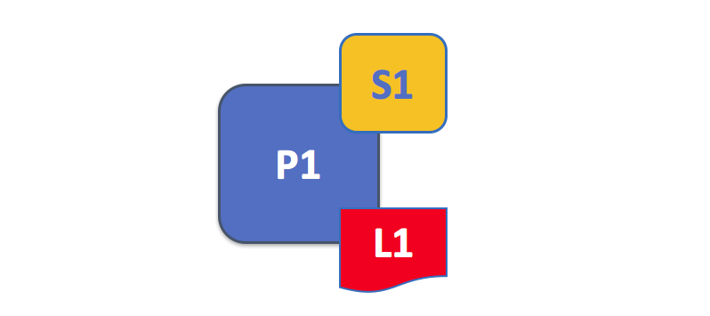

# Пиры

Пиры являются важнейшими элементами блокчейн-сети, поскольку они хранят реестры и смартконтракты. Напомним, что реестр записывает 
(без возможности последующего редактирования) транзакции, созданные смартконтрактами.

Другие элементы блокчейн-сети также, конечно, очень важны: реестры, смартконтракты, ordering-службы, 
политики, каналы, приложения, организации, identities, membership --- о них можно 
почитать в разделах, специально посвященным им. В этом разделе идет речь о пирах и их отношениях 
с остальными элементами сети Fabric.

*Блокчейн-сеть состоит из пиров, каждый из которых может хранить копии реестров и копии 
смартконтрактов. В этом примере, сеть  N состоит из пиров P1, P2 и P3, каждый из которых хранит 
свою копию распределенного реестра L1. P1, P2 и P3 используют один и тот же чейнкод S1, для обеспечения
доступа в свою копию распределенного реестра*.

Пиры можно создавать, запускать, останавливать, перенастраивать и даже удалять. Они 
предоставляют набор API, который позволяет администраторам и приложениям взаимодействовать с 
услугами, которые они предоставляют. Мы узнаем больше про эти услуги ниже.

### Пара слов о терминологии

**Смартконтракты** реализованы в Fabric с помощью чейнкода --- куска кода, 
который имеет доступ к реестру и написан на одном из поддерживаемых языков программирования. В 
этой теме мы будем чаще использовать термин **чейнкод**, но вы можете читать этот термин как 
**смартконтракт**, если так вам привычнее. Если вы хотите узнать больше о 
чейнкодах и смартконтрактах, ознакомьтесь с
[документацией про чейнкоды и смартконтракты](../smartcontract/smartcontract.html).

## Реестры и чейнкод

Давайте присмотримся к пиру. Мы видим, что этот пир хранит и реестр, и чейнкод. Точнее пир 
хранит *копию* реестра и *копию* чейнкода. Заметьте, благодаря этому Fabric избегает единичных 
точек сбоя. Мы узнаем больше о децентрализованности и распределенности блокчейн-сети позже в 
этом разделе.

*Пир хранит копии реестров и чейнкодов. В этом примере, P1 хранит копию реестра L1 и копию 
чейнкода S1. Отдельно взятый пир может хранить много реестров и чейнкодов.*

Поскольку пир хранит реестры и чейнкоды, приложения и администраторы для получения доступа к 
этим ресурсам взаимодействуют с пиром. Именно поэтому пиры считаются важными элементами в сети 
Fabric. Только что созданный пир не имеет ни копии реестра, ни копии чейнкода. Позже мы увидим, 
как у пиров создаются реестры и устанавливаются чейнкоды. 

### Несколько реестров

Пир способен хранить больше одного реестра, что полезно, поскольку так архитектура системы 
становится более гибкой. В простейшей конфигурации пир управляет единственным реестром, но, если 
пир хранит два и более реестра, это абсолютно нормально.

*Пиры хранят один или более реестр и каждый реестр имеет чейнкоды, которые 
пополняют его. В нашем примере пир P1 хранит реестры L1 и L2. Доступ к реестр L1 осуществляется 
с помощью чейнкода S1. Доступ к реестру L2 же осуществляется с использованием чейнкодов S1 и 
S2.*

У подавляющего большинства пиров установлен хотя 
бы один чейнкод, с помощью которого можно запросить или обновить копию реестра пира. Стоит 
упомянуть, что вне зависимости от того, установили ли пользователи чейнкод для использования 
внешними приложениями, у пиров всегда есть специальные **системные чейнкоды**. Мы обсудим это 
более детально позже.

### Несколько чейнкодов

Между количеством реестров и количеством чейнкодов отдельного пира нет установленного 
соотношения. Пир может иметь много чейнкодов и много реестров, доступных чейнкодам.

*Каждый реестр может иметь много чейнкодов, у которых есть к нему доступ. В нашем примере пир P1 
хранит реестры L1 и L2, причем L1 доступен чейнкодам S1 and S2, а L2 доступен S1 and S3. Мы 
видим, что S1 имеет доступу и к L1, и к L2.*

Позже мы поймем почему **каналы** в Fabric при хранении нескольких реестров или чейнкодов одним 
пиром так важны.

## Приложения и пиры

Сейчас мы увидим, как приложения взаимодействуют с пирами, если хотят получить доступ к реестру. 
Взаимодействия типа поискового запроса в реестр состоят из трехступенчатого диалога между пиром и 
приложением, взаимодействия типа обновления требуют на два шага больше. Мы упростили эти шаги, 
чтобы упростить вам начало работы с Fabric, но не волнуйтесь --- самое важное --- понять разницу 
между запросами в реестр и обновлениями реестра.

Приложения подключаются к пирам, когда им нужен доступ к реестрам и чейнкодам. Fabric Software 
Development Kit (SDK) упрощает это для программистов --- его API позволяет приложениям 
подключаться к пирам, запускать чейнкоды для создания транзакций, распространять в сеть 
транзакции, которые впоследствии будут упорядочены, проверены и сохранены в распределенный 
реестр, и получать информацию о событиях после завершения этого процесса.

Через подключение к пирам приложения могут запускать чейнкоды для запросов в реестр или 
обновлений его. Результат транзакции запроса в реестр возвращается сразу же, а для обновления 
реестра нужно более сложное взаимодействие между приложениями, пирами и ordering-службами. 
Давайте рассмотрим процесс более детально.

*Пиры вместе с ordering-службами обеспечивают актуальность реестра на каждом пире. В нашем 
примере приложение A подключается к P1 и запускает чейнкод S1 для запроса в реестр L1 или его 
обновления. P1 запускает S1 для генерации ответа на proposal, содержащего результат запроса или 
proposal на обновление реестра. Приложение A получает ответ на proposal и на этом завершается 
процесс запроса. В случае же обновлений A составляет из всех ответов транзакцию и посылает ее O1 
для упорядочивания. O1 собирает транзакции со всей сети в блоки и распространяет их пирам всей 
сети, в том числе P1. P1 проверяет транзакцию перед сохранением в L1. После обновления L1 P1 
создает событие, которое для приложения A означает окончание процесса.*

Пир сразу же возвращает результат запроса приложению, так как вся необходимая информация 
находится в локальной копии реестра пира. Пиры не взаимодействуют друг с другом для отправки 
приложению ответа на запрос. Однако приложения могут подключиться к нескольким пирам для одного и 
того же запроса; например, для сопостовления результатов от разных пиров или для получения более 
актуальтой информации, при подозрении, что информация могла устареть. На схеме можно видеть, что 
запрос это простой трехступенчатый процесс.

Транзакция обновления начинается так же, как и транзакция запроса, но содержит на два шага 
больше. Хотя приложения, обновляющие реестр, тоже подключаются к пиру для запуска чейнкода, в 
отличие от приложений, запрашивающих реестр, пир не может в одиночку обновить реестр, поскольку 
остальные пиры должны согласиться на изменениях, иначе **консенсус может быть не достигнут**. 
Так, пиры возвращают **свое** подтверждение обновления, которое будет применено в случае согласия 
всех остальных пиров. Первый дополнительный шаг --- четвертый --- требует, чтобы приложения 
послали соответствующий набор предлагаемых обновлений всей сети пиров в виде транзакций для 
сохранения в их реестры. Это достигается с использованием ordering-службы, упаковывающей 
транзакции в блоки и распространяющей их по всей сети пиров, после чего их подтверждают перед 
занесением в реестр. Процесс упорядочивания происходит какое-то время (порядка секунд), 
приложение асинхронно уведомляется, как и показано на пятом шаге.

Позже в этом разделе вы узнаете больше о процессе упорядочивания --- но можете ознакомиться с 
темой [Transaction Flow](../txflow.html) для более подробной информации.

## Пиры и каналы

Хотя этот раздел скорее о пирах, чем о каналах, можно потратить немного времени, чтобы понять, 
как пиры взаимодействуют друг с другом и приложениями с помощью *каналов* --- механизма, с 
помощью которого набор компонент блокчейн-сети может коммуницировать и совершать транзакции 
*конфиденциально*.

Этими компонентами обычно являются пиры, ordering-узлы и приложения. Присоединяясь к каналу, они 
соглашаются совместно использовать и управлять идентичными копиями реестра этого канала. Можно 
думать о канале как о группе друзей (хотя члены канала, конечно, не обязаны дружить). Человек 
может иметь несколько групп друзей, с каждой из которых у него есть определенные занятия. Эти 
группы могут быть как изолированы друг от друга (группа друзей по работе и группа школьных 
друзей) или могут пересекаться. Тем не менее у каждой группы есть собственная структура и 
своеобразные "правила".

*Каналы позволяют определенной группе пиров и приложений клммуницировать друг с другом в 
блокчейн-сети. В этом примере, приложение A может напрямую контактировать с пирами P1 и P2 при 
помощи канала C. (Для простоты ordering-службы не показаны на нашей схеме, но в функционирующей 
сети должны быть.)*

Важно понять, что пиры предоставляют "контрольный пункт" для доступа к каналам и управлению ими.

## Пиры и организации

Теперь, когда вы понимаете, что такое пиры и их отношения с реестром, чейнкодами и каналами, вы 
сможете понять, как несколько организаций объединяются для формирования блокчейн-сети.

Блокчейн-сети администрируются набором организаций, а не одной организацией. Пиры играют 
центральную роль в создании такого рода распределенной сети, поскольку они принадлежат этим 
организациям и служат для них точками соединения с сетью. 

*Пиры в блокчейн-сети из нескольких организаций. Блокчейн-сеть состоит из пиров, принадлежащих 
разным организациям. В нашем примере четыре организации предоставили восемь пиров для 
формирования сети. Канал C объединяет пять из этих пиров сети N --- P1, P3, P5, P7 и P8. Другие 
пиры, принадлежащие этим организациям не включены в канал, но, как правило, включены хотя бы в 
один канал. Приложения, разработанные одной конкретной организацией подключаются к пирам своей 
организации, а также пирам других организаций. Опять же, для простоты ordering-узла нет на этой 
схеме.*

Важно понять, что именно происходит во время образования блокчейн-сети.
*Сеть формируется и управляется несколькими организациями, которые вносят в нее ресурсы*.
Пиры --- это тоже ресурсы. Сеть просто не существует без организаций, их ресурсы ее образуют.

Приложения разных организаций, как на [примере выше](#Peer8), могут отличаться, потому что
только сама организация решает, как ее приложению использовать копии реестра пиров организации.

Приложения могут соединяться с пирами их организации или пирами другой, в зависимости от случая.
Для поисковых запросов по реестру, приложения обычно соединяются к пирам своей организации.
Для запросов обновления реестра, приложения должны соединится  пирами всех таких организаций, подтверждение
от которых требуется для удовлетворения политики подтверждения.

## Пиры и Identity

После того, как вы увидели, как пиры разных организаций объединяются для формирования
блокчейн-сети, следует понять, как пиры были назначены организациям администраторами этих организаций.

Все пиры имеют identity, назначенную им администратором организации через цифровой сертификат от определенного CA.

*Когда пир подсоединяется к каналу, его цифровой сертификат идентифицирует владеющую им организацию через MSP канала.
В этом примере P1 и P2 имеют identities, выпущенные CA1. Канал C через политику из конфигурации C, что identities,
выпущенные CA1, должны быть связаны с Org1 через ORG1.MSP. Аналогично, P3 и P4 идентифицируются через
ORG2.MSP.*

Каждый раз, когда пир соединяется через канал с блокчейн-сетью, *политика из конфигурации канала
использует identity пира, чтобы определить его права*. Соответствие identity -> организация
задается с помощью компонента под названием *Membership Service Provider* (MSP) --- этот компонент
определяет роль identity (пир, администратор, ...), и, соответственно, его права на ресурсы сети.

Пиром может владеть только одна организация и, следовательно, он может соответствовать только одному MSP.

Физическое местоположение пира не важно --- это может быть, например, облако или датацентр организации ---
важен его цифровой сертификат. В примере выше, P3 может размещен на сервере Org1, но если он связан с
сертификатом, выданным CA2, им владеет Org2.

## Пиры и ордереры

Мы обсудили, как пиры формируют базу блокчейн-сети и как приложения могут обновлять реестр пира
и искать по нему. Но мы не затронули механизм, с помощью которого реестры пиров канала
поддерживаются синхронизированными друг с другом. Этот механизм работает через
специальные узлы, *ордереры*.

Транзакция обновления реестра отличается от транзакции запроса, так как один пир не может
самостоятельно обновить реестр канала --- надо согласовать это обновление со всеми
остальными пирами перед тем, как можно занести изменение в локальный реестр. После того, как
изменение согласовано с пирами, оно сохраняется в реестр, и тогда пиры уведомляют
приложения о том, что реестр был обновлен.

Приложения, которые хотят обновить реестр, вовлечены в следующий процесс:

1. Сначала приложения работают с *подтверждающими пирами*, каждый из которых
   дает подтверждение (endorsement) предложения (proposal) об изменении реестра, но они не обновляют свой реестр.
2. Подтверждения включаются вместе с обновлением в одну транзакцию, которая попадает в новый блок.
3. Эти блоки распространяются каждому пиру, каждый их которых проверяет каждую транзакцию, а потом обновляет свою копию реестра.

Ордеринг-узлы играют важную роль в этом процессе, так что давайте разберем его в
деталях, чтобы понять, как же с помощью ордереров достигается распределенность и 
синхронизированность реестра.

### Первая фаза: Proposal

Эта фаза никак не задействует ордереры, на ней происходит взаимодействие между
приложением и набором пиров. 

Чтобы начать первую фазу, приложение создает transaction proposal (предложение о транзакции) и 
посылает его необходимому набору пиров на подтверждение. Каждый из этих *подтверждающих пиров*
самостоятельно исполняет чейнкод и создает transaction proposal response (ответ). Он не
обновляет реестр, а только подписывает обновление и возвращает его приложению.
Как только приложение получило достаточное количество proposal responses,
Первая фаза транзакционного потока завершена.

*Приложение A1 создает proposal P1 транзакции T1, вызывающий смартконтракт S1 с определенными аргументами. A1 посылает P пирам P1 и P2. 
P1 исполняет S1 с аргументами из P и создает repsonse R1 с созданным пиром подтверждением, E1. 
В это же время P2 аналогично создает R2 с E2. Приложение A1 получает R1 и R2.*

Набор пиров, которым необходимо подтвердить транзакцию для того, чтобы ее включили в реестры все пиры канала, указан в политике подтверждения
определенного чейнкода

Пир подтверждает proposal response своей цифровой подписью всех данных response.
Это подтверждение служит доказательством того, что
пир действительно создал этот response.

Фаза 1 заканчивается, когда приложение получает достаточное количество responses.
Разные пиры могут вернуть разные и, соответственно, не согласующиеся ответы *для одного и того же proposal*.
Это может случится из-за того, что пиры выполняли чейнкод в разные моменты времени с разным состоянием реестра,
или потому что чейнкод *не детерминирован*. 

Если в конце фазы 1 приложение обнаружит, что responses расходятся, то оно может либо прервать транзакционный поток, либо
продолжить, но тогда ордеринг-служба отвергнет обновление.

### Вторая фаза: упорядочивание и упаковка транзакций в блоки

Ордереры получают транзакции с подтвержденными responses от разных приложений, устанавливают строгий
порядок транзакций и упаковывает их в блоки. Более подробно эта фаза описана
[тут](../orderer/ordering_service.html#вторая-фаза-упорядочивание-и-упаковка-транзакций-в-блоки).

### Третья фаза: Проверка и сохранение

Последняя фаза транзакционного потока включает распространение блоков пирам проверку
блоков пирами. Каждый пир проверяет каждую транзакцию.

*Вторая роль ordering-узла: распространение блоков пирам. O1 распространяет блок B2
P1 и P2. P1 обрабатывает B2 и включает его в свою копию L1. То же самое делает P2.
После этого L1 был обновлен и согласован на P1 и P2.*

Не каждый пир должен получить блок напрямую от ордерера, они могут получить его
от других пиров по gossip-протоколу.

По получению блока, пир начнет обрабатывать транзакции в том порядке, в каком они указаны в блоке.
Обрабатывая транзакцию, пир сначала проверит, что все подтверждения к response подлинны и их достаточно
для удовлетворения политики подтверждения.

Если транзакция подтверждена, то пир попытается применить ее к реестру. Он проверяет, что
текущее состояние реестра совместимо с состоянием реестра на момент запуска чейнкода. Например, 
если другая транзакция обновила тот же актив и стоит раньше в блоке, то текущая транзакция
невалидна.

После того, как пир проверил каждую транзакцию, он обновляет реестр. Невалидные транзакции
не обновляют реестр, но они сохраняются в целях аудита, как и валидные транзакции. Это значит, что
блоки, которые хранят пиры --- это блоки от ордеринг-службы, но с полем валидности транзакции.

Фаза 3 и фаза 2 не исполняют чейнкод. Это означает, что чейнкод должен быть установлен только
на подтверждающих пирах. Это полезно, так как логику исполнения чейнкода знают только подтверждающие организации. Отделение
подтверждающих пиров способствует масштабируемости и конфиденциальности.

Каждый раз когда пир сохраняет блок в свой реестр, он создает соответствующее *событие* (event).
*Block events* (события о создании блока) включают все содержимое блока, а *block transaction events*
включают только общую информацию, такую как валидность транзакций. *События, произведенные
во время выполнения чейнкода* (chaincode events) также могут быть посланы на этом этапе.
Приложения могут подписаться на рассылку определенных типов событий.

<!--- Licensed under Creative Commons Attribution 4.0 International License
https://creativecommons.org/licenses/by/4.0/) -->
