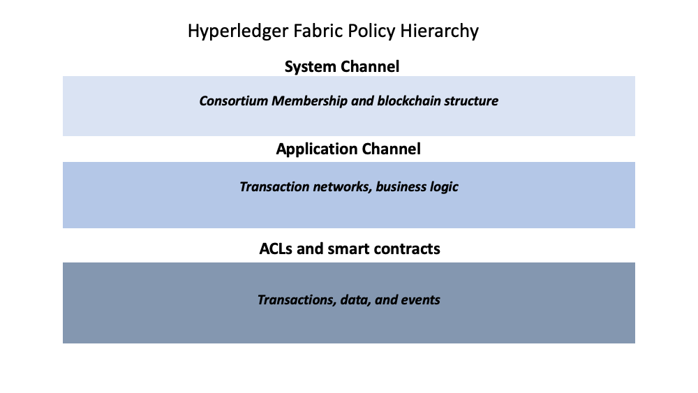

# Политики

**Для кого это**: Архитекторы, разработчики приложений и смартконтрактов,
администраторы.

В этом разделе мы обсудим:

* [Что такое политика](#что-такое-политика)
* [Зачем нужны политики](#зачем-нужны-политики)
* [Как политики реализованы в Fabric](#как-политики-реализованы-в-fabric)
* [Области политик Fabric](#области-политик-Fabric)
* [Как написать политику в Fabric](#как-написать-политику-в-fabric)
* [Жизненный цикл чейнкода Fabric](#жизненный-цикл-чейнкода)
* [Переопределение политик](#переопределение-политик)

## Что такое политика?

Простыми словами, политика это набор правил, определяющих структуру принятия 
решений. Политика, как правило, описывает права, которыми субъект обладает в
отношении какого-либо актива. Мы увидим, что политики используются в нашей 
повседневной жизни для защиты важных активов, таких как машины или дома.

Например, страховой полис описывает условия, при которых будет выплачена 
страховка. Политика --- соглашение между владельцем страховки и страховой 
компанией, она определяет права и обязанности обеих сторон.

Страховые полисы используются для управления рисками, а в Hyperledger
Fabric политики --- это механизм для управлением инфраструктурой. Политики 
Fabric показывают, как члены сети приходят к соглашению, принимая или 
отклоняя изменения в сети, канале или смартконтракте. Политики согласуются
консорциумом при первой настройке сети, однако их можно менять по мере ее 
роста и развития. Например, они описывают критерии добавления в канал и исключения 
из него членов сети, могут утвердить порядок формирования блоков или указать 
число организаций, необходимое для подтверждения смартконтрактов. Все 
эти действия описываются политикой, определяющей лица, которые могут совершить 
определенное действие. Проще говоря, все, что вы хотите делать в сети Fabric 
регулируется политиками.

## Зачем нужны политики

Политики --- одна из черт Hyperledger Fabric, отличающих его от других блокчейнов,
таких как Ethereum или Bitcoin. В таких системах транзакции могут создаваться и 
утверждаться любым узлом в сети. Политики, регулирующие сеть, могут быть изменены в
любой момент, но лишь с использованием того же процесса, который управляет кодом. 
Поскольку Fabric --- permissioned-блокчейн, ее пользователи принимают все решения,
касающиеся управления сети, до ее запуска, а после запуска могут изменять их.

Политики позволяют членам выбирать организации, которые имеют доступ в сеть Fabric 
или права на обновление сети, и предоставляют для этого определенные механизмы. Политики содержат списки
организаций, имеющих доступ к определенному ресурсу, например к пользователям или к чейнкодам.
Они также определяют, какое количество организаций должны дать свое согласие на предложение
обновить ресурс, например, смартконтракт или канал. Политики собирают подписи, 
относящиеся к транзакциям и их proposal'ам и подтверждают их, если они соответствуют
правилам, установленным в сети.

## Как политики реализованы в Fabric

Политики реализованы на разных уровнях работы сети Fabric. Каждая отдельная область
политик управляет различными аспектами работы сети.

 *Наглядное представление
иерархии политик Fabric. System Channel - системный канал, Application Channel - (прикладной) канал,
обычно имеется в виду именно он.*

### Настройка системного канала в части ordering

Каждая сеть начинается с **системного канала**. В каждой сети должен быть
ровно один системный канал для ordering-службы, который создается первым.
Системный канал содержит организации-члены ordering-службы (ordering-организации), 
а также организации, которые являются сторонами транзакций (организации консорциумов).

Политики в конфигурационных блоках системного канала управляют консенсусом,
используемым ordering-службой, и определяют то, как создаются новые блоки. Системный
канал также отвечает за то, кто из членов консорциума могут создавать новые каналы.

### Настройка канала в части политик прикладных транзакций

Каналы предоставляют механизм для приватной коммуникации организаций консорциума.

Политики канала могут предоставить возможность удалять или добавлять членов в канал.
Каналы также управляют тем, какие организации должны одобрить чейнкод до того, как 
чейнкод определен и сохранен в канал, следуя жизненному циклу чейнкода в Fabric. По умолчанию, канал
сразу после создания наследует все параметры ordering-службы от 
системного канала. Однако эти параметры (как и политики) можно в дальнейшем настроить 
в каждом канале.

### Access control lists (ACL) (списки контроля доступа)

Администраторам сети будет особенно интересно использование Fabric ACL (списки 
контроля доступа), которые предоставляют возможность настраивать доступ к ресурсам,
связывая эти ресурсы с существующей политикой. Эти "ресурсы" могут быть правами 
на взаимодействие с системным чейнкодом (например, "GetBlockByNumber" для системного
чейнкода "qscc") и другими ресурсами (например, возможность получать события, связанные 
с блоками). ACL обращается к политикам, определенным в конфигурации канала и расширяет их
для контроля над дополнительными ресурсами. По умолчанию набор ACL Fabric находится в 
файле `configtx.yaml` под разделом `Application: &ApplicationDefaults`, но они могут и 
должны быть переопределены при промышленном использовании. Список ресурсов, находящийся в 
`configtx.yaml` --- полный набор всех внутренних ресурсов, на данный момент определенных 
Fabric.

В этом файле ACL представлены в следующем формате:

```
# ACL policy for chaincode to chaincode invocation
peer/ChaincodeToChaincode: /Channel/Application/Readers
```

Здесь `peer/ChaincodeToChaincode` отвечает за предоставляемый ресурс, а
`/Channel/Application/Readers` отсылает к политике, которая должна быть удовлетворена для того, 
чтобы соответствующая сделка считалась действительной.

Чтобы узнать больше про ACL, ознакомьтесь с разделом про [ACLs](../access_control.html) из 
Руководства по эксплуатации.

### Политика подтверждения смартконтрактов

Каждый смартконтракт внутри пакета чейнкода имеет политику подтверждения, которая указывает, 
сколько пиров разных членов канала должны выполнить и проверить транзакцию смартконтракта, 
чтобы транзакция была признана валидной. Таким образом, политика подтверждения определяет организации (через их пиры), которые должны "подтвердить" (одобрить) реализацию proposal'а.

### Политики изменения

`Modification policy` (политики изменения) --- последний тип политик, играющий важную роль в 
работе Fabric. Политики изменения указывают группу identities, которые должны подписать
(одобрить) любое изменение конфигурации. Это политика, определяющая, как другие политики могут 
изменяться. Таким образом, каждый элемент конфигурации канала включает в себя ссылку на 
политику, которая управляет изменениями этого канала.

## Области политик (policy domains) Fabric

Хотя политики Fabric могут подстраиваться под нужды сети, области политик разделяются на
управляемых организациями ordering-службы и управляемых членами консорциума. В 
нижеприведенной диаграмме можно видеть, как стандартные политики реализуют контроль над 
областями политик Fabric.

 *Более детальный взгяд на то, какие области политик
управляются ordering-организациями, а какие - организациями консорциума.*

В функционирующей сети Fabric может существовать множество организаций, обладающих разными 
обязанностями. Области предоставляют возможность раздачи различных ролей и привилегий разным 
организациям, позволяя создателям ordering-службы устанавливать первоначальные правила и 
членство в консорциуме. Также они позволяют присоединившимся к консорциуму организациям 
создавать приватные каналы, управлять своей бизнес логикой и регулировать доступ к данным 
в сети.

Конфигурация системного канала и, частично, конфигурация обычного канала предоставляет ordering-организациям 
механизм консенсуса, используемый узлами ordering-службы, а также контроль над тем, 
какие организации являются членами консорциума и как блоки доставляются в каналы.

Конфигурация системного канала позволяет членам консорциума создавать каналы. Каналы и ACL --- 
это механизмы, используемые организациями консорциума для добавления в канал и удаления из него, 
а также для регулирования доступа к данным и смартконтрактам в канале.

## Как реализовать политику в Fabric

Если вы хотите что-нибудь изменить в Fabric, политика, связанная с ресурсом, определяет **кто** 
должен подтвердить изменение: или же с явной подписью каждого участника, или с неявной подписью 
группы. В области страхования, аналогом явной подписи может быть требование одобрения хотя бы одного члена группы страхования,
а аналогом неявной подписи может быть требование одобрения 
большинством управляющих членов группы страхования. Это особенно полезно, поскольку изменения в 
составе группы не требуют обновления политики. В Hyperledger Fabric явные подписи в политике используют синтаксис `Signature`, а неявные - `ImplicitMeta`.

### Политики `Signature`

Политики `Signature` указывают определенные типы пользователей, которые должны подписаться для 
удовлетворения политики, например, `OR('Org1.peer', 'Org2.peer')`. Эти политики считаются самыми 
универсальными, поскольку позволяют конструировать очень специфичные правила, например: 
"Администратор организации А (org A) и 2 других администратора" или "5 из 6 администраторов 
организации". Синтаксис поддерживает произвольные сочетания `AND`, `OR` и `OutOf`. Например, 
политику можно описать, используя `AND('Org1.member', 'Org2.member')`, что означает, что для 
удовлетворения политики нужна подпись хотя бы одного члена Org1 И (AND) одного члена Org2. 

### Политики `ImplicitMeta`

Политики `ImplicitMeta` допустимы только в контексте конфигурации канала, основанной на 
многоуровневой иерархии политики в дереве конфигурации. Политики ImplicitMeta агрегируют в себе 
результат политик, расположенных глубже в дереве конфигурации.
Политики --- `Implicit`, поскольку они неявно строятся на основе существующих оганизаций в конфигурации канала, 
и `Meta`, поскольку они зависят не от конкретных MSP principals, а от других политик, находящихся глубже их в дереве.

Нижеприведенная диаграмма иллюстрирует многоуровневую структуру канала и показывает, как политика
`ImplicitMeta` администраторов конфигурации канала, `/Channel/Admins`, удовлетворяется через суб-политики `Admins`, где галочка обозначает, что политика удовлетворена.
На картинке присутствуют ошибки, что будет исправлено в будущем: Channel/Application/Admins должна иметь тип 3. Также, перевод исправленной подписи звучит так:
_Для того, чтобы политика Channel/Admins была удовлетворена, должно быть удовлетворено большинство (MAJORITY) ее суб-политик._


Как можно видеть на диаграмме выше, политики `ImplicitMeta`, Type = 3, используют другой синтаксис, `"<ANY|ALL|MAJORITY> <SubPolicyName>"`, например:
```
`MAJORITY sub policy: Admins`
```
Диаграмма показывает суб-политику `Admins`, которая указывает на все политики `Admins`, находящиеся глубже в дереве.
Вы можете создать свои суб-политики и назвать их так, как хотите, а потом определить их для каждой организации.

Как было упомянуто ранее, ключевая польза `ImplicitMeta` политик, например `MAJORITY
Admins` в том, что когда вы добавляете новую организацию в канал, вам не нужно будет обновлять политику канала.
Так, политики `ImplicitMeta` считаются более гибкими, когда члены консорциума могут меняться.

Вы можете определить implicit-политику на уровне приложения в канале.

Более точный контроль может быть достигнут, если вы включите 
[`NodeOUs`](msp.html#organizational-units) в определение вашей организации.
 Organization Units (OUs, организационные подразделения) определяются в конфигурационном файле Fabric CA
client и при создании могут быть связаны с любой identity. В Fabric, `NodeOUs` предоставляют способ классификации identities в
иерархии цифровых сертификатов. К примеру, организация, имея определенный `NodeOUs`, может потребовать для подтверждения транзакции подпись именно
пира, а не другого участника сети, а организации, не использующие `NodeOUs` могут только потребовать подписи любого своего члена.

## Пример: политика конфигурации канала

Понимание политик начинается с изучения `configtx.yaml`, где определены политики канала.
Мы можем использовать `configtx.yaml` файл из тестовой сети Fabric, чтобы увидеть применения обоих синтаксисов политик.
Мы будем изучать configtx.yaml из примера [fabric-samples/test-network](https://github.com/hyperledger/fabric-samples/blob/{BRANCH}/test-network/configtx/configtx.yaml).

Первая секция файла определяет организации сети. Внутри каждого определения организации находятся
стандартные политики этой организации: `Readers`, `Writers`,
`Admins`, и `Endorsement` (подтверждение), хотя вы можете называть свои политики как захотите.
Каждая политика имеет `Type`, описывающий какой синтаксис используется (`Signature` or `ImplicitMeta`) и `Rule` (само правило политики).

Следующий пример показывает определение организации Org1 системного канала, использующую политики с `Type` - `Signature` и таким правилом политики подтверждения:
`"OR('Org1MSP.peer')"`. Эта политика указывает, что для подтверждения транзакции требуется подпись пира, являющегося членом 
`Org1MSP`. Именно подобные политики `Signature` становятся саб-политиками, которые используют политики `ImplicitMeta`.

<details>
  <summary>
    **Нажмите сюда, чтобы посмотреть пример определения организации с политиками `Signature`**
  </summary>

```
 - &Org1
        Name: Org1MSP

        # ID, чтобы загрузить определение MSP
        ID: Org1MSP

        MSPDir: crypto-config/peerOrganizations/org1.example.com/msp

        # Policies определяет набор политик на этом уровне дерева конфигурации
        # Для политик организации, путь к ним обычно такой:
        #   /Channel/<Application|Orderer>/<OrgName>/<PolicyName>
        Policies:
            Readers:
                Type: Signature
                Rule: "OR('Org1MSP.admin', 'Org1MSP.peer', 'Org1MSP.client')"
            Writers:
                Type: Signature
                Rule: "OR('Org1MSP.admin', 'Org1MSP.client')"
            Admins:
                Type: Signature
                Rule: "OR('Org1MSP.admin')"
            Endorsement:
                Type: Signature
                Rule: "OR('Org1MSP.peer')"
```
</details>

Следующий пример показывает, как политика `ImplicitMeta` используется в секции `Application`
`configtx.yaml`. Этот набор политик доступен через путь `/Channel/Application/`. Если вы используете стандартный набор Fabric ACLs,
эти политики определяют поведение многих важных параметров каналов, таких как кто может выполнять поисковые запросы к реестру канала, исполнять
чейнкод или обновлять конфигурацию канала. Эти политики работают через суб-политики, определенные для каждой организации.
Org1, определенная в секции выше, содержит суб-политики`Reader`, `Writer` и `Admin`, которые используются политика `ImplicitMeta`
из секции `Application`. Так как тестовая сеть использует стандартные политки, вы можете использовать Org1 для выполнения поисковых запросов к реестру канала, 
исполнять чейнкод и одобрять изменения канала для любого канала тестовой сети, который вы создадите.

<details>
  <summary>
    **Нажмите сюда, чтобы посмотреть пример использования политики `ImplicitMeta`**
  </summary>
```
################################################################################
#
#   SECTION: Application
#
#   - Эта секция определяет значения, связанные с приложениями, которые будут 
#   записаны в конфигурационную транзакцию или genesis-блок 
#
################################################################################
Application: &ApplicationDefaults

    # Organizations - это список организаций, указанных как участники прикладной стороны сети
    Organizations:

    # Policies определяет набор политик на этом уровне дерева конфигурации
    # Для политик приложений, путь к ним обычно такой:
    #   /Channel/Application/<PolicyName>
    Policies:
        Readers:
            Type: ImplicitMeta
            Rule: "ANY Readers"
        Writers:
            Type: ImplicitMeta
            Rule: "ANY Writers"
        Admins:
            Type: ImplicitMeta
            Rule: "MAJORITY Admins"
        LifecycleEndorsement:
            Type: ImplicitMeta
            Rule: "MAJORITY Endorsement"
        Endorsement:
            Type: ImplicitMeta
            Rule: "MAJORITY Endorsement"
```
</details>

## Жизненный цикл чейнкода Fabric

В релизе Fabric 2.0, был представлен новый жизненный цикл чейнкода,
в котором используется более демократичный процесс управления чейнкодом сети.
Новый цикл позволяет нескольким организациям голосовать, как будет эксплуатироваться
чейнкод до того, как он будет доступен на канале. Это важно, так как именно этот
новый жизненный цикл вкупе с политиками определяет безопасность сети.
[Больше деталей про жизненный цикл чейнкода](../chaincode_lifecycle.html).
Для понимания этой темы, необходимо осознавать, какое место занимают политики в этом цикле.
Новый цикл включает два шага, на которых определяются политики:
Когда чейнкод **одобряется** участниками организации, и когда он **сохраняется** в канал.

В секции `Application` файла `configtx.yaml` включена стандартная политика подтверждения для жизненного
цикла чейнкода. При промышленном использовании, вы можете изменить ее под ваш случай.

```
################################################################################
#
#   SECTION: Application
#
#   - Эта секция определяет значения, связанные с приложениями, которые будут 
#   записаны в конфигурационную транзакцию или genesis-блок 
#
################################################################################
Application: &ApplicationDefaults

    # Organizations - это список организаций, указанных как участники прикладной стороны сети
    Organizations:

    # Policies определяет набор политик на этом уровне дерева конфигурации
    # Для политик приложений, путь к ним обычно такой:
    #   /Channel/Application/<PolicyName>
    Policies:
        Readers:
            Type: ImplicitMeta
            Rule: "ANY Readers"
        Writers:
            Type: ImplicitMeta
            Rule: "ANY Writers"
        Admins:
            Type: ImplicitMeta
            Rule: "MAJORITY Admins"
        LifecycleEndorsement:
            Type: ImplicitMeta
            Rule: "MAJORITY Endorsement"
        Endorsement:
            Type: ImplicitMeta
            Rule: "MAJORITY Endorsement"
```

- Политика `LifecycleEndorsement` управляет тем, кому надо  _одобрить определение чейнкода_.
- Политика `Endorsement` - _стандартная политика подтверждения для чейнкода_.

## Политики подтверждения чейнкода

Политика подтверждения указывается для **чейнкода**, когда он одобрен и сохранен в канал, следуя
жизненному циклу чейнкода (то есть одна политика подтверждения покрывает все состояния (ключи), 
связанные с данным чейнкодом). Политика подтверждения может быть указана или как ссылка на существующую
политику подтверждения из конфигурации канала или через явное определения политики `Signature`.

Если политика подтверждения не явно определена во время шага одобрения, выбирается стандартная 
`Endorsement`-политика - `"MAJORITY Endorsement"`, что означает, что
большинство пиров, принадлежащих разным участникам (организациям) канала должны выполнить и проверить
транзакцию, чтобы транзакция считалась валидной. Эта стандартная политика позволяет автоматически включить присоединяющихся к каналу организациям в процесс подтверждения.
Если вы не хотите использовать стандартную политику подтверждения, вы можете использовать формат политики `Signature`, чтобы указать более сложную политику подтверждения 
(например, требующую подтверждения чейнкода одной организацией и отличающейся от нее организацией).

Политики `Signature` также позволяют включить `principals`, которые, на самом деле, просто представляют из себя
способ совмещения определенной identity с ролью. Principals похожи на user ID или group ID, но они более универсальные, 
так как могут включать широкий набор параметров, таких как identity, организация, организационное подразделение (OU) и роль. 
Principals - наборы свойств, определяющих права участников.
Principals указываются через ``'MSP.ROLE'``, где ``MSP`` --- необходимый идентификатор MSP и ``ROLE`` --- одна из четырех ролей: ``member``, ``admin``, ``client`` и
``peer``.
Роль должна быть связана с identity во время того, как пользователь регистрируется через CA.

Несколько примеров корректных principals:

 * `'Org0.admin'`: любой администратор из `Org0` MSP
 * `'Org1.member'`: любой участник `Org1` MSP
 * `'Org1.client'`: любой клиент `Org1` MSP
 * `'Org1.peer'`: любой пир `Org1` MSP
 * `OrdererOrg.Orderer`: orderer из OrdererOrg MSP

Бывают случаи, когда необходимо указать политику подтверждения конкретному состоянию, то есть паре ключ-значение.
**Подтверждение на уровне состояния** позволяет для конкретного состояния указать свою политику,
которая отменит политику подтверждения на уровне чейнкода.

Для более подробной информацией про политики подтверждения, обратитесь к статье
раздела Руководства об эксплуатации [Политики подтверждения](../endorsement-policies.html).

**Заметка:**  Политики работают по разному в зависимости от используемой версии Fabric:
- В релизах до 2.0, политики подтверждения могут быть обновлены во время инстанцирования (instantiation) чейнкода
  или при использовании команд жизненного цикла чейнкода.
  Если политики не были указаны во время инстанцирования, они по умолчанию устанавливаются на
  “любой участник организации канала”. Например, в канале из “Org1” и “Org2” стандартная политика подтверждения такая -
  `OR(‘Org1.member’, ‘Org2.member’)`.
- Релиз Fabric v2.0 представил новый цикл, который позволяет нескольким организациям голосовать, как будет эксплуатироваться
  чейнкод до того, как он будет доступен на канале. Новый процесс требует, чтобы организации согласились на параметрах, определяющих чейнкод,
  таких как имя, версия и политика подтверждения чейнкода.

## Переопределение политик

Hyperledger Fabric включает политики по умолчанию, полезные для начала работы с Fabric, для разработки и для тестирования блокчейна,
но при промышленном использовании их надо настроить. Вы быть в курсе стандартных политик из файла `configtx.yaml`. Политики конфигурации канала могут быть расширены
вне стандартных `Readers, Writers, Admins` из файла `configtx.yaml`. Orderer-система и каналы переопределяются через выпуск обновления конфигурации, когда вы 
переопределяете стандартные политики, редактируя `configtx.yaml` канала.

За более подробной информацией, смотрите статью [Обновление конфигурации канала](../config_update.html#updating-a-channel-configuration).

<!--- Licensed under Creative Commons Attribution 4.0 International License
https://creativecommons.org/licenses/by/4.0/) -->
