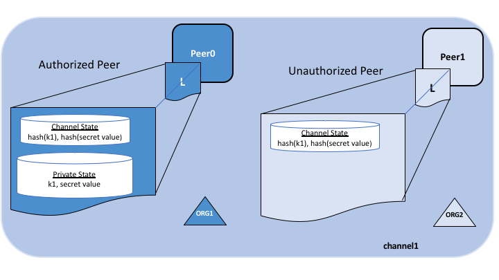
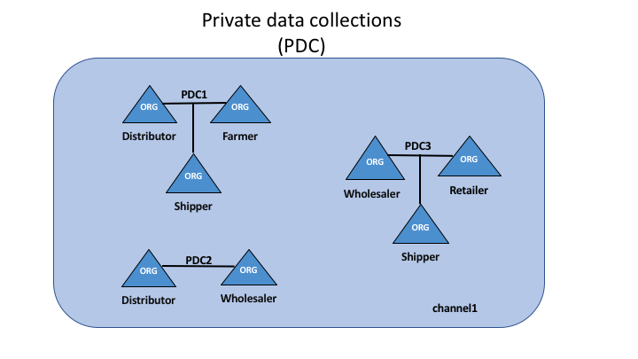

# Конфиденциальные данные

## Что такое конфиденциальные данные?

В случаях, когда группе организаций канала необходимо скрыть часть данных от других организаций канала, 
они могут создать новый канал только из огранизаций, которым нужен доступ к этим данным.
Однако создание отдельного канала создает административные накладные расходы 
(поддержка актуальных версий чейнкода, политик, MSP и т.д.), и не решает проблемы в случаях, когда
вы хотите, чтобы все участники канала увидели транзакцию, но при этом некоторые ее данные остались
конфиденциальными.

Поэтому Fabric предоставляет возможность создавать **Коллекции конфиденциальных данных**,
что позволяет определенному подмножеству организаций канала иметь возможность подтверждать, сохранять или запрашивать конфиденциальные данные
без нужды заводить отдельный канал.

## Что такое "коллекция конфиденциальных данных"?

Коллекция - это совокупность двух элементов:

1. **Самих конфиденциальных данных**, передаваемых от пира к пиру [через gossip-протокол](../gossip.html)
   только организациям, авторизованным на доступ к данным. Эти данные хранятся в отдельной конфиденциальной
   базе данных состояния (state DB) на пирах авторизованных организаций, которую можно использовать в чейнкоде авторизованных пиров.
   Ордеринг-служба не вовлечена в этот механизм и не имеет доступа к данным.
   Заметьте, что так как gossip-протокол распространяет конфиденциальные данные от пира одной организации к пиру другой,
   требуется создать anchor-пиры в канале, и настроить
   CORE_PEER_GOSSIP_EXTERNALENDPOINT на каждом пире для создания меж-организационного сообщения.

2. **Хеш этих данных** подтверждается, подвергается ордерингу и записывается в реестр каждого пира канала.
   Хеш служит доказательством транзакции и используется для проверки state и может использоваться для проведения аудита.

Следующая диаграмма иллюстрирует содержимое реестра на пире с доступом к конфиденциальным данным (authorized peer)
и на пире без доступа к ним (unauthorized peer).

Участники коллекции могут дать доступ к данным другим участникам, если у них возникнут разногласия или если они решает
поделиться данными с третьей стороной, которая может вычислить хеш приватных данных и проверить, сходится ли он с состоянием реестра канала, и если да, то это будет
служить доказательством существования состояния канала в определенный момент времени.

В некоторых случаях, вы можете решить использовать набор коллекций, каждая из которых предназначена только своей организации.
Например, организация может записывать конфиденциальные данные в свою коллекцию, которой можно потом поделиться с другими 
участниками канала и на использование которой можно указать в чейнкод-транзакциях.
Примеры такого использования конфиденциальных данных будут ниже.

### В каких случаях создавать коллекцию внутри канала, а в каких создавать отдельный канал?

* Используйте **отдельный канал**, когда все транзакции и реестры должны быть скрыты и доступны только определенному набору организаций, 
  которые и составят участников нового канала.

* Используйте **коллекции**, когда транзакции и реестры должны распространяться между множеством организаций, но только подмножество этих организаций
  должно иметь доступ к части (или ко всему набору) данных транзакций. Кроме того, так как конфиденциальные данные распространяются от пира к пиру, а не
  через блоки, используйте коллекции конфиденциальных данных, когда данные транзакции должны быть скрыты от узлов ордеринг-служб.

## Сценарий использования коллекций

Представьте группу из 5 организаций канала по торговле продукцией:

* **Фермер** (Farmer) продает свои товары за границу
* **Дистрибьютор** (Distributer) поставляет товары за границу
* **Грузоотправитель** (Shipper) перевозит товары между сторонами
* **Оптовик** (Wholesaler) приобретает товары у агентов по сбыту
* **Ритейлер** (Retailer) покупает товары от грузоотправителей и оптовиков

**Дистрибьютор** хочет совершать конфиденциальные транзакции с **фермером** и **грузоотправителем**, чтобы не распространять условия сделок
**оптовику** и **ритейлеру** и не выдать свою наценку.

**Дистрибьютор** хочет иметь отчасти конфиденциальные отношения с **оптовиком**, так как выставляет ему более низкие цены, чем **ритейлеру**.

**Оптовик** также хочет иметь такие отношения с **ритейлером** и **грузоотправителем**.

Вместо того, чтобы создавать по маленькому каналу на каждое такое отношение, можно организовать несколько коллекций
приватных данных **(PDC, Private Data Collection)**:

1. PDC1: **Дистрибьютор**, **Фермер** и **Грузоотправитель**
2. PDC2: **Дистрибьютор** и **Оптовик**
3. PDC3: **Оптовик**, **Ритейлер** и **Грузоотправитель**

Пиры, принадлежащие **дистрибьютор** будут иметь несколько приватных баз данных внутри их реестра, включающих
конфиденциальные данные PDC1 и PDC2.

## Транзакционный поток с конфиденциальными данными

Когда в чейнкоде используются используются конфиденциальные данные, транзакционный поток
немного меняется, чтобы скрыть конфиденциальные данные при совершении proposal, подтверждении и сохранении в реестр транзакций.

Для подробного описания транзакционного потока без конфиденциальных данных, обратитесь к документации:
[транзакционный поток](../txflow.html).

1. Клиентское приложение посылает proposal-запрос к подтверждающим пирам, чтобы вызвать функцию чейнкода (запись или чтение конфиденциальных данных).
   Подтверждающие пиры должны быть частью организации с доступом к коллекции. 
   Конфиденциальные данные, или данные, использующиеся для их генерации, посылаются в поле `transient` proposal'а.

2. Подтверждающие пиры выполняют транзакцию и сохраняют конфиденциальные данные в 
   `transient data store` (временном хранилище пира). Они распространяют конфиденциальные данные, основываясь на политике коллекции, авторизованным пирам по 
   [gossip-протоколу](../gossip.html).

3. Подтверждающие пиры отправляют ответ на proposal обратно клиенту.
   Ответ включает подтвержденный read/write set, включающий публичный данный вместе с хешем
   ключей и значений конфиденциальных данных. *Никаких конфиденциальных данных
   клиенту не посылается*. [Более детальная информация по подтверждению транзакций
   с конфиденциальными данными](../private-data-arch.html#endorsement).

4. Клиентское приложение посылает транзакцию (включающую ответ на proposal с хешами конфиденциальных данных)
   ордеринг-службе. Транзакция с хешами конфиденциальных данных включается в блок как обычная транзакция.
   Блок с хешами конфиденциальных данных распространяется на все пиры. Таким образом,
   все пиры канала могут проверить транзакции с хешами конфиденциальных данных согласованно, без знания конфиденциальных данных.

5. Во время сохранения блока, авторизованные пира применяют политику коллекции, чтобы понять, имеют ли они доступ к конфиденциальным данным.
   Если да, они проверят свой локальный `transient data store`, чтобы определить, получили ли они эти данные во время подтверждения чейнкода. Если не получили, то
   они попытаются получить данные с другого авторизованного пира. Потом они сверят хеш конфиденциальных данных с хешем в публичном блоке и сохранят
   транзакцию и блок. Во время проверки/сохранения, конфиденциальные данные перемещаются в их копию конфиденциальной state-базе данных и их конфиденциального
   writeset хранилища. Затем конфиденциальные данные удаляются `transient data store`.

## Распространение конфиденциальных данных не авторизованным участникам

Во многих сценариях некоторые значения из конфиденциальных данных должны быть отправлены
другим участникам канала или включены в другую коллекцию, например, когда необходимо совершить
транзакцию с конфиденциальными данными с участником или группой участников без доступа к коллекции.
Принимающая данные сторона скорее всего захочет провести проверку конфиденциальных данных на совпадение их хеша
с хешем в блокчейне как часть транзакции.

Есть несколько возможностей PDC, позволяющих обмен и проверку конфиденциальных данных:

* Во-первых, вам не нужно быть участником коллекции, чтобы записать что-либо в нее, при условии, что соблюдена политика подтверждения.
  Политика подтверждения может быть определена на уровне чейнкода, на уровне ключей (используя основанное на state подтверждение) или на уровне коллекции (начиная с Fabric v2.0).

* Во-вторых, начиная с v1.4.2 существует API чейнкода GetPrivateDataHash(), позволяющее
  чейнкоду или пирам не входящим в коллекцию получать хеш по конфиденциальному ключу. Это важная функция, в чем вы убедитесь позже,
  так как она позволяет чейнкоду сверять хеши конфиденциальных данных с теми, что лежат в блокчейне.

Эта возможность распространять и проверять конфиденциальные данные должна быть учитана при проектировании приложении и связанных с ними PDC.
Хотя вы, конечно, можете создать множество наборов много-организационных PDC для распространения данных между различными комбинациями участников канала,
этот подход может привести к созданию большого числа коллекций, которые нужно определить.
Вместо этого, рассмотрите создание небольшого числа PDC (например, одна коллекция на организацию или одна коллекция на пару организаций)
а потом распространяйте указанным в этом разделе образом данные с другими участниками или коллекциями при необходимости.
Начиная с Fabric v2.0, неявные внутриорганизационные коллекции доступны для использования любым чейнкодом, поэтому вам не придется создавать по коллекции на каждую организацию при
развертывании чейнкода.

### Паттерны проектирования с механизмов распространения конфиденциальных данных

При использовании внутриорганизационных PDC на каждую организацию, появляется несколько паттернов для распространения или передачи конфиденциальных данных
без нужды в определении много-организационных коллекций. Вот несколько таких паттернов, которые могут быть использованы в чейнкод-приложениях:

//ToDo
* **Use a corresponding public key for tracking public state** -
  You can optionally have a matching public key for tracking public state (e.g. asset
  properties, current ownership. etc), and for every organization that should have access
  to the asset's corresponding private data, you can create a private key/value in each
  organization's private data collection.

* **Chaincode access control** -
  You can implement access control in your chaincode, to specify which clients can
  query private data in a collection. For example, store an access control list
  for a private data collection key or range of keys, then in the chaincode get the
  client submitter's credentials (using GetCreator() chaincode API or CID library API
  GetID() or GetMSPID() ), and verify they have access before returning the private
  data. Similarly you could require a client to pass a passphrase into chaincode,
  which must match a passphrase stored at the key level, in order to access the
  private data. Note, this pattern can also be used to restrict client access to public
  state data.

* **Sharing private data out of band** -
  As an off-chain option, you could share private data out of band with other
  organizations, and they can hash the key/value to verify it matches
  the on-chain hash by using GetPrivateDataHash() chaincode API. For example,
  an organization that wishes to purchase an asset from you may want to verify
  an asset's properties and that you are the legitimate owner by checking the
  on-chain hash, prior to agreeing to the purchase.

* **Sharing private data with other collections** -
  You could 'share' the private data on-chain with chaincode that creates a matching
  key/value in the other organization's private data collection. You'd pass the
  private data key/value to chaincode via transient field, and the chaincode
  could confirm a hash of the passed private data matches the on-chain hash from
  your collection using GetPrivateDataHash(), and then write the private data to
  the other organization's private data collection.

* **Transferring private data to other collections** -
  You could 'transfer' the private data with chaincode that deletes the private data
  key in your collection, and creates it in another organization's collection.
  Again, use the transient field to pass the private data upon chaincode invoke,
  and in the chaincode use GetPrivateDataHash() to confirm that the data exists in
  your private data collection, before deleting the key from your collection and
  creating the key in another organization's collection. To ensure that a
  transaction always deletes from one collection and adds to another collection,
  you may want to require endorsements from additional parties, such as a
  regulator or auditor.

* **Using private data for transaction approval** -
  If you want to get a counterparty's approval for a transaction before it is
  completed (e.g. an on-chain record that they agree to purchase an asset for
  a certain price), the chaincode can require them to 'pre-approve' the transaction,
  by either writing a private key to their private data collection or your collection,
  which the chaincode will then check using GetPrivateDataHash(). In fact, this is
  exactly the same mechanism that the built-in lifecycle system chaincode uses to
  ensure organizations agree to a chaincode definition before it is committed to
  a channel. Starting with Fabric v2.0, this pattern
  becomes more powerful with collection-level endorsement policies, to ensure
  that the chaincode is executed and endorsed on the collection owner's own trusted
  peer. Alternatively, a mutually agreed key with a key-level endorsement policy
  could be used, that is then updated with the pre-approval terms and endorsed
  on peers from the required organizations.

* **Keeping transactors private** -
  Variations of the prior pattern can also eliminate leaking the transactors for a given
  transaction. For example a buyer indicates agreement to buy on their own collection,
  then in a subsequent transaction seller references the buyer's private data in
  their own private data collection. The proof of transaction with hashed references
  is recorded on-chain, only the buyer and seller know that they are the transactors,
  but they can reveal the pre-images if a need-to-know arises, such as in a subsequent
  transaction with another party who could verify the hashes.

Coupled with the patterns above, it is worth noting that transactions with private
data can be bound to the same conditions as regular channel state data, specifically:

* **Key level transaction access control** -
  You can include ownership credentials in a private data value, so that subsequent
  transactions can verify that the submitter has ownership privilege to share or transfer
  the data. In this case the chaincode would get the submitter's credentials
  (e.g. using GetCreator() chaincode API or CID library API GetID() or GetMSPID() ),
  combine it with other private data that gets passed to the chaincode, hash it,
  and use GetPrivateDataHash() to verify that it matches the on-chain hash before
  proceeding with the transaction.

* **Key level endorsement policies** -
  And also as with normal channel state data, you can use state-based endorsement
  to specify which organizations must endorse transactions that share or transfer
  private data, using SetPrivateDataValidationParameter() chaincode API,
  for example to specify that only an owner's organization peer, custodian's organization
  peer, or other third party must endorse such transactions.

### Example scenario: Asset transfer using private data collections

The private data sharing patterns mentioned above can be combined to enable powerful
chaincode-based applications. For example, consider how an asset transfer scenario
could be implemented using per-organization private data collections:

* An asset may be tracked by a UUID key in public chaincode state. Only the asset's
  ownership is recorded, nothing else is known about the asset.

* The chaincode will require that any transfer request must originate from the owning client,
  and the key is bound by state-based endorsement requiring that a peer from the
  owner's organization and a regulator's organization must endorse any transfer requests.

* The asset owner's private data collection contains the private details about
  the asset, keyed by a hash of the UUID. Other organizations and the ordering
  service will only see a hash of the asset details.

* Let's assume the regulator is a member of each collection as well, and therefore
  persists the private data, although this need not be the case.

A transaction to trade the asset would unfold as follows:

1. Off-chain, the owner and a potential buyer strike a deal to trade the asset
   for a certain price.

2. The seller provides proof of their ownership, by either passing the private details
   out of band, or by providing the buyer with credentials to query the private
   data on their node or the regulator's node.

3. Buyer verifies a hash of the private details matches the on-chain public hash.

4. The buyer invokes chaincode to record their bid details in their own private data collection.
   The chaincode is invoked on buyer's peer, and potentially on regulator's peer if required
   by the collection endorsement policy.

5. The current owner (seller) invokes chaincode to sell and transfer the asset, passing in the
   private details and bid information. The chaincode is invoked on peers of the
   seller, buyer, and regulator, in order to meet the endorsement policy of the public
   key, as well as the endorsement policies of the buyer and seller private data collections.

6. The chaincode verifies that the submitting client is the owner, verifies the private
   details against the hash in the seller's collection, and verifies the bid details
   against the hash in the buyer's collection. The chaincode then writes the proposed
   updates for the public key (setting ownership to the buyer, and setting endorsement
   policy to be the buying organization and regulator), writes the private details to the
   buyer's private data collection, and potentially deletes the private details from seller's
   collection. Prior to final endorsement, the endorsing peers ensure private data is
   disseminated to any other authorized peers of the seller and regulator.

7. The seller submits the transaction with the public data and private data hashes
   for ordering, and it is distributed to all channel peers in a block.

8. Each peer's block validation logic will consistently verify the endorsement policy
   was met (buyer, seller, regulator all endorsed), and verify that public and private
   state that was read in the chaincode has not been modified by any other transaction
   since chaincode execution.

9. All peers commit the transaction as valid since it passed validation checks.
   Buyer peers and regulator peers retrieve the private data from other authorized
   peers if they did not receive it at endorsement time, and persist the private
   data in their private data state database (assuming the private data matched
   the hashes from the transaction).

10. With the transaction completed, the asset has been transferred, and other
    channel members interested in the asset may query the history of the public
    key to understand its provenance, but will not have access to any private
    details unless an owner shares it on a need-to-know basis.

The basic asset transfer scenario could be extended for other considerations,
for example the transfer chaincode could verify that a payment record is available
to satisfy payment versus delivery requirements, or verify that a bank has
submitted a letter of credit, prior to the execution of the transfer chaincode.
And instead of transactors directly hosting peers, they could transact through
custodian organizations who are running peers.

## Purging private data

For very sensitive data, even the parties sharing the private data might want
--- or might be required by government regulations --- to periodically "purge" the data
on their peers, leaving behind a hash of the data on the blockchain
to serve as immutable evidence of the private data.

In some of these cases, the private data only needs to exist on the peer's private
database until it can be replicated into a database external to the peer's
blockchain. The data might also only need to exist on the peers until a chaincode business
process is done with it (trade settled, contract fulfilled, etc).

To support these use cases, private data can be purged if it has not been modified
for a configurable number of blocks. Purged private data cannot be queried from chaincode,
and is not available to other requesting peers.

## How a private data collection is defined

For more details on collection definitions, and other low level information about
private data and collections, refer to the [private data reference topic](../private-data-arch.html).

<!--- Licensed under Creative Commons Attribution 4.0 International License
https://creativecommons.org/licenses/by/4.0/ -->
